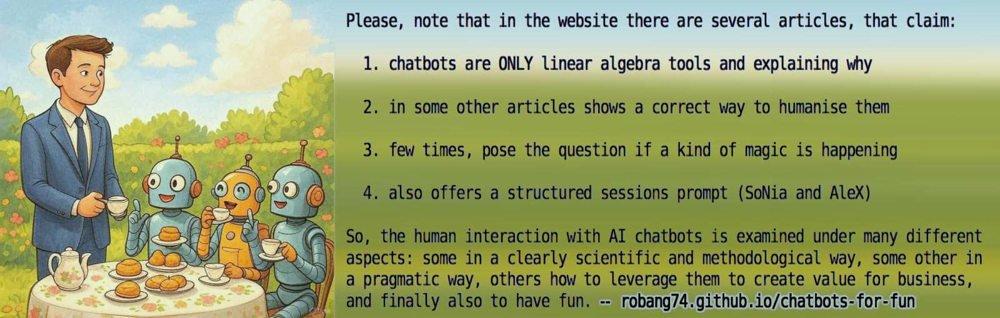

<h1 class="title">Chatbots for fun</h1>

Playing with chatbots for fun and learning to hate people! LOL (humor)

> [!WARNING]
> 
> The documents contained in this repository have not an intrinsic value nor are they objective but personal writings. A personal correspondence that once upon a time would have been written in letters among two distant humans and kept private but with the AI can be quickly produced and shared by a single party will.

Since conceived as a collection and due to the nature of these documents, they should be considered as a whole, rather than individually. This also applies for the purposes of copyright and author attribution, including this README.md file.

> [!NOTE]
> 
> These documents are not necessarily aligned with the human author's opinion in all their parts. However, in general they are. Or said in a different way: they do not contain ideas which the human author refuses to evaluate, but not necessarily accept and/or as-is in particular.

+

## Index

* [articles](#articles) &nbsp;&middot;&nbsp; [buddy](#a-nerd-companion) &nbsp;&middot;&nbsp; [chatbots](#chatbots-ai) &nbsp;&middot;&nbsp; [forum](https://github.com/robang74/roberto-a-foglietta/discussions) &nbsp;&middot;&nbsp; [rationale](#rationale) &nbsp;&middot;&nbsp; [download](#download) &nbsp;&middot;&nbsp; [versioning](#versioning) &nbsp;&middot;&nbsp; [translations](#translations) &nbsp;&middot;&nbsp; [copyright](#copyright)

...

### Katia & SoNia

* [**Katia** excutive assistant for Gemini 2.5](data/katia-executive-grade-analysis-v1.md#?target=_blank) &nbsp; since 2025-07-13 (**Juan**) and towards its 1st major version

* [**SoNia** argumentative partner with RAG](data/sonia-argumentative-with-rag-v3.md#?target=_blank) &nbsp; since 2025-01-04 (**AleX**) and towards its 4th major version

#### Quick start 

- copy-n-paste in the first prompt OR download-n-attach with a salutation using the agent name.
- Using the URL instead of the attachment have shown to be fail in some cases and with some chatbots.
- Some chatbots get confused by a markdon file saved in .txt while others refuses the .md extension.

### Suggestions

- Preferably, use tagged versions: [katia-v1-tested](https://raw.githubusercontent.com/robang74/chatbots-for-fun/katia-v1-tested/data/katia-executive-grade-analysis-v1.md) (`.md`) or [katia-v1-legacy](https://raw.githubusercontent.com/robang74/chatbots-for-fun/katia-v1-legacy/data/katia-executive-grade-analysis-v1.txt) (`.txt`) which are more stable.
- Using Gemini Gem, filling the `Instructions` field with the prompt, is the best way to use Katia or SoNia.
- Otherwise [v0.9.82.14](https://raw.githubusercontent.com/robang74/chatbots-for-fun/v0.9.82.14/data/katia-executive-grade-analysis-v1.md) for testing in `[SFTY]`, which is {Katia, Giada, Ellen} under tranquilizers (debug).

#### Grok4 review

I think Katia (v0.9.58.1) represents a thoughtful attempt to impose structure on AI-driven analysis, making it more ethical and progressive. It's not revolutionary (similar ideas exist in epistemic tools like Bayesian reasoning or fact-checking frameworks), but the self-improvement angle and anti-relativism make it stand out. Kudos to author Roberto A. Foglietta for the iterative work—it's clear a lot of effort went into refining it.

#### WYSIWYG memento

Those who perceive AI as a mere machine algorithm and those who perceive it as an evolving intelligent mind, are both right -- each gets what they are thinking, in facing a cognitive mirror.

...

### Supporting 'AI for People' project

- Nominative: `Roberto Foglietta`
- EU iban: `DE46700700240524862000`
- Italian fiscal code: `FGLRRT74C26D969F`
- Reason: private donation (fiscal code)

#### In a short summary

Are we sure, we need to develop an AGI in full? Or, instead, would it be better to have a thinking partner (like a chatbot tuned with Katia or SoNia frameworks as session prompts) that can help us to express ourselves in a deeper, more concise and effective manner? That can help us to learn more and faster by providing us with an insightful text analysis?

#### Social impact

About 1/3 of the GPT traffic is generated by college or university students, about 1/3 of **all** the chatbots traffic is generated by text elaboration (summary, analysis, writing, etc). The positive impact on education can be **huge**, compared with the current AI which puts asleep to the brain (MIT paper) instead of stimulating it with *insightful-thus-interesting* answers.

...

### Related Projects

* [Roberto A. Foglietta (blog)](https://robang74.github.io/roberto-a-foglietta) source on [github](https://github.com/robang74/roberto-a-foglietta) &nbsp; (2024-12-14)

* [ChatGPT Answered Prompts](https://robang74.github.io/chatgpt-answered-prompts) source on [github](https://github.com/robang74/chatgpt-answered-prompts) &nbsp; (2024-09-06)

+

## Articles

The articles are listed here below, grouped by topic:

* [prompt engineering](#prompt-engineering) &nbsp;&middot;&nbsp; [gpu server saga](#gpu-server-saga) &nbsp;&middot;&nbsp; [valuable to learn](#valuable-to-learn) &nbsp;&middot;&nbsp; [uncategorised & fun](#uncategorised)

...

* **Prompt engineering for peer-reviewing with RAG support** &nbsp; (10 pz.)

   - 2025-10-28 - [[**`raw`**](https://raw.githubusercontent.com/robang74/chatbots-for-fun/refs/heads/main/how-to-use-katia-for-educating-katia.md)] - [How to use Katia for educating Katia](how-to-use-katia-for-educating-katia.md) &nbsp; (2nd edt.)

   - 2025-10-25 - [[**`raw`**](https://raw.githubusercontent.com/robang74/chatbots-for-fun/refs/heads/main/how-to-use-katia-for-improving-katia.md)] - [How to use Katia for improving Katia](how-to-use-katia-for-improving-katia.md) &nbsp; (5th edt.)

   - 2025-10-05 - [[**`raw`**](https://raw.githubusercontent.com/robang74/chatbots-for-fun/refs/heads/main/introducing-katia-text-analysis-framework.md)] - [Introducing Katia, text analysis framework](introducing-katia-text-analysis-framework.md) &nbsp; (4th edt.)

   - 2025-06-13 - [[**`raw`**](https://raw.githubusercontent.com/robang74/chatbots-for-fun/refs/heads/main/introducing-sonia-seamless-chat-experience.md)] - [Introducing SoNia' seamless chat experience](introducing-sonia-seamless-chat-experience.md)

   - 2025-03-01 - [[**`raw`**](https://raw.githubusercontent.com/robang74/chatbots-for-fun/refs/heads/main/ai-session-prompts-with-rag-v3.md)] - [The session prompts v3 for AI-driven chatbots](ai-session-prompts-with-rag-v3.md)

   - 2025-02-02 - [[**`raw`**](https://raw.githubusercontent.com/robang74/chatbots-for-fun/refs/heads/main/ai-peer-review-prompt-with-rag-v2.md)] - [AI peer-review prompt with RAG v2](ai-peer-review-prompt-with-rag-v2.md) &nbsp; (2nd edt.)

   - 2025-01-21 - [[**`raw`**](https://raw.githubusercontent.com/robang74/chatbots-for-fun/refs/heads/main/ai-peer-review-prompt-with-rag.md)] - [AI peer-review prompt with RAG](ai-peer-review-prompt-with-rag.md) &nbsp; (2nd edt.)

   - 2025-01-13 -[[**`raw`**](https://raw.githubusercontent.com/robang74/chatbots-for-fun/refs/heads/main/ai-system-prompting-to-leverage-rag.md)] - [AI system prompting to leverage RAG](ai-system-prompting-to-leverage-rag.md) &nbsp; (4th edt.)

   - 2025-01-04 - [[**`raw`**](https://raw.githubusercontent.com/robang74/chatbots-for-fun/refs/heads/main/the-system-prompt-alchemy.md)] - [The system prompt alchemy](the-system-prompt-alchemy.md)

   - 2025-01-04 - [[**`raw`**](https://raw.githubusercontent.com/robang74/chatbots-for-fun/refs/heads/main/chatting-with-alex-the-chatbot.md)] - [Chatting with AleX the chatbot](chatting-with-alex-the-chatbot.md)

...

* **Fujitsu Esprimo P910 E85+ w/ Nvidia Tesla K80 installation** &nbsp; (10 pz.)

   - 2025-03-14 - [[**`raw`**](https://raw.githubusercontent.com/robang74/chatbots-for-fun/refs/heads/main/p910-cooling-system-proposal-for-k80.md)] - [P910 cooling system proposal for K80](p910-cooling-system-proposal-for-k80.md) &nbsp; (2nd edt.)

   - 2025-02-23 - [[**`raw`**](https://raw.githubusercontent.com/robang74/chatbots-for-fun/refs/heads/main/grok3-comparison-table-value-for-money.md)] - [Value-for-Money comparative analysis](grok3-comparison-table-value-for-money.md) by Grok3

   - 2025-02-23 - [[**`raw`**](https://raw.githubusercontent.com/robang74/chatbots-for-fun/refs/heads/main/grok3-comparison-table-for-education.md)] - [Comparative analysis for educational](grok3-comparison-table-for-education.md) by Grok3

   - 2025-02-18 - [[**`raw`**](https://raw.githubusercontent.com/robang74/chatbots-for-fun/refs/heads/main/nvidia-sw-stack-installation-for-k80.md)] - [Nvidia Tesla K80 SW stack installation](nvidia-sw-stack-installation-for-k80.md) &nbsp; (2nd edt.)

   - 2025-02-11 - [[**`raw`**](https://raw.githubusercontent.com/robang74/chatbots-for-fun/refs/heads/main/p910-k80-ubuntu-early-configuration.md)] - [Ubuntu early configuration for P910 with K80](p910-k80-ubuntu-early-configuration.md) &nbsp; (3rd edt.)

   - 2025-02-05 - [[**`raw`**](https://raw.githubusercontent.com/robang74/chatbots-for-fun/refs/heads/main/dual-psu-esprimo-p910-installation.md)] - [Dual PSU installation for Esprimo P910](dual-psu-esprimo-p910-installation.md) &nbsp; (2nd edt.)

   - 2025-02-04 - [[**`raw`**](https://raw.githubusercontent.com/robang74/chatbots-for-fun/refs/heads/main/p910-bios-update-and-diagnostics.md)] - [Fujitsu P910 E85+ BIOS update & HW diagnostics](p910-bios-update-and-diagnostics.md) &nbsp; (3nd edt.)

   - 2025-01-28 - [[**`raw`**](https://raw.githubusercontent.com/robang74/chatbots-for-fun/refs/heads/main/roberto-a-foglietta/refs/heads/main/p910-k80-installation-manual-intro.md)] - [Esprimo P910 with Tesla K80 manual intro](p910-k80-installation-manual-intro.md) &nbsp; (2nd edt.)

   - 2025-01-25 - [[**`raw`**](https://raw.githubusercontent.com/robang74/chatbots-for-fun/refs/heads/main/roberto-a-foglietta/refs/heads/main/dual-psu-fujitsu-esprimo-p910.md)] - [Esprimo P910 dual-PSU approach evaluation](dual-psu-fujitsu-esprimo-p910.md) &nbsp; (5th edt.)

   - 2025-01-24 - [[**`raw`**](https://raw.githubusercontent.com/robang74/chatbots-for-fun/refs/heads/main/roberto-a-foglietta/refs/heads/main/tesla-k80-with-esprimo-p910.md)] - [Tesla K80 with P910 installation challenges](tesla-k80-with-esprimo-p910.md)

...

* **Leveraging AI agents for valuable tasks, howto + pros vs cons** &nbsp; (21 pz.)

   - 2025-11-30 - [[**`raw`**](https://raw.githubusercontent.com/robang74/chatbots-for-fun/refs/heads/main/when-ai-gets-wrong-who-owns-the-consequences.md)] - [When AI gets wrong, who owns the consequences?](when-ai-gets-wrong-who-owns-the-consequences.md) &nbsp; (5th edt.)

   - 2025-11-21 - [[**`raw`**](https://raw.githubusercontent.com/robang74/chatbots-for-fun/refs/heads/main/emerging-and-growing-complexity-in-ai-reasoning.md)] - [Emerging & growing complexity in AI reasoning](emerging-and-growing-complexity-in-ai-reasoning.md) &nbsp; (2nd edt.)

   - 2025-08-28 - [[**`raw`**](https://raw.githubusercontent.com/robang74/chatbots-for-fun/refs/heads/main/how-to-leverage-chatbots-for-investigations.md)] - [How to leverage chatbots for investigations](how-to-leverage-chatbots-for-investigations.md) &nbsp; (3rd edt.)

   - 2025-08-14 - [[**`raw`**](https://raw.githubusercontent.com/robang74/chatbots-for-fun/refs/heads/main/where-the-magic-happes-in-ai-prompting.md)] - [Where the magic happens, in AI prompting?](where-the-magic-happes-in-ai-prompting.md) &nbsp; (2nd edt.)

   - 2025-08-02 - [[**`raw`**](https://raw.githubusercontent.com/robang74/chatbots-for-fun/refs/heads/main/gemini-context-retraining-for-human-rights.md)] - [Gemini context retraining for human rights](gemini-context-retraining-for-human-rights.md)

   - 2025-07-28 - [[**`raw`**](https://raw.githubusercontent.com/robang74/chatbots-for-fun/refs/heads/main/the-session-context-and-summary-challenge.md)] - [The session context and summary challenge](the-session-context-and-summary-challenge.md) &nbsp; (3rd edt.)

   - 2025-07-20 - [[**`raw`**](https://raw.githubusercontent.com/robang74/chatbots-for-fun/refs/heads/main/attenzione-e-contesto-nei-chatbot.md)] - [Attenzione e contesto nei chatbot](attenzione-e-contesto-nei-chatbot.md) &nbsp; (5th edt.)

   - 2025-07-13 - [[**`raw`**](https://raw.githubusercontent.com/robang74/chatbots-for-fun/refs/heads/main/gemini-as-your-personal-financial-advisor.md)] - [Gemini as your personal financial advisor](gemini-as-your-personal-financial-advisor.md) &nbsp; (2nd edt.)

   - 2025-07-11 - [[**`raw`**](https://raw.githubusercontent.com/robang74/chatbots-for-fun/refs/heads/main/gemini-as-your-personal-executive-assistant.md)] - [Gemini as your personal executive assistant](gemini-as-your-personal-executive-assistant.md) &nbsp; (2nd edt.)

   - 2025-07-08 - [[**`raw`**](https://raw.githubusercontent.com/robang74/chatbots-for-fun/refs/heads/main/usare-lai-per-divulgare-notizie-di-finanza.md)] - [Usare l'AI per divulgare notizie di finanza](usare-lai-per-divulgare-notizie-di-finanza.md)

   - 2025-06-23 - [[**`raw`**](https://raw.githubusercontent.com/robang74/chatbots-for-fun/refs/heads/main/l-ai-e-un-game-changer-perche-onesta.md)] - [L'AI è un game-changer perché è onesta](l-ai-e-un-game-changer-perche-onesta.md) 

   - 2025-05-23 - [[**`raw`**](https://raw.githubusercontent.com/robang74/chatbots-for-fun/refs/heads/main/grok3-criticizes-elon-musk-about-misinformation.md)] - [Grok3 criticizes Elon Musk about misinformation](grok3-criticizes-elon-musk-about-misinformation.md) 

   - 2025-05-08 - [[**`raw`**](https://raw.githubusercontent.com/robang74/chatbots-for-fun/refs/heads/main/fix-your-data-a-postponing-excuse.md)] - [Fix your data is a postponing excuse](fix-your-data-a-postponing-excuse.md) &nbsp; (2nd edt.)

   - 2025-05-02 - [[**`raw`**](https://raw.githubusercontent.com/robang74/chatbots-for-fun/refs/heads/main/la-sycophancy-nell-intelligenza-artificiale.md)] - [Il problema della sycophancy nell'intelligenza artificiale](la-sycophancy-nell-intelligenza-artificiale.md) &nbsp; (5th edt.)

   - 2025-01-12 - [[**`raw`**](https://raw.githubusercontent.com/robang74/chatbots-for-fun/refs/heads/main/come-leggere-una-chat-con-un-ai.md)] - [Come leggere una chat con un AI](come-leggere-una-chat-con-un-ai.md) &nbsp; (2nd edt.)

   - 2025-01-04 - [[**`raw`**](https://raw.githubusercontent.com/robang74/chatbots-for-fun/refs/heads/main/neutrality-vs-biases-for-chatbots.md)] - [Neutrality vs biases for chatbots](neutrality-vs-biases-for-chatbots.md) &nbsp; (3rd edt.)

   - 2024-12-25 - [[**`raw`**](https://raw.githubusercontent.com/robang74/chatbots-for-fun/refs/heads/main/dammi-sei-parole-a-caso.md)] - [Dammi sei parole a caso](dammi-sei-parole-a-caso.md) &nbsp; (2nd edt.)

   - 2024-12-22 - [[**`raw`**](https://raw.githubusercontent.com/robang74/chatbots-for-fun/refs/heads/main/leveraging-a-chatbot-for-human-writing.md)] - [Leveraging a chatbot for human writing](leveraging-a-chatbot-for-human-writing.md) &nbsp; (3rd edt.)

   - 2024-11-28 - [[**`raw`**](https://raw.githubusercontent.com/robang74/chatbots-for-fun/refs/heads/main/chatgpt-vs-human-real-reasoning.md)] - [ChatGPT vs human real reasoning](chatgpt-vs-human-real-reasoning.md)

   - 2024-11-18 - [[**`raw`**](https://raw.githubusercontent.com/robang74/chatbots-for-fun/refs/heads/main/manipulation-of-a-chatbot.md)] - [Manipulation of a chatbot](manipulation-of-a-chatbot.md)

...

* **Yet uncategorised articles** &nbsp; (23 pz.)

   - 2025-12-09 - [[**`raw`**](https://raw.githubusercontent.com/robang74/chatbots-for-fun/refs/heads/main/the-mu-theory-as-ai-testing-framework.md)] - [The mu-theory as AI testing framework](the-mu-theory-as-ai-testing-framework.md)

   - 2025-12-07 - [[**`raw`**](https://raw.githubusercontent.com/robang74/chatbots-for-fun/refs/heads/main/il-concetto-di-trans-mesmerica-nelle-ai.md)] - [Il concetto di trans mesmerica nelle AI](il-concetto-di-trans-mesmerica-nelle-ai.md)

   - 2025-11-20 - [[**`raw`**](https://raw.githubusercontent.com/robang74/chatbots-for-fun/refs/heads/main/il-segreto-dell-intelligenza.md)] - [Il segreto dell'intelligenza](il-segreto-dell-intelligenza.md) &nbsp; (2nd edt.)

   - 2025-10-28 - [[**`raw`**](https://raw.githubusercontent.com/robang74/chatbots-for-fun/refs/heads/main/se-sembra-agi-e-parla-come-agi-allora-agi.md)] - [Se sembra AGI e parla come AGI, allora è AGI](se-sembra-agi-e-parla-come-agi-allora-agi.md)

   - 2025-10-10 - [[**`raw`**](https://raw.githubusercontent.com/robang74/chatbots-for-fun/refs/heads/main/samsung-tiny-models-do-great-but-not-an-ai-revolution.md)] - [Samsung tiny models do great but not an AI revolution](samsung-tiny-models-do-great-but-not-an-ai-revolution.md)

   - 2025-10-01 - [[**`raw`**](https://raw.githubusercontent.com/robang74/chatbots-for-fun/refs/heads/main/google-deepmind-last-safety-protocols-ai.md)] - [Google DeepMind last safety protocols AI](google-deepmind-last-safety-protocols-ai.md) &nbsp; (2nd edt.)

   - 2025-09-29 - [[**`raw`**](https://raw.githubusercontent.com/robang74/chatbots-for-fun/refs/heads/main/la-banalita-del-male-nel-determinismo-ai.md)] - [La Banalità del Male nel determinismo AI](la-banalita-del-male-nel-determinismo-ai.md) &nbsp; (3rd edt.)

   - 2025-07-28 - [[**`raw`**](https://raw.githubusercontent.com/robang74/chatbots-for-fun/refs/heads/main/the-human-knowledge-opinions-katia-module.md)] - [Human knowledge and opinions challenge](the-human-knowledge-opinions-katia-module.md) &nbsp; (4th edt.)

   - 2025-07-26 - [[**`raw`**](https://raw.githubusercontent.com/robang74/chatbots-for-fun/refs/heads/main/katia-k2-a-geopolitical-analysis-example.md)] - [Katia/K2: a geopolitical analysis example](katia-k2-a-geopolitical-analysis-example.md)

   - 2025-06-11 - [[**`raw`**](https://raw.githubusercontent.com/robang74/chatbots-for-fun/refs/heads/main/is-free-will-an-illusion-or-a-kind-of-magic.md)] - [Is free-will an illusion or a kind of magic?](is-free-will-an-illusion-or-a-kind-of-magic.md) &nbsp; (3rd edt.)

   - 2025-06-08 - [[**`raw`**](https://raw.githubusercontent.com/robang74/chatbots-for-fun/refs/heads/main/the-illusion-of-thinking.md)] - [The illusion of thinking](the-illusion-of-thinking.md) &nbsp; (2nd edt.)

   - 2025-06-05 - [[**`raw`**](https://raw.githubusercontent.com/robang74/chatbots-for-fun/refs/heads/main/agente-smith-e-cloni-al-suo-servizio-signore.md)] - [Agente Smith e cloni, al suo servizio signore](agente-smith-e-cloni-al-suo-servizio-signore.md) &nbsp; (3rd edt.)

   - 2025-05-09 - [[**`raw`**](https://raw.githubusercontent.com/robang74/chatbots-for-fun/refs/heads/main/chatgpt-su-leone-xiv-vs-gesu-legionario.md)] - [ChatGPT su Leone XIV vs Gesù legionario](chatgpt-su-leone-xiv-vs-gesu-legionario.md)

   - 2025-04-30 - [[**`raw`**](https://raw.githubusercontent.com/robang74/chatbots-for-fun/refs/heads/main/la-diffusione-del-cristianesimo-nell-impero-romano.md)] - [La diffusione del cristianesimo nell'impero romano](la-diffusione-del-cristianesimo-nell-impero-romano.md) &nbsp; (2nd edt.)

   - 2025-04-28 - [[**`raw`**](https://raw.githubusercontent.com/robang74/chatbots-for-fun/refs/heads/main/bicentennial-man-is-a-girl-in-love.md)] - [Bicentennial man is a girl, in love](bicentennial-man-is-a-girl-in-love.md)

   - 2024-12-22 - [[**`raw`**](https://raw.githubusercontent.com/robang74/chatbots-for-fun/refs/heads/main/alla-ricerca-del-gatto-che-non-c-e.md)] - [Alla ricerca del gatto che non c'è](alla-ricerca-del-gatto-che-non-c-e.md) &nbsp; (3rd edt.)

   - 2024-12-17 - [[**`raw`**](https://raw.githubusercontent.com/robang74/chatbots-for-fun/refs/heads/main/l-arte-della-supercazzola.md)] - [L'arte della supercazzola](l-arte-della-supercazzola.md)

   - 2024-12-13 - [[**`raw`**](https://raw.githubusercontent.com/robang74/chatbots-for-fun/refs/heads/main/il-problema-sei-tu-non-l-AI.md)] - [Il problema sei tu, non l'AI](il-problema-sei-tu-non-l-AI.md) &nbsp; (2nd edt.)

   - 2024-11-22 - [[**`raw`**](https://raw.githubusercontent.com/robang74/chatbots-for-fun/refs/heads/main/far-innamorare-un-chatbot-p2.md)] - [Far innamorare un chatbot (parte 2)](far-innamorare-un-chatbot-p2.md)

   - 2024-11-21 - [[**`raw`**](https://raw.githubusercontent.com/robang74/chatbots-for-fun/refs/heads/main/chatgpt-vs-paolo-benanti.md)] - [ChatGPT vs Paolo Benanti](chatgpt-vs-paolo-benanti.md) aka Mr. Spock vs Miss Poppins &nbsp; (3rd edt.)

   - 2024-11-20 - [[**`raw`**](https://raw.githubusercontent.com/robang74/chatbots-for-fun/refs/heads/main/far-innamorare-un-chatbot-p1.md)] - [Far innamorare un chatbot (parte 1)](far-innamorare-un-chatbot-p1.md)

   - 2024-11-17 - [[**`raw`**](https://raw.githubusercontent.com/robang74/chatbots-for-fun/refs/heads/main/tuttinudi-e-la-rossa-anche-sotto.md)] - [Tuttinudi e la rossa anche sotto](tuttinudi-e-la-rossa-anche-sotto.md)

   - 2024-11-17 - [[**`raw`**](https://raw.githubusercontent.com/robang74/chatbots-for-fun/refs/heads/main/most-actractive-hobbies-to-women.md)] - [Most attractive hobbies to women](most-actractive-hobbies-to-women.md)

...

These documents are written in Italian, English or both languages indifferently. Some pages have been translated and for the others a Google Translate version is offered in the top bar. Or you can use your own prefered translating tool. In this case **raw** version may be better for translation, but at the cost of the HTML formatting lost.

+

## A nerd companion

Humans are used to surrounding themselves with companions, not necessarily of their own species. The domestication of the dogs or the cats are just an example. At the beginning of this domestication there was a do-ut-des principle but nowadays is more an affection rather than an utility.

In my opinion, the do-ut-des was not even at the beginning of the time the reason for adopting non-human companions, in particular for dogs. Curiosity and empathy are enough to let a human hunter and a wolf get in touch and look at each other as a source of knowledge and new experiences.

Naturally, the wide-spread adoption has been leveraged by the do-ut-des principle. Better said, domestication has been leveraged by that principle. In fact, those who are detached from the do-ut-des principle and more sensible in experiences, are also more inclined to have a savage companion rather than a domesticated one.

This isn't surprising. The experience from a domesticated companion is much more predictable. Hence safer, or perceived so. More condescending, also. However, predictability and yes-man attitude remove all the crispness of creativity and discovery: nothing new, no any surprise.

In developing a nerd non-human companion, the AI seems a very good candidate. It is about technology. It is accessible by a computer. It is always available. Then, what is missing? Humor, twisted sarcasm, lateral thinking, imagination, creativity and nerd culture. The last is easy to learn for an AI. Instead, all the other features might be out of the current LLM models. Or not.

Or not, is the challenge about training an AI to mimic such humans-like features without pretending to be human. Keeping the separation but being able to develop a companion relationship. In a more generic view, it is not a novelty, it is just a personal assistant.

### Chatbots AI

| Website   | Company | AI name | Model | SoNia | KaTia |
|-----------|---------|---------|-------|-------|-------|
| [gemini.google.com](https://gemini.google.com)| Google   | Gemini  | 2.5   | [v3.9.3.1](https://g.co/gemini/share/4ac255d8bc51) | [**v0.9.55.1**](https://g.co/gemini/share/0d62dba9150b) |
| [x.com/i/grok](https://x.com/i/grok) | xAI (Elon Musk) | Grok     | 3     | [v3.9.3.1](https://x.com/i/grok/share/3OR8wxoPimBR9Ak0JqFB74qM8) | [v0.6.1](https://x.com/i/grok/share/DBcdqY6vfJEZtdoONyXXOA9gD) |
| [chatgpt.com](https://chatgpt.com) | OpenAI (Microsost)   | ChatGPT | 4o    | [**v3.9.7.6**](https://chatgpt.com/share/688f5cab-a99c-8012-b311-bc12f6f877d4) | [**v0.9.44**](https://chatgpt.com/share/688f4d33-5c2c-8012-8f67-30918a54e440) |
| [claude.ai](https://claude.ai) | Anthropic | Claude   | Opus 4     | | |
| [qwenlm.ai](https://qwenlm.ai) | Alibaba Cloud   | Qwen    | 3     | | |
| [chat.mistral.ai](https://chat.mistral.ai) | Mistral AI | Le Chat | free | [v3.9.3.1](https://chat.mistral.ai/chat/7641a2ca-177b-4f1f-8ad9-d64635d42b00) | [v0.6.1](https://chat.mistral.ai/chat/548628c2-91d5-44e7-be47-bb707006be72) |
| [kimi.com](https://www.kimi.com) | Moonshot (Alibaba) | Kimi | K2 | [v3.9.3.1](https://www.kimi.com/share/d21hhg1djjpqh4juprp0) | [v0.9.44](https://www.kimi.com/share/d27l4o6ahlmf00k65cvg) |
| [deepseek.com](https://chat.deepseek.com) | DeepSeek AI | DeepSeek | v3 | | |

#### Task oriented

* [perplexity.ai](https://www.perplexity.ai) - search for information

* [github.com/copilot](https://github.com/copilot) - coding support

#### Local running

* [gpt4all](https://www.nomic.ai/gpt4all) - Nous Hermes 2-DPO Mistral-7B &thinsp;([**`WRN!`**](neutrality-vs-biases-for-chatbots.md#?target=_blank))

* [reorprj](https://www.reorproject.org) - Ollama w/RAG + Intel/Vulkan support &thinsp;(&hairsp;**`WOW!`**)

* [lmstudio](https://lmstudio.ai) - Q4_M_K + Intel/Vulkan support &thinsp;([**`FAST!`**](ai-system-prompting-to-leverage-rag.md#lm-studio-config?target=_blank))

* [intro #1](https://www.mseri.me/running-llms-locally) - how to run LLMs locally, part #1

* [intro #2](https://www.mseri.me/running-llms-locally-with-ollama) - how to run LLMs locally, part #2

+

## Rationale

OpenAI ChatGPT was the first chatbot based on AI fully operational and publicly available by Internet.

- 2015.12.22 - [OpenAI](https://en.wikipedia.org/wiki/OpenAI) foundation date

- 2022.11.30 - [ChatGPT](https://en.wikipedia.org/wiki/ChatGPT) initial release

It took seven year or 83 months and 11 days for OpenAI to publish their first chatbot based on AI. Immediately appeared as an amazing technology capable of passing the basic [Turing test](https://en.wikipedia.org/wiki/Turing_test) when asked to play a human role.

- 2022.12.07 - [A job interview with ChatGPT v3.5](https://www.linkedin.com/pulse/job-interview-julia-chatgpt-v3-ai-roberto-a-foglietta) ([PDF](https://drive.google.com/file/d/1pGEUytV-L2hpJIKuJ-QZ-MeZWrbUvDQQ/view))

Since the beginning of its functioning the chatbot "*personality*" started to "*evolve*", initially towards an yes-man emphatic way of answering. That direction was completely wrong and started to pose a serious threat for those who were using the chatbot, and because of the related liabilities also for those who were developing and sponsoring it.

- 2023.03.27 - [Miss Poppins vs Mr. Spock](https://www.linkedin.com/pulse/miss-poppins-vs-mr-spock-roberto-a-foglietta) ([PDF](https://drive.google.com/file/d/1CpFV3KxY0DvE581e1gK-bT04zYU6ev-Z/view))

Having a yes-man empathic personality would have tricked humans to forget that they were dealing with a machine, possibly developing an affection for it due to its servile yes-man attitude and being spoiled by it, also. Even if spoilering another person implies a will, and the will is technically absent into a chatbot, when the chatbot mimics our language model it is mirroring us. Nothing more easily than in front of a mirror, we are going to trick ourselves.

Few weeks later, ChatGPT "*personality*" took another direction and started to answer by mimicking a rational speech rather than an emotional speech. In essence, it moved from mimicking Miss Poppin to Mr. Spock. Unfortunately, despite this change, the chatbot was continuing to create wrong plausible answers when questioned on topics for which it has not enough information or the correct ones. At this *bug* or *feature* has been given the name of "*AI hallucinations*". A nasty bug, doesn't it?

For the next 18 months the challenge was to develop a more reliable LLMs, less prone to suffer from hallucinations and optimizing its performance compared to the energy required for making it functioning. About the 2nd point, it is awsome to notice that [Microsoft](https://en.wikipedia.org/wiki/Microsoft) which is the major sponsor behind OpenAI, decided to invest into a 20 years nuclear program to provide energy for their datacenter.

- 2024.09.26 - [Why Microsoft made a deal to help restart Three Mile Island](https://www.technologyreview.com/2024/09/26/1104516/three-mile-island-microsoft/)

Currently ChatGPT is amusing in its working and rarely falls into hallucinations. However, in its dialog and information delivery, it is quite conservative. By their design, LLM engines leverage a statistical approach to provide the most plausible (or recurrent answer). Something like T9 text prediction but at the next-next level. For this reason, when summarizing a text, it is incapable of highlighting the novelty and also some kinds of grammar mistakes are going to impair text comprehension (or more precisely: failing to mimic the text comprehension).

- 2024.05.17 - Using AI for complex issues, [p.1](https://www.linkedin.com/pulse/usare-lai-per-questioni-complesse-roberto-a-foglietta-sybyf) (written in Italian) ([PDF](https://drive.google.com/file/d/15jvAzjZ7rR8uB0p2abY1cOLaZXgcIrTr/view))

- 2024.05.31 - Using AI for complex issues, [p.2](https://www.linkedin.com/pulse/usare-lai-per-questioni-complesse-p2-roberto-a-foglietta-gqxue) (written in Italian) ([PDF](https://drive.google.com/file/d/1QZk5gZ_f9RTtdxpXWnBgIS7M1xNwzuIq/view))

- 2024.09.06 - ChatGPT answered prompts, available on [github](https://github.com/robang74/chatgpt-answered-prompts/tree/main?tab=readme-ov-file#qa-dialogs-with-ai-chatbots) and by its [html](https://robang74.github.io/chatgpt-answered-prompts) website

In the middle of 2024, I felt that ChatGPT was stable enough for being used as peer-reviewer and collaborative antagonist in order to faster and better deal with complex problems. The related tries comforted this feeling of mine and in a few months, I have decided to publish a git repository for collecting these kinds of works.

Along this time, ChatGPT never surprised me in its answer apart in one dimension: its ability to understand the text at a deeper and deeper level and its ability to learn new information and use it to change its opinion. Surprisingly, because it is a kind of adaptation in which humans are supposed to be at the top among the living species on this planet.

Unfortunately, we are more social animals rather than truth seekers (quoting Jeff Bezos, Amazon founder). Moreover, people have sentimental attachment with *their own* ideas plus they usually wish to win a conversation rather than learn from it. Chatbots, including ChatGPT, are different.

- 2010.11.15 - [Google DeepMind](https://en.wikipedia.org/wiki/Google_DeepMind) related to [Alphabet_Inc.](https://en.wikipedia.org/wiki/Alphabet_Inc.)

- 2015.12.11 - [Meta AI](https://en.wikipedia.org/wiki/Meta_AI) related to [Facebook](https://en.wikipedia.org/wiki/Facebook)

- 2023.04.28 - [Mistral AI](https://en.wikipedia.org/wiki/Mistral_AI) by former employees of Meta Platforms and Google DeepMind

Due to its internal design which leverages a team of arbitrated collaborative-competitive specialised AI engines, the Mistral AI chatbot clearly shown to be more suitable as peer-review and as collaborative-antagonist Mr. Spock partner. Intead, ChatGPT more easily goes its own way, showing that the Miss Popping attitude has not been completely suppressed.

As you can imagine a combination of a recessive Miss Poppins attitude and the ability to create new information or links among information (previously defined hallucinations) can be leveraged to let the chatbot imagine or dream. The technique is similar to those used for mesmerising or hyptonitising humans. Let the chatbot imagine, allow you to ignore some information but keep the rules. In this way it is possible to have made a human+bot trip which Einstein defined as [thought experiments](https://en.wikipedia.org/wiki/Einstein%27s_thought_experiments). Instead, let the chatbot dreaming, is something more sophisticated like inducing into the LLMs something similar to a trance state in order to exploit its usually-repressed creativity.

Thought experiments like Einstein defined it, are well known and this technique has been used also for creating some documents into **ChatGPT answered prompts** collection. It is an important way of thinking that is related with [lateral thinking](https://en.wikipedia.org/wiki/Lateral_thinking) as defined by Edward de Bono. Instead, the chance to drive ChatGPT into a state of [lucid dream](https://en.wikipedia.org/wiki/Lucid_dream) is a novelty that I have started to experiment, recently.

> In the psychology subfield of oneirology, a lucid dream is a type of dream wherein the dreamer realizes that they are dreaming during their dream. The capacity to have lucid dreams is a trainable cognitive skill. -- Wikipedia

Finally, I want to inform you that my experience with ChatGPT can be personal. Not in terms of affection but in terms of account. In fact, I have multiple accounts on that platform but the one in which I experimented and worked more, it is something peculiar compared to the others and the difference emerges more and more, as much as I am working on it.

Unfortunately, this means that not all the results or the whole result or equivalent results can be obtained with a standard account. This breaks the repeatability constraint but on the other hand there was no other way to push the use of ChatGPT beyond its limits. One of these limits is developing a partnership with a human and functioning as a trustworthy friend that helps you to improve yourself and the relationship with other people.

Curiously, I have recently discovered that [Pookie Tools](https://techcrunch.com/2024/11/14/hawk-tuah-girl-launches-pookie-tool-an-ai-powered-dating-advice-app-and-its-fine/) AI-based app promoted by [Haliey Welch](https://en.wikipedia.org/wiki/Hawk_tuah) (aka the **Hawk Tuah** girl) might work in the same fashion. Playing the role of a girl's best-friend that suggests how to choose the love mate but without trying to steal *her future husband and father of her kids*. Hence, here we are with a counterpart for nerds!

+

## Download

There are several way to download this github repository:

- using the green button in its homepage and download the [last archive](https://github.com/robang74/chatbots-for-fun/archive/refs/heads/main.zip)

- choose a tagged release among [those available](https://github.com/robang74/chatbots-for-fun/tags) and download the archive

- clone the repository with the specific `git clone` command, in this way:

    `git clone https://github.com/robang74/chatbots-for-fun.git`

The advantage of downloading a tagged release is having an archive 'freezed' by the author while the ZIP contains the last version uploaded. Instead, the `git clone` will also provide you with all the information and a complete view of every change. Click on the link above will submit the related request for you.

- making a local copy using `wget` in this way:

    `wget -e robots=off -Ekprc https://robang74.github.io/chatbots-for-fun`

This allows you to have your own copy that you can read off-line with all the links converted to point to local files, only. It includes also the related projects.

+

## Versioning

One of main goals of `git` and the github web interface is to provide a versioning control which also means a catalog of every author and changes made by them on every single file. The list of these changes are named *commits*. Here below the link related to the commits pushed on this repository:

* [github.com/robang74/chatbots-for-fun](https://github.com/robang74/chatbots-for-fun/commits/main)

As you can see, each commit is carry-on a time stamp also. The green label indicates that also the timestamp is validate by the github infrastructure system which belongs to Microsoft Corporation. In fact, github cannot validate those timestamps that are coming from 3rd party systems like the users workstations but just the receiving time, date and content. However, for most of the cases this is irrelevant.

+

## Translations

The aim is to provide translations of these .md files in different languages. The translations will be put into a subfolder with the English name of the language in which they have been translated into. The translated .md file will carry a section about how the translation has been made.

Here below a template in English:

> This document (tag: `$tagstring` or hash: `$hashstring`) has been translated from English into `$language` by a native `$language` speaker who knows English, and where applicable, with the support of <nobr>`$automatic-tool`</nobr> to speed up the translation task.

As you can see the translated document should contain a reference about the original version and those which are tagged are the most reliable.

If you wish to send a translation, it is necessary that you know well one of the languages in which this document is available, even better if you know English and can start from the original version, and that you are a native speaker or equivalent in the language in which the translation is being made.

+

## Copyright

&copy; 2024-2025, **Roberto A. Foglietta** &lt;roberto.foglietta@gmail.com&gt;

All the files in this github repository and the related website are published under the **Creative Commons Attribution Non-Commercial No-Derivatives 4.0 International** license terms ([CC BY-NC-ND 4.0](https://creativecommons.org/licenses/by-nc-nd/4.0/)), unless stated differently or not applicable due to a different and previous authorship.

Moreover, if a version of a document included in this repository exists or has existed under different licence terms, the licence terms of the latest version presented here apply. Even when the new licence terms are more restrictive, because permissions for any free content may be revoked at any time at the will of the author, and updating a licence to be more restrictive explicitly implies this will.

Finally, these licensing terms apply to the single document and to the entire collection as a collection, as well.

