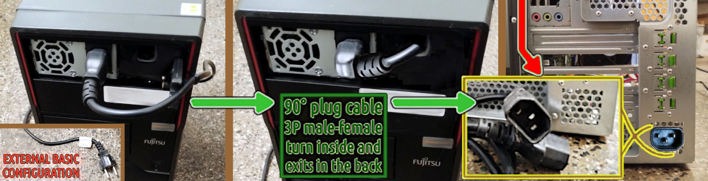

 

## Dual PSU for Esprimo P910 installation

This article is the natural prosecution of the previous one.

- [Dual PSU for Fujitsu Esprimo P910](dual-psu-fujitsu-esprimo-p910.md#?target=_blank) &nbsp; (2025-01-25)

While the bill of material (BoM) has been added after the Manual introduction and structure.

- [The bill of material (BoM)](p910-k80-installation-manual-intro.md#bom?target=_blank) &nbsp; (2025-02-05)

Due to the budget constraints, this project is progressing quite slowly because each batch of material is ordered when a step is completed and it takes about two weeks to arrive from China.

However, some stuff has been bought from Amazon Italy or around Europe. Under this point of view, it is - in its small scale - an example of how the supply-chain impacts both on the time of production and on the final cost of the single unit.

In the meantime, I worked on the "prompt for peer-review with RAG support" engineering in parallel, and soon after the DVI-adapter arrived, which I missed to order with the Esprimo P910, I created a manual for diagnosing the hardware and updating the BIOS.

- [P910 E85+ BIOS update & diagnostics](p910-bios-update-and-diagnostics.md) &nbsp; (2025-02-04)

It is specifically tailored for Esprimo P910 E85+ but it can be used as a canvas for every other PC/laptop for which tools running on DOS are available.

---

### Dual PSU installation

Just to recap, the main problem of providing 225W TDP, 300W peak to the Nvidia Tesla K80 was mainly related with the proprietary power system embedded into the Fujitsu Esprimo P910 and therefore too hard to change without doing a bricolage that would far beyond the educational scope of this project.

Therefore an industrial Flex size PSU has been chosen, which has been designed and built to power the ATX PC-based automated point of sales (PoS). For this reason it is particularly small, compared to the standard ATX power supply unit and cheap, compared with the PC-gaming market segment.

[!INFO]

The new PSU flex ATX provides 2 molexes and 1 CPU 4-pin connectors. Hence, it offers two ways of powering the 225W TDP (peak 300W) Tesla K80 card, each one with a different adapter. 

- Each molex brings a 12V line supporting up to 11A for a total of 264W of constant current flow, hence a TDP figure. Which is 85% of the K80's TDP and 114% of the peak load.

- Fortunately, the CPU 4-pin connector is cabled with two yellow (12V) and two black (GND) wires which means it offers two separate lines for 22A in total, hence 264W of TDP.

In case of a single 2mm line, only 12V x 11A = 132W would be available, like using a single molex when two are required. In that case the K80's TDP should be limited accordingly, using the **`nvidia-smi`** tool. Cutting by half the TDP is not a bad idea for a system that should undergo a whole test including the venting system, after all.

[/INFO]

This PSU's height is almost the same as a standard DVD-ROM reader, shorter and less wide (82 x 150 x 41 mm). For a confrontation, the hosted DVD-ROM was 150 x 165 x 42 mm. Plus it does not have the standard holes to receive the plate used into P910 to lock the DVD-ROM in its place.

Moreover, once this PSU replaces the DVD-DOM, it offers the 3 pole male plug on the front side of the case which is not particularly comfortable. It is safe but the cable is much more exposed to a risk of being accidentally unplugged and aesthetically unpleasant.

For these reasons, in creating a custom frame adapter, I built it in a way in which it will be easy in the near future to move the 3 pole C14F plug on the back of the tower case.

|x|>

+
right click menu to enlarge (x2) the image
<|x|

Replacing the cable with a straight C13M plug with another one providing a down angle C13M plug, the length exposed will be much shorter. While the power cable will extend in a way that it will be perfectly safe to turn into the tower case for being brought in the back.

Moreover, moving back the new PSU by 15mm, it will get deep in the case as much as the old DVD-ROM driver keeping the plug protected within the bay. At that point the bay can be partially closed, separating the 220V stage from the fan air-corridor and levelling at the case front face with an air-flow anti-dust grid fan guard, this last mainly for aesthetic reasons.

---

### Venting system

About the venting system, I was considering to use 2 fan 5020 or 5015 to place outside the back of the case, in front of the 2 PCI slots engaged by the Tesla K80 for sucking air through its airflow tunnel, as per its factory design, while the main fan into the case would push air into it, as show here below in the image.

The area to cover in such a scenario is not larger than 11 x 5 cm, for this reason the best is using 2 fan 5 x 5cm which seems optimal because the remaining area is essentially covered by the metal of the case or the PCI slot vertical locking mechanism.

Unfortunately, the 5010 fans are not very powerful while the 5020+ are rare. Instead, among the 5015s as the only viable option, most of them do not offer any PWM control (connection by 2-pin cable, or 3-pin at the best) because they are designed mainly for 3D printers.

|x|>

+
right click menu to enlarge (x4) the image
<|x|

The few remaining options that may have a chance to fulfill the role are as costly as the 12 cm fans, noisier and way less powerful than them. Which should not surprise us because the gaming market pushes hard on the competition and keeps the warehouses well-assorted for the 12cm fans.

---

### New challenges

Enlarging the image below and looking at the right side of the Nvidia K80 card, we can be assured that fitting a couple of 12cm fans overthere, in that narrow and messy space, will be not easy, if it is possible altogether, and it requires some kind of cabling rearrangement, at least.

|x|>

+
right click menu to enlarge (x4) the image
<|x|

The second challenge arises looking at that same image but on the opposite side of the tower case. Considering the length of the cable that I have ordered within the next material batch, it is quick to determine that it is not long enough to reach the diametrical opposite side of the tower case.

In fact, the cable ordered is 60cm long while to reach the ending point on the rear right bottom corner, it needs about 100cm. About the power cable, the availability or the price have not been the major driver of this choice, but noticing that with 60cm it can reach the grid below the Fujitsu original PSU.

Despite the relatively simplicity of the P910 model and the Fujitsu maniacal attitude to lock the cables in position, within the case, there are many cables. For sure there are more cables than available locking-grips or tieing points, especially for a relatively big cable like a power one.

While in the top of the case there is an almost lack of cabling and reaching the first grid available for hosting a C14F plug is quite straightforward. There are not any locking points for the cable, but a nice 3M duct-tape will be enough to win the gravity.

In this image above, the lime-green bordered blue lines indicate where the power cabling, from the front of the newly installed PSU, is turning back and going to find its way to end back in the rear of the tower case.

Too nice and easy to be true... In fact, compared with opening a hole at the end of data storage bays row, going to tackle to cut the metal grid up over there and possibly spread conductive crumbs which might go around for the circuitry in a brisky mood... is not the most appealing scenario.

For those wish to sleep well during the night or are more keen to take a short-cut, in the image below is portrayed a cable which [Amazon Italia](https://www.amazon.it/gp/product/B07P7WHQZD) offers for €9.11 Prime delivery included.

|x|>

<|x|

**Spoiler**: pushing the power plug through the PCI slot opening, the closest one to the CPU, that 1.8mt cable will reach his destination to be connected with the public power network without the need to create new holes in the tower case.

This will cost you a PCI-express x4 mechanically x16, and the day someone will pull the power cord in a strong manner, likely stumbling rather than walking over it, possibly also the CPU or the RAM will leave the motherboard for a better place in the trash. {;-)}

[!INFO]

For those who have a professional practice of 220V electric cabling, and the related authorisations and certifications to operate on that lines, the most customised solution is about wiring a C14F, usually protected by a 10A-220V fuse and at cheap price €1.39 also including a on/off led-lighted button. This might be done without even modding the grid but leveraging its reasonably large hexagonal pattern to pass through the cables to wire and fixing the plug externally to the grid.

In this scenario, a knot before the grid and another one after will fix the cable to the grid in a way it will not be able to be pulled by one side or another. Obviously, having the care to add an extra protection to the cable insulating sleeve towards damages by accidental pulls or frictions against the metall grid. Some heating shrinking guaina can provide a reasonable isolation in the wiring plug/switch pins while an electric plastic box will protect everything and hide the fixing bolts.

In Italy, respecting CEI-UNI normatives and standards, a light point made by a professional electrician is priced between €25 and €40 each plus the cost of the electric material, on average. From many light points to few the average unitary price increases. So, we can reasonably assume that such a mod will cost around 50 bucks. As much as bucks, I have paid the whole P910 with 16GB but without any data storage and expedition apart.

[/INFO]

If you conclude, by all of these, that it is better for you to go to work as an electrician instead of IT guys, well... that's another story! {;-)}

---

### Preparing for installation

The two 12cm fan height is 25mm which is too much to fit between the 2nd floor of the case and the K80 that should necessarily be installed in the second PCI-express slot because the other is functionally a 4x despite it having a 16x size. Moreover, a 12 cm fan does not fit in the middle data storage bay, also. A 10 cm could fit and work, assuming the openings in that bay can vehiculate enough air-flow. While the rear upper grid can internally host two 6cm fans, as an alternative.

Under such a tough scenario, another solution is necessary. Assuming that the two fans mounted on the new PCI frame can be installed into the first PCI-express slot, then they will cool the CPU and the two power supply units. At that point, it will be possible to converge all the main 12cm fan air-flow into the K80's cooling channel and leverage its design by factory .

|x|>

+
right click menu to enlarge (x2) the image
<|x|

For all these reasons, the venting system is still an open question and it might be integrated with a couple of 5cm fans to suck hot air from the K80 front while the main 12cm fan is pushing fresh air into it thanks to the diverting panels.

[!INFO]

A **least-effort option** to give a try, is to keep the 12cm main fan in its original position, do not add any extra deflector but remove the plastic case from the Tesla K80 leaving exposed the radiators, removing the closing rear frame on the void PCI slot below the GPU card and install a 90/92 x 25mm 4-pin fan into the middle data-storage bay and connect it in a way both will work together with the PWM tuned on the hottest CPU/GPU component.

[/INFO]

In one way or another, it sounds reasonable that the main fan will be converted for cooling the K80 also or instead of the CPU and the system in general. Which brings to the need to supply the lost air-flow with another venting system.

It is worth noticing that once solved the venting question, the home made deflector/concentrator can be used to prototype the first 3D printed version and hopefully with few further refinement to let it fit perfectly in place and doing its job.

---

### About the PCI-e slot lost

Engaging the PCI-express first slot is not a great idea because it will be lost. However, considering that this is a dedicated system, such limitation does not seem so impactful. Unless, someone wishes to use the PCI-e 4x to leverage a non-SATA storage device with a PCI-e adapter.

Which usually happens when a spare part from a previous machine is available for free and it is worth reusing it. Considering that a 128GB or a 512GB SATA3 SSD can be bought for €11 or €28 on Amazon Italia with Prime expedition included, the sacrifice of the 4x PCI-e slot with the fans.

After all, it does not seem to compromise the overall value of the final system configuration. The USB 3.0 data transfer is 500 Mb/s while the SATA offers 600 MB/s but the USB 3.1+ and 3.2 much more. Let's check how fast USB3 can be on the P910 E85+, really.

Booting with a TinyCore w/Linux 5.15.10 on a Netac US9 USB 3.2, R/W at 40 MB/s on USB3 and 32 MB/s. Instead, a Hitachi HTS72323 2.5" SATA 3Gbit/s HDD R/W at 80-90MB/s. For comparison The US9 on a Thinkpad x390, does 818 MB/s. When the same USB stick is connected to the P910's blue ports on the back, it does 450 MB/s.

---

### Second PSU cabling

I decided to go with the 4-pin/8-pin CPU configuration because such adapter is easier to find and cheaper to buy compared with the 2-molexes adapter.

|x|>

+
right click menu to enlarge (x2) the image
<|x|

From the left to the right and proceeding clockwise, this is the list of the highlighted points/area:

- the strip link between the original PSU the dual-PSU manager board;
- the dual-PSU manager board fixed to the case over the original PSU;
- the velcro strip fixing the unused 2nd PSU cables and the tower case;
- the SATA powering cable offering a free plug for one of 2.5" bays;
- the CPU 8-pin connected to the Nvidia Tesla K80, free cable yet.

From the above, the arrows indicate the following point of interest:

- the on/off switch for the 2nd PSU power-on signal on the board;
- the velcro strip grouping the unused 2nd PSU cables among them.

Obviously, the dual-PSU manager board is isolated by the case external metallic shield by an insulating polyurethane foam plate which is fixed to the board with 4 tie wraps. The dual-PSU board is locked to the case with two bamboo sticks which are struck into the board holes and are pressing it against the PSU side by pressing on the case internal border. This mechanism allows the board to move horizontally and potentially quitting from this lock when moving on the right. A tie wrap prevents the slippage by fixing it by hooking the PSU.

----

### Tools list

Here below is a list of almost all tools I have used, some reported in full specs and prices because they have been as **useful** as nearly indispensable.

- Mini Cleaning Soft Brush, Crevice and Keyboard Cleaner - paid price  €0.37 on temu.com
- Set di 115 Cacciaviti di Precisione, Kit Multifunzione - paid price  €7.99 amazon.it
- 15cm Carbon Fiber Dial Vernier Caliper Gauge Microm - paid price €0.88 on temu.com
- Scissors, cutter knife, pliers, hot-glue pistol, electrician cutting cutters, etc.

|x|>

<|x|

When a K80 card is bought on the used or refurbished market, a good idea is to clean their metallic radiators enclosed into the plastic case. To remove the plastic case it is required to unscrew the 8 torx, size #6 in my case. The soft brush listed above is hardly replaceable in its functionality by anything else to remove stratified dust and dust balls.

[!INFO]

As you can imagine, cleaning the thermal radiators is an operation which is quite important considering that cumulating dirty inside the channel and spaces between fins can seriously affect their performance, when not also obstructing the air-flow channel. An important operation that usually people forget or overlook or underestimate.

[/INFO]

+

## External sources

Power limiting a GPU using the Linux systemd and Nvidia smi

- [Quad RTX3090 power limiting](https://www.pugetsystems.com/labs/hpc/Quad-RTX3090-GPU-Power-Limiting-with-Systemd-and-Nvidia-smi-1983)

Few interesting video about power supply 1U units and quiet fan

- [TF400 350W](https://youtu.be/Z5QblIG1ca4) - Full Modular 1U Mini Flex PC-ATX PSU 350W
- [TF600 550W](https://youtu.be/kABIUwzTaBw) - Skywindint TF600 flex ATX PSU from AliExpress
- [Quiet fan](https://youtu.be/dH-_UA8sVwg) - Noisy flex ATX PSU fix (if you dare to...)

Nvidia Tesla K80 cooling adapters & adaptable fans system

- [Ventola di scarico per camper, 25W 12V](img/ventola-per-camper-tesla-k80.png?target=_blank) on [Amazon Italia](https://www.amazon.it/Ventilatore-Laterale-Scarico-Ventilazione-Rimorchio/dp/B0C86HGQRQ/)
- [Nvidia Tesla K80 duct for Dell Optiplex blower](https://www.thingiverse.com/thing:6038375) on ThingiVerse with 32 likes
- [Nvidia Tesla K80 duct for 7530 12V bearing blower](https://www.thingiverse.com/thing:3689165) on ThingiVerse with 25 likes
- [A 90° fan shroud for the Nvidia Tesla K80 GPU](https://www.thingiverse.com/thing:4602916) on ThingiVerse with 9 likes

Despite these solutions being interesting or noticeable, none of them can fit into the P910 tower case, IMHO.

+

## About the connections with/in P910 collecting here to move on the next article

Notes about connection with/in the P910 which are working in progress and lately moved on to the next article.

---

### Front USB 3.0 ports

The Nvidia Tesla K80 is so long that it goes over the USB 3.0 connector but it is too high. In order to keep the two USB 3.0 front ports, a 90° adapter can be used. There are two similar adapters quite similar and I took the one with 15 mm height which it seems to fit in place but the other which is 1 mm lower, I think it fits even better.

|x|>

+
right click menu to enlarge (x2) the image
<|x|

Because the front USB 3.0 ports are working at 40 MB/s - while those in the back at 450 MB/s - can be fine living only with 2x USB 2.0 at 30 MB/s on the front panel. Therefore, this adapter should be considered an optional. It is better to buy an USB 3.0 extension cable and leave it connected to one of the ports on the back of the case.

---

### Wi-Fi/LAN networking

The Wi-Fi dongle is NOT an alternative to the cabled network for transferring data to the GPU server. Because configuring the Wi-Fi in a way that clients over that network can see each other is NOT a good idea, in terms of security nor data privacy.

On the other hand, connecting the GPU server in a cabled network requires a proxy/firewall for reaching the Internet which can be useful for maintenance, updates and downloads. In a home network the Wi-Fi usually provides Internet access.

Providing the GPU server with an independent connection to the Internet, which can physically disable removing the USB dongle, allows us to downsize the RJ45 cabled network to a single link point-to-point with our workstation without configuring it as Internet proxy as well.

Please note that within the **RTL8188** family there are adapters which support 2.4GHz at 150 Mbit/s, only. Just in case your Wi-Fi network is working only at 5GHz, instead. Moreover, it will result relatively slow to leverage a full-fledged optic fiber Internet connection.

----

### Ethernet configuration

First of all we need to set up the Ethernet network link between the workstation and the GPU server.

| Hostname | IPv4   | IPv6    | IP address | Netmask       | Gateway | DNS | Route     | Name    |
|----------|--------|---------|------------|---------------|---------|-----|-----------|---------|
| X390     | manual | disable | 10.10.10.1 | 255.255.255.0 |         | off | automatic | usbeth0 |
| P100     | manual | disable | 10.10.10.2 | 255.255.255.0 |         | off | automatic | pcieth0 |

These configuration settings are provided to be used with the Ubuntu Network Manager. Please note that installing Ubuntu 24.04.x LTS is not mandatory but for lowering the entry barrier for those users who are not used to operating as system administrators.

[!INFO]

For those prefer to use Microsoft Windows, please notice that I strongly doubt that a 2014 system will be support by Windows 11 and hence you will be forced to be stick with Windows 10 at the little extra cost $30/year support plus the a license than you might provide yourself buying a refurbished OEM sata disk/system. However, if you decide to go with Windows 10 and pay for its support, then refer to those you are paying to give you support! {;-)}

[/INFO]

Before everything else, note that the Esprimo P910 has 100 Mbit/s network and this is almost the best you can achieve from it:

[!CODE]
k80user@p910:~$ nc -l 1111 > /dev/null

roberto@x390:~$ dd if=/dev/zero bs=1500 count=16K | nc -N 10.10.10.2 1111 
16384+0 records in 
16384+0 records out 
24576000 bytes (25 MB, 23 MiB) copied, 2.01924 s, 12.2 MB/s
[/CODE]

Which suggests that a cheap 100 MB/s USB-Ethernet (fast Ethernet) is enough, and it makes us wonder how to leverage one of the 5 Gbits/s USB3 rear port for connecting the GPUserver to our workstation as it were a USB storage device to quickly transfer huge chunk of data.

---

### Remote control

In order to avoid to waste our time switching between our laptop/PC and the GPU server:

- `Settings --> System --> Remote Desktop --> Desktop Sharing --> Remote Control --> ON`

we can activate the remote control and for a smoother experience disabling the screen lock:

- `Settings --> Privacy & Security --> Blank Screen Delay --> NEVER`

in order to be always able to access the remote desktop, as a quick & easy way to configure the system.

Please, note that this is NOT the proper way to go with a system in "production" but a setup shortcut.

----

### Thermal control

Let start from the basics, here below some line commands for Ubuntu just for starting with the P910 before even installing the Tesla K80 within:

[!CODE]
sudo apt install lm-sensors fancontrol read-edid i2c-tools python3-smbus pigz

yes | sudo sensors-detect

sudo service kmod start

sudo sensors

sudo pwmconfig
[/CODE]

Moreover, the application [gkrellm](https://gkrellm.srcbox.net/) even if it is not particularly well integrated in Ubuntu can help us keep the system under careful supervision.

> `Package id 0:  +44.0°C  (high = +85.0°C, crit = +105.0°C)`

Which is the highest temperature seen up to now, with the case open and laying on its closed side. Which makes the CPU radiator operate in a sub-optimal way, as per its factory design. Without the support of an active device like a fan, it relies on the "hot-air is lighter" physics principle that lets the air flow bottom-up through its fins for natural convection. But in that position, laying down 90° tilted, the air tends to remain trapped among its fins instead of flowing and the main fan - with the case open - is too far to bring a sensitive benefit before its flow spreads around unguided.

---

### Noise control

Time to close the tower case and raise it on its feet again.

[!CODE]
dd if=/dev/zero bs=1M | pigz -11 -p4 - >/dev/null &

for i in $(seq 1 40); do sensors | grep Package;

sleep 1; done & sleep 30; killall pigz;
[/CODE]

Running this code for two times in a row, lead to warm up the CPU core:

> `Package id 0:  +77.0°C  (high = +85.0°C, crit = +105.0°C)`

At 75°C the main 12 cm fan starts to be loud, working at almost the full throttle. This is because the default BIOS configuration is tuned to be silent as much as possible. However, these settings could be changed and the difference is very sensitive.

- `F2 --> BIOS --> Advanced --> Acoustic Management --> Acoustic Management --> 0/1`

- `F2 --> BIOS --> Advanced --> System Monitoring --> Fans control --> auto, enanched, disabled`

While acoustic management has an impact on "auto" and "enhanced" fans control modes, it has not on "disabled" for which all the fans are running at their full throttle.

---

### Spinning the whirlybird

In order to have a quantitative idea about the noise figure, I have installed this Android application on my smartphone and put it on the tower case.

- **Sound meter** : SPL & dB meter by **KTW Apps**, 4.8* on [Google Play](https://play.google.com/store/apps/details?id=com.ktwapps.soundmeter&hl=en)

Between the case and the smartphone I put a mouse pad, just to absorb those low-frequencies which are below the human ability to hear but a capacitor microphone may catch. Usually, this kind of measures should be done after a calibration and reading the value at a standard distance (usually 1 mt) from the geometric center of the noise source.

Instead, I took the value on an arbitrary and generic mouse pad with an uncalibrated app because I am interested in the relative metric, not in the absolute. In fact, a quiet room is about 40 dB while the keyboard beep scales at 62 dB. My studio in the night is as quiet as 25 db while the modded P910 with its 12 cm fan at full throttle showed a steady 64 db figure, the double of the most silent BIOS configuration.

| Acoustic Management | Fans Control | Noise (RdB) | Noise (R%) |
|---------------------|--------------|-------------|------------|
| enabled             | auto         | 32          | 1.00       |
| enabled             | enhanced     | 40          | 1.25       |
| irrelevant          | disabled     | 64          | 2.00       |

This table shows that the original system can potentially be quieter than a quiet room in the night but also annoying like the keyboard beep when a key is kept pressed down, but at lower frequency. Once completed the system software configuration, the GPU card will be installed and tested. Prudently, we will test the system in its initial stages of configuration by unleashing its "wanna-be an helicopter" character... LOL

+
<!--
## Blank page for notes

Available only with the printed on paper format. {;-)}

+
//-->
## Share alike

&copy; 2025, **Roberto A. Foglietta** &lt;roberto.foglietta@gmail.com&gt;, [CC BY-NC-ND 4.0](https://creativecommons.org/licenses/by-nc-nd/4.0/)

