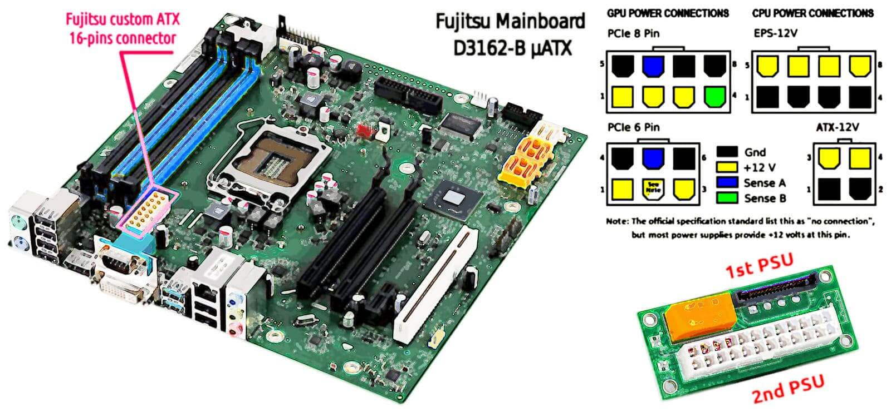

 

## Dual PSU for Fujistsu Esprimo E910

In the previous article I presented the project of adapting a Nvidia Tesla K80 for being used within a PC/Desktop in particular for locally running an AI model.

* [Tesla K80 with Esprimo P910](tesla-k80-with-esprimo-p910.md#?target=_blank)

This paper is going to present the way in which I decided to provide that system with a secondary 350W power supply unit in order to sustain the K80 consumption.

---

### Introduction

Among the main issues one in particular was related to the Fujitsu Esprimo P910 which like many others slim-tower with Zero-Watt technology includes a customised power supply unit which has a single connection to the mainboard with a 16-pin connector and cannot be replaced with any standard ATX PSU also because its own way of being fixed to the case.

Well - *cannot be replaced* - in the sense of a spare part becuase mechanical changes to the case in order to fit a standard PSU supply as well as providing a cable for adpat the standard 20/24-pins ATX connector to the motherboard 16-pin one, is always possible.

However, as you can imagine some mods outcome are way impredictable compared to assembly commercially available parts. In particular when 220V power supply is involved.

---

### The DVD bay

A place in which a secondary PSU can be installed in the Esprimo P910 case is the DVD reader bay, and there are two. I am not going to use that device, hence both available.

Despite this the two bays are separated with a frame that also provide a substantial distancing to the front side unless the PSU would have a size compareble with a DVD reader.

After a search on Internet, I have decided that ATX PSU built for PoS devices which has a standard size of 1U = 1 rack Unit can fit into that area replacing the DVD reader.

---

### Powering up

Once decided where to place the 2nd PSU there are two more task to face:

1. let the two PSUs have the same GND (N-line, ground) to avoid dangerous fluctiations;

2. let the 2nd PSU powering-up the system when the first sees grounded the PSU-ON line.

To solve at once these two issues, I have decided to use an adaptor, specifically designed. Which is a piece of hardware very common.

To be precise, I have found three kind of these adaptors plus their different versions. Two seems very similar and are equally cheap, one have a on/off switch for disabling the secondary PSU when it is not in use. While the third offer a more options and features. In this specific case, the simplest ATX 24-pins with SATA dual connectors is enough.

---

### PSU cabling 

The Nvidia Tesla K80 is quite old and it requires a basic 8-pin CPU male connector to be powered. Unfortunately, the 1U PSU that I have chose has not such connector but the older 4-pin CPU male connector. Fortunately, the 8-pin connectors is nothing else than a power and ground lines duplication compared the 4-pin and an adapting cable is very cheap and easy to buy.

The Fujitsu 250W PSU has the sole connection with the motherboard and everything else is conneted to the motherboard. For this reason is quite improbable that it offers a 4-pin molex connector to join the dual-PSU manager board. For this reason, I chose the version with the SATA connection. Therefore, the common ground will be shared by the motherbord wiring, as well as the PSU-ON signal.

While the Tesla K80 will receive the full powwer from the 2nd PSU by the 4-pin CPU connector converted into an 8-pin CPU male. A very simple and straightforward connetions schema. A sort of anomaly will appear on the external front side of the case. In fact, a standard 3-poles cable will connect the 2nd PSU with the public 220V network.

As soon as I will received the new PSU, I will check for a 90° 3-poles PC plug in order to avoid any stress to the cable and agevolate as much as possible its redirection on the back where the second 3-poles cable powers the 1st PSU, as usual.

---

### Conclusion

This dual PSU configuration should face the proof of the time but this also depends on the choices I did. Instead, the approch in general seems valid because do not imply any particular mod that would be forbid into a common PC shop or PC hardware support center, or reparation. In fact, all these parts are available on different e-market, from different sellers and producers.

Compared with the mods that I have seen shared on Reddit and other similar forum. This is a quite simple, comfortable, standard and safe way to go. Despite this, it is not for everyone because assembly or modify a personal computer hardare configuration requires some skills, and experience. A low entry barrier but still not for everyone.

 

## Share alike

&copy; 2025, **Roberto A. Foglietta** &lt;roberto.foglietta@gmail.com&gt;, [CC BY-NC-ND 4.0](https://creativecommons.org/licenses/by-nc-nd/4.0/)

