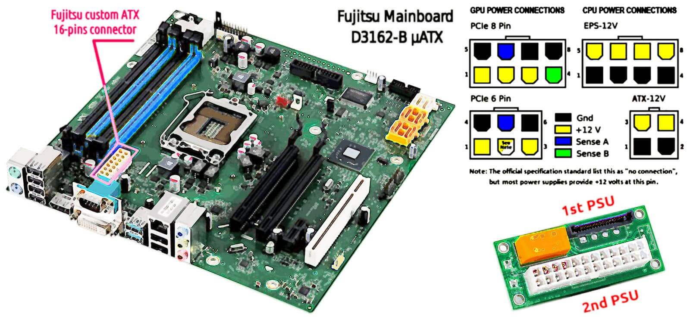
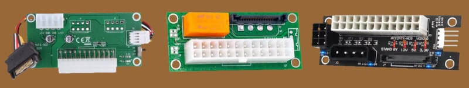
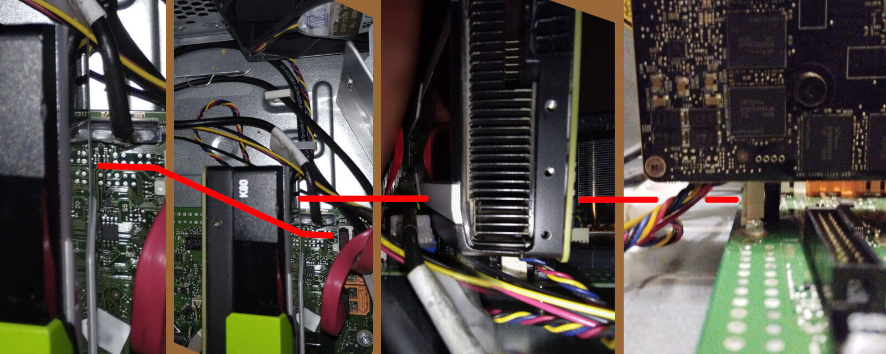
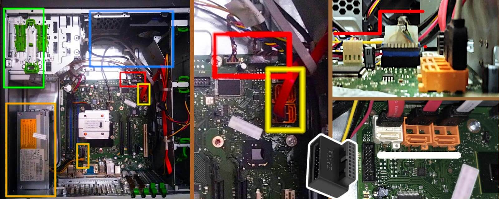
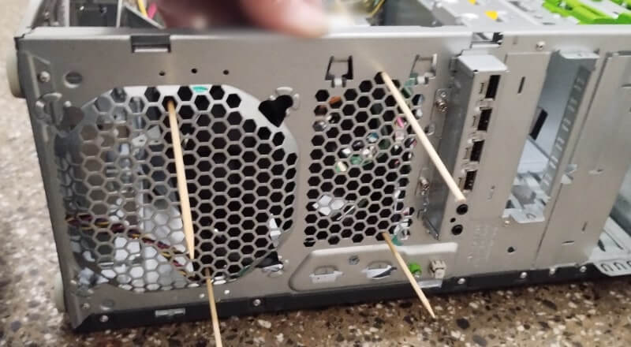
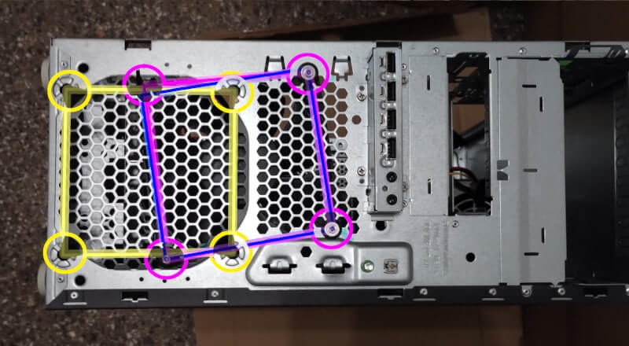

 

## Dual PSU for Fujitsu Esprimo P910

In the previous article I presented the project of adapting a Nvidia Tesla K80 for being used within a PC/Desktop in particular for locally running an AI model.

* [Tesla K80 with Esprimo P910](tesla-k80-with-esprimo-p910.md#?target=_blank) &nbsp; (2025-01-24)

While, this paper is going to present the way in which I decided to provide that system with a secondary 350W power supply unit in order to sustain the K80 consumption.

- The **2nd** edition (since rev. 6) includes the [external sources](#external-sources) session and a more comprehensible English language.

- The **3rd** edition (since rev. 8) includes two new sections about addressing the [P910 issues](#p910-issues) with K80 and its [cooling system](#cooling-the-k80).

- The **4th** edition (since rev. 9) includes two rendering about how the final Tesla K80 installation and the [cooling](#cooling-rendering) air flow is expected will look like 

- The **5th** edition (since rev. 10) includes the [bricolage](#bricolage) image parade and instructions to change the internal cooling system's air-flow.

---

### Introduction

Among the main issues one in particular was related to the Fujitsu Esprimo P910 which like many others slim-tower with Zero-Watt technology includes a customised power supply unit which has a single connection to the mainboard with a 16-pin connector and cannot be replaced with any standard ATX PSU also because its own way of being fixed to the case.

Well - *cannot be replaced* - in the sense of a spare part because mechanical changes to the case in order to fit a standard PSU supply as well as providing a cable for adapting the standard 20/24-pins ATX connector to the motherboard 16-pin one, is always possible.

However, as you can imagine some mods' outcomes are way unpredictable compared to assembly of commercially available parts. In particular when 220V power supply is involved.

---

### The DVD bay

A place in which a secondary PSU can be installed in the Esprimo P910 case is the DVD reader bay, and there are two. I am not going to use that device, hence both are available.

Despite this the two bays are separated with a frame that also provides a substantial distancing to the front side unless the PSU would have a size comparable with a DVD reader.

After a search on the Internet, I have found that an ATX PSU built for PoS devices which has a standard size of 1U = 1 rack Unit can fit into that area replacing the DVD reader.

---

### Powering up

Once decided where to place the 2nd PSU there are two more task to face:

1. make sure the two PSUs share the same ground line to avoid dangerous voltage fluctuations;

2. switch on the 2nd PSU when the PWR button is pressed and the 1st PSU sees grounded the PSU-ON line

To solve these two issues at once, I have decided to use an adaptor, specifically designed for dealing with a dual-PSU configuration. Which is a quite common piece of hardware.

To be precise, I have found three kinds of these adaptors plus their different versions.

 

Two seem very similar and are equally cheap, one has an on/off switch for disabling the secondary PSU when it is not in use. While the third offers more options and features. 

In this specific case, the simplest ATX 24-pins with SATA dual connectors is enough, but I choose the one with the on/off switch which has the SATA female attached to a 4-pins connector.

---

### PSU cabling 

The Nvidia Tesla K80 is quite old and it requires a basic 8-pin CPU male connector to be powered. Unfortunately, the 1U PSU that I have chosen has no such connector but the older 4-pin CPU male connector.

Fortunately, the 8-pin connector is nothing else than a power and ground lines duplication compared to the 4-pin and an adapting cable is very cheap and easy to buy.

The Fujitsu 250W PSU has the sole connection with the motherboard and everything else is connected to the motherboard and it does not offer a 4-pin molex connector to join the dual-PSU manager board.

For this reason, regarding the dual-PSU sync board, I chose the version with the SATA connection. Therefore, the common ground will be shared by the motherboard wiring, as well as the PSU-ON signal. While the Tesla K80 will receive the full power from the 2nd PSU by the 4-pin CPU connector converted into an 8-pin CPU male.

A very simple and straightforward connections schema for which the 220V socket will appear on the external front side of the case: a standard 3-poles cable will connect the 2nd PSU with the public 220V network.

Soon, I will check for a 90° 3-poles PC plug in order to avoid any stress to the cable and facilitate as much as possible its redirection on the back where the second 3-poles cable powers the 1st PSU, as usual.

---

### P910 issues

The first problem in installing the Nvidia Tesla K80 into a Fujitsu Esprimo P910 is related to the high of the USB 3.0 male connector which prevents the GPU card to be installed into the only PCI express 3.0 x16 because the one near the CPU is mechanically a x16 long but it is a PCIe 2.0 x4.

 right click menu to enlarge the image in a new tab

Fortunately, I have found an adapter that turns the USB 3.0 20-pins connector by 90° within 15mm above the motherboard surface which is the altitude of the cooler fan 12 cm connector which did not prevent the Tesla K80 to be temporarily installed into the first PCIe slot. Wrong, but an useful try,

While, in this image the interior of a Fujitsu Esprimo P910 E85+ is shown with the troubling areas highlighted in different colors.

 right click menu to enlarge the image in a new tab

The colors chosen do not indicate the seriousness or the importance of the problem. Here below the list of the areas and their relevance.

- The yellow area is about the SATA cabling which is better to move into the SATA slots near the edge of the motherboard to free as much space as possible for the K80.

- The orange area is about the Fujitsu customised power supply and in green the DVD ROM reader bay in which it will be installed the secondary 1U rack PSU for supporting the K80.

- The red area is about the USB 3.0 connector which is used to export 2x USB 3.0 in the front size of the case. The P910 has 2x USB 3.0 ports exposed in the backside also.

Considering that 2x USB 2.0 ports remain available on the front, and 2x USB 3.0 in the back, we might have sacrificed the other 2x USB 3.0 but it is not so simple.

---

### Cooling the K80

Giving the USB 3.0 connector a proper altitude like the cooler FAN power connector has - which is 15 mm - allows the K80 to sit on top of that 90° flat adapter. This will stabilise the K80 and we can use it as anchor for grip of the K80 with a long, self-locking knurled plastic strip. Which will be also useful to create a link with the internal front side of the case to install a fan deflector. Because, as soon as the Tesla K80 will have passed the basic tests, it will be necessary to provide it enough cooling to work at its factory TDP.

- The blue area shows the cooling 12 cm fan and a metal deflector which splits the air flow in two halves.

The splitter is a wise way to keep ventilated both the internal of the case and the sata hard-disk rack that is available at the bottom of the case in three bays. A lot of space for potentially a lot of data storage that make this tower a candidate for an advanced NAS for local caching - hybrid cloud - the daily data of a middle-size office without clogging the internet connection during the working hours.

Installing a 300W TDP GPU in that case in which two PSU and a CPU with a passive cooling system are installed, it is not a good idea to fulfil that space of storage units. Instead, considering that as higher is the working temperature as shortre the SSD/HDD life average time is, the best is to dedicate this tower for computational purposes and leverage ethernet and USB 3.0 for exchange data in packets or in large chunks.

For this reason, I will soon evaluate to move the fan toward the center of the case, and closing the splitter, redirecting the bottom half of the air flow into the Tesla 80, while the top bottom of the air flow will remain available for cooling the CPU and better support the dual-PSU venting system, each one by its own fan.

 right click menu to enlarge the image in a new tab

This image shows two renderings about how the final Tesla K80 installation would look and how it is expected the internal cooling system will manage the airflow.

---

### Bricolage

In order to replace the cooling fan, I decided to use four skewer woodsticks to find the suitable holes to use to fix the fan.

 

The best position that I found matches three holes almost perfectly and the fourth not precisely enough. I think that with a proper set of rubber spacers all the four holes are suitable for fixing the fan with screws.

 

The yellow square is the original fixing place, while the blue is the original but translated and rotated accordingly with the holes found and the purple is the actual positioning.

As you can see the difference is sensitive in just one hole and noticing that the purple square has been skewed, it means that the fan is not perfectly planar with the case because the distancing was changed and properly compensated.

However, I fixed that hole with two auto-gripping plastic strips plus I inserted a skewer wood-stick, fixed it with heat shrink tubing and used it to position the new air flow deflector. Which has been made of cardboard, packing tape and electrical tape.

 right click menu to enlarge the image in a new tab

These two photos show the actual result and we can compare them with the two renderings on which the modification has been planned. In the image, the light blue lines indicate, starting from the left: the line at the center of the 12 cm fan, the new deflector air-flow direction and the original deflector air-flow direction.

#### New deflector

The new deflector is quite simple: a plane bent at 45° c.a. which pushes on the corner of the case and leans on the passing-by-the-fan wood-stick by a horizontal cut. Another wood-stick is embedded vertically on the bended edge that matches and gets stuck behind the original air-flow deflector. The vertical wood-stick keeps the new deflector steady and rigidly vertical while a 90° bent side pushing against the case corner provides the second steady vertical line.

Is that a professional piece of hand-work? Obviously not.

However, it is a pretty good try to start with designing a 3D printable additional air-flow. Until, we consider the cost and the labour related to 3D printing. Including that PLA is more flammable than cardboard and wood-sticks. That it has a higher energy density to sustain a fire. Then, we may agree that once properly covered by insulating silver strong-duct tape, the cardboard deflector would look much more professional.

---

### Conclusion

Yet, this dual-PSU configuration has to face the proof of the time but this also depends on the choices I made.Instead, the approach in general seems valid because it does not imply any particular mod that would be forbidden into a common PC shop or PC hardware support center, or reparation.

In fact, it is a matter of just assembling some spare parts and all these parts are available on different e-market, from different sellers and producers.

Making a comparison - with the mods that I have seen shared on Reddit and other similar forums, but some are 4 years old - this is a quite simple, comfortable, standard and safe way to go. Despite this, it is not for everyone because assembly or modification of a personal computer hardware configuration requires manual dexterity to use tools, and a little experience.

In short this project has a low entry barrier but still not for everyone.

 

## External sources

In the first  link there is a practical example using the `nvidia-smi` command to cap the maximum power consumption in order to prevent overheating problems

* [Running a Nvidia Tesla K80 at home](https://blog.thomasjungblut.com/random/running-tesla-k80) &nbsp; (2021-05-26)

* [Using an Nvidia Tesla K80 for gaming](https://www.reddit.com/r/pcmods/comments/nhfwh7/guide_using_an_nvidia_tesla_k80_datacenter_gpu) &nbsp; (2021-05-20)

* [Kepler overclock, how to tweak the BIOS](https://linustechtips.com/topic/1058561-simple-tutorial-ish-for-kepler-and-probably-maxwell-ii-bios-tweaker) &nbsp; (2019-04-19)

at the opposite, in the last link there is the opposite: how to increase the voltage and the working frequency in order to squeeze all its computation power.

 

## Share alike

&copy; 2025, **Roberto A. Foglietta** &lt;roberto.foglietta@gmail.com&gt;, [CC BY-NC-ND 4.0](https://creativecommons.org/licenses/by-nc-nd/4.0/)

