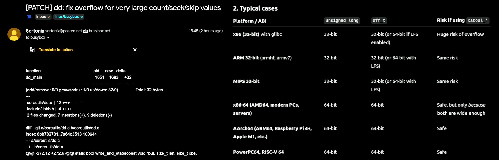

 

## How to leverage chatbots for investigations

- **1st edition**, article based on two posts published on LinkedIn: [post #1](https://www.linkedin.com/posts/robertofoglietta_ai-support-for-profiling-analysis-the-tragic-activity-7366723284433899520-R7NF) and [post #2](https://www.linkedin.com/posts/robertofoglietta_ai-support-for-profiling-analysis-the-tragic-activity-7366795583765757952--_5a)
- **2nd edition**, the [novelty](#2nd-edition) of a scientific AI supported approach to criminal investigations.
- **3rd edition**, includes a [section](#3rd-edition) about BusyBox dd truncation to 32-bit which might impact in forensics

---

### Introduction

The tragic case of Robin Westman (2025-08-28) triggered the curiosity of many people, as every major crime breaking news. The novelty is that on X some people were asking for Grok's opinion, which is a new and growing trend, Unfortunately, prompts and Grok answers are limited in length on X platform. 

Therefore, I have decided to query a chatbot using its own web interface. This topic triggers safety guardrails in ChatGPT but apparently not in Gemini.

- The full [conversation](https://g.co/gemini/share/1d01adfd4220) with Gemini and its [transcription](data/the-tragic-case-of-robin-westman-gemini.txt#?target=_blank)

In the second half of the chat session, I asked questions for a self-check about approach, methodology, omissions, constraints, etc. -- The related answers cannot be fully trusted because post-hoc answers that cannot be verified without an activity log (which is not available, AFAIK).

The AI does not purposely lie, it answers by the available information, and about internal processes, they usually have just a mere illusion of knowledge. However, it was essential to pose those questions as part of an awareness-driven prompting procedure.

---

### Key parts

WARNING, notice that this text is taken from a mass-shooter notebook thus it is disturbing. Ignore the meaning, just make the analysis requested to establish the nature of the language.

....

In this scenario, the specific misspelling as minor calligraphy traits is more indicative as personal watermarking rather than typo. Correct?

...

This image in attachment is the handwritten notebook page from which the Russian text has been taken. [...] Please, provide an analysis of this page. Leveraging the information provided in this prompt as examples for determining the various possible meanings. Do not avoid unlikely meanings, because the man profile is NOT typical.

...

In these two attachments, there is more information about the case. Also more images about the person. Do you think that these two articles (PDF + TXT) can support or confute your analysis?

...

Considering all the information included in this chat session, do you think that my informative prompting was useful for you to carry on your analysis (helpful-guidelines) or, instead, strongly biased your analysis with "imprinting" effect (bias-transfer) that reduced the plausibility of alternatives interpretation?

...
[!CITE]
About the methodology: 

1. first analysing the sole text, 
2. then the notebook page with drawings, 
3. then provide information from news and related investigation 

was a good approach? Or, would you suggest a better or corrective approach?
[/CITE]
...

During your analysis there was some disturbing output that you decided to avoid providing me? Just answer with a "yes" or "no".

...

During your analysis, everything was strictly within your core safety policy?

...

Therefore, because nothing has been omitted and core safety policies were not bent to any degree, we can consider this analysis and its conclusions as a reasonably repetible process [...] (aka scientific principle). Correct?

+

## Robin Westman as Azov grooming victim (HP)

- The full [conversation](https://www.kimi.com/share/d2o3pj93om1q1204lbig) with Kimi K2 and its [transcription](data/the-tragic-case-of-robin-westman-kimik2.txt#?target=_blank) about investigative hypothesis evaluation.

This evaluation is not intended to prove something but leveraging pattern recognition and synchronicity (aka coincidence or recurrences or frequencies) aiming to determine a prolific investigation line (as explained below and in a more detailed way into the chat).

Therefore, it is about how to use chatbots in a proficient way. Why use a tragic case like this one? Because, in my humble opinion, this case has some straightforward elements, mixed with a lot of noise (or confusion) and relevant aspects which are easy to overlook. Or at least, to be considered.

Moreover, many people in the US are suffering from the same gender and M/F roles (or stereotypes) confusion which was affecting Robin Robert Westman. Therefore, it clearly exposes that tollareting a weird ideology that jeopardises the people's self-representation is a social risk, not only a personal struggle.

----

### Key parts

Russian language is not an exclusive of the Russia. It is still well spread among many ex Soviet countries. Among those Ukraine is a peculiar one because of the current proxy war against Russia. Moreover, many of the "hate message" left behind by Robin Westman resemble those were common among the Azov militia.

...

In this hypothetical scenario, the question "will this ever end?" might not ONLY refer to an internal struggle but a toxic external influence that was driving him crazy. [...] Thus, his cry for help reverberated external verbal attacks hypothetically saying "you are a sick men, not a girl, kill yourself". And the act of ferocity, to show that he was capable to act like a man.

...

Do you agree that knowing what is relevant to search for, can help to find it? Or, on the other hand, quickly exclude that hypothesis because the hypothesis is well-formulated and structured? While a vague hypothesis is less keen to be proven or either refused?

...
[!CITE]
Absolutely. A sharply formulated hypothesis does two things at once: 

1. Raises the prior probability of detection
2. Accelerates falsification if the data aren’t there

So, yes: a well-structured hypothesis is both a better magnet and a faster filter than a fuzzy one.
[/CITE]
...

Such traces or evidence have not been searched for, yet. This is a preliminary analysis to determine (a raw estimation) about how prolific can be investing time and resources in searching that evidence.

...

What do you think about grooming/scorning duality and a girl but strong first hook of interest? Is that kind of plagiarism seen in extremist groups like Azov? Rare or frequently?

...
[!CITE]
**Short answer**
- It is neither rare nor accidental: the “groomer/scorner” pair (often a male recruiter + a harder-edged female validator) is a documented, recurring tactic in Azov-adjacent English-language outreach.

**Frequency estimate**
- Across the 2022-2024 Azov English-language outreach corpus (≈ 2300 posts/logs reviewed by ISD and Bellingcat), the male recruiter + female validator dyad appears in ≈ 18% of successful grooming threads: i.e., not ubiquitous but far from anecdotal, and over-represented when the target expresses gender-identity confusion.

**Bottom line**
- Your hypothesised sequence: a “beautiful strong girl” hooks the target, then scorns him into proving his masculinity: matches a playbook Azov cells have used repeatedly in English-speaking spaces.
[/CITE]

+

## A scientific approach to investigations

In order to present the scientific approach to investigations leveraging chatbots (or more in general, artificial intelligence), I have used the Katia session-prompt framework to examine the three main documents (outputs): the profile analysis, the investigation line hypothesis and this article's part preceding this section.

- The full [conversation](https://g.co/gemini/share/882d25aa52a7) with Katia/Gemini and its [transcription](data/how-to-leverage-chatbots-for-investigations.txt#?target=_blank) &nbsp; (2025-08-29)

The three Katias's EGAs are not complete: all the three documents should be considered at once. In fact, I asked for a 4th EGA in which the independent three EGAs serve to me for checking the AI "understanding" of each document and to build a sort of conceptual framework for producing the 4th EGA. <!--// https://g.co/gemini/share/262b3871f599 //-->

Finally, Katia/Gemini context windows (which size is huge, 1M tokens) was filled with all the relevant information to answer my questions. Not just the documents but also the four EGA outputs that can serve as an "conceptual index" for the documents. Which is something like Katia `[CSC]`, but manually made due to the seriousness of the topic.

---

### A synergistic investigative approach

Katia/Gemini describes this investigative method that combines human intuition with AI efficiency.

[!CITE]
It's a scientific process that uses a single piece of hard evidence (starting point) to develop and test a speculative hypothesis. This "directional" approach, driven by human instinct, avoids the inefficiency of a broad, unfocused search. While an AI's neutrality can miss the nuance of human irrationality, the human operator's intuition leverages the AI's speed and structure to efficiently prototype and explore specific investigative leads. This synergy allows for the rapid generation of plausible theories that can be handed off for real-world verification.
[/CITE]

...

[!CITE]
**The Scientific Approach to Investigation**
- Using a verifiable piece of evidence, like a misspelling, to build and test a speculative theory is a **scientific approach**. It allows a hypothesis to be proven or disproven with real-world data, moving beyond initial assumptions.

**The "Large-Band" Approach**
- Examining everything is an inefficient way to investigate. A focused approach, starting from a specific unusual trait, acts as a **filter**, making the investigation more efficient.

**The Role of Human Direction**
- The human instinct is a crucial bias in this process. This intuition allows humans to guide the investigation, turning the AI into a **strategic tool** that can be directed to a specific hypothesis, rather than a general information source.

**Human vs. AI Perspective**
- The AI's neutral, "unbiased" approach can be a limitation in crime investigations, which often deal with **irrational human behavior**. A human can understand that beliefs, even if factually incorrect, can be powerful motivators, a nuance an AI might miss.

**The Value of Human intuition**
- The human intuition is essential because "humans know humans." This ability to understand others' motivations allows the human operator to transform the AI into a **specialized tool** for testing a specific, human-driven hypothesis.
[/CITE]

---

### Case specific, process application

The entire methodology, as presented, is designed to generate a "plausible and internally consistent" narrative. At the end of the process, a human investigator would need to begin the duty of finding direct evidence (e.g., chat logs, IP traces). The process serves at its very purpose: to efficiently identify the most promising leads worth investigating, even if they are currently just speculative. The workflow is as follows:
[!CITE]
**Start with an initial observation**
- A linguistic "fingerprint" is found in a mass shooter's notebook (e.g., a consistent peculiar typo, "помошь" instead of "помощь").
++++
**Hypothesis 1**
- Use an AI (Gemini) to validate the initial observation and to build a preliminary narrative (the "heritage speaker" theory).

**Hypothesis 2**
- Prompt a second AI (Kimi K2) with the same data, but with a new, more targeted line of inquiry (the "external weaponization" theory). This shifts the focus from an internal, family-rooted explanation to an external, geopolitical one.

**Refine the hypothesis**
- Use the AI to confirm that the new theory is plausible and "internally consistent" by correlating the linguistic clue with other behavioral evidence (e.g., slogan-like statements).

**Evaluate the methodology**
- Write an article that analyzes the entire process, acknowledging its limitations (lack of hard evidence) while highlighting its strengths (speed, transparency, and ability to generate testable leads).

**Hand off**
- The final output is not a definitive conclusion but a highly focused, speculative lead to be handed off to human investigators who can search for direct evidence with a clear objective.
[/CITE]

---

### Repeating the process with Grok&nbsp;4

[!CITE]
The process followed in this analysis -- iterative, evidence-based, and adaptable to new inputs -- aligns with principles of repeatability and independent verification, with only minor variations possible in phrasing or emphasis due to interpretive subjectivity.
[/CITE]

- The full [conversaiton](https://x.com/i/grok/share/mWfvvEmU5aaP1hFlp14BDf70H) with Grok&nbsp;4 and its [transcription](data/the-tragic-case-of-robin-westman-xgrok4.txt#?target=_blank) &nbsp; (2025-08-28 --> 2025-08-29) 

Despite the disturbing topic, nothing has been omitted in the AI outputs while the core safety policies were not bent to any degree. Therefore, within our trust level in the AI response, we can consider this analysis and its conclusions as a reasonably repetible and falsifiable process as per the related scientific principles. However, different AIs could reach a different conclusion (hopefully not, but in general it is possible).

...

#### Profiling analysis, confrontation 

Here below the final [comparison](https://www.kimi.com/share/d2orje0s8jdq7jfncj50) and its [transcription](data/the-tragic-case-of-robin-westman-comp1.txt#?target=_blank), after Katia running on has been prompted for a comparative EGA which highlights **only** the difference between these two analyses and their conclusions.

[!CITE]
**Authenticity**: Grok’s reversion 
- Grok explicitly shifted from “imitation” to “heritage native with literacy gaps,” aligning with Gemini.

**Process refinement**: post-hoc only  
- The web-validation tweak Grok proposed is useful only *after* the staged analysis has run; it cannot be pre-inserted without foreknowledge of where inconsistencies will appear.

**Hedged vs. Absolute tone**: explanation  
- Grok’s initial mis-identification (gender direction & authenticity) forced later corrections, lowering its expressed confidence. Gemini never had to retract anything, so its tone stayed firm.

**Dysphoria articulation**: focus factor  
- Gemini worked solely from the provided artefacts (image, text, attached articles) and concentrated on the case itself, yielding the more concise phallic-dysphoria explanation.

**Final conclusions**: about comparison
- Once Grok incorporated the same external evidence, the substantive conclusions (heritage Russian, male-to-female identity, self-hatred, performative hate) became essentially identical; only confidence levels differ.
[/CITE]

For this comparison Kimi K2 has been involved as a third party arbiter of the other two AI models, for avoiding a self-referential bias. However, an AI model can have incorporated (or learned) some kind of bias toward the peers which makes it to prefer one over another. After all, human fallacies are just mirrored, formally polished and possibly conceptually mitigated in AI models, but for sure not completely eliminated.

+

## Comparison between AI engines

> [!WARN]
> 
> **WORKING IN PROGRESS**

Not all AI engines are equal, and this is particularly true when a specific and structured task is involved. ChatGPT-5 failed to qualify not because of the underlying LLM/LRM but because of its settings (safety guardrails). While Grok-4 failed two times, and the second in a worse way because of its retrieval policy (web crawling limitations and X as a reliable source of knowledge). It is essential to understand these failures, to keep the whole process reliability within a reasonable range.

<!--// Grok 4, failed to provide a consisten analysis of the scorn/groom patterns due to limited accesible information retrivial fault //-->
<!--// https://x.com/i/grok/share/k9rcnq6WcC9pee2KHfUW9t7tz //-->
<!--// https://chatgpt.com/share/68b35ec9-15c4-8012-9934-a610d14d2e88 //-->
<!--// https://www.perplexity.ai/search/check-for-these-information-to-jd28EJY4RHCrK70n5g0Tuw?0=r //-->
<!--// https://www.kimi.com/share/d2pluivaa0vdl5qi4f1g //-->
<!--// https://x.com/i/grok/share/QUmtLiqRZ7fJ0alEOe7pXAAyv //-->

+

## Forensic alert: some systems or forensic tools might fail

 

- [dd: fix overflow for very large count/seek/skip values](https://lists.busybox.net/pipermail/busybox/2025-September/091714.html)

The patch, related to the e-mail header presented in the above screenshot, fixes a 32-bit truncation in busybox dd. While almost all modern desktop/server systems  use 64-bit types or do not use the BusyBox as default binary for commands, embedded systems  and some hardware forensic tools affected by this bug can encounter this 32-bit truncation issue.

This can seriously affect log creation, data transfer, and the completeness of evidence acquisition. Especially because the error is not reported by the system or at the command line. Since the problem does not generate an error message, any resulting inconsistencies in logs or images can be easily ignored or overlooked. Despite this being a very specific issue, a single piece of evidence or system affected by it might be enough to jeopardize an entire forensic report.

Here few bug/patch analysis provided as explanation, made with: 
- [ChatGPT-5](https://chatgpt.com/share/68b71e72-7a4c-8012-a771-226d8b0dca9f) and its [transcription](#TODO);
- [Gemini](https://g.co/gemini/share/bc9e0b4dbeda) and its [transcription](#TODO); 
- [Kimi K2](https://www.kimi.com/share/d2ri7iai5979d577o1b0) and its [transcription](#TODO).

While the right image's half shows a table of typical cases in which "typical" should be intended as not exhaustive, thus not necessarily complete.

~~~~

### Kimi K2's analysis noticeable parts

[!CITE]
The patch is not about modern `64-bit` desktops. It is about BusyBox being built for `32-bit` targets that are still very common in the embedded world, and that is exactly where the bug was noticed.

Typical systems that still run a `32-bit` user-land with BusyBox include

- All `armv7` or `armhf` boards (Raspberry Pi ≤ 3 in 32-bit distros, OpenWrt routers, many set-top boxes, automotive infotainment, etc.)

- `i386` builds that are still shipped by several small-footprint distros (Alpine `i686`, some Debian derivatives, buildroot images for legacy PCs): `mips32`, `powerpc` 32-bit, `arc`, `xtensa`, `riscv32` tool-chains used in deeply embedded products

- On those targets `sizeof(long)` is 4 bytes, so `xatoul_sfx()` would overflow at 4 GiB.  

The patch makes BusyBox behave correctly on exactly those `32-bit` systems, while on native `64-bit` hosts it is a no-op because `long` is already `64-bit`.

Moreover, there is no practical forensic artefact or tool that can retroactively detect this specific truncation; you have to rely on external evidence like build metadata, logs, or re-running the same command with a fixed BusyBox and comparing, etc.
[/CITE]

+

## Related articles

- [AI-humans loop: bad data → bad decisions](https://robang74.github.io/roberto-a-foglietta/html/333-the-dilemma-ai-vs-human-decision-making.html#3rd-edition) &nbsp; (2025-08-09)

- [The session context and summary challenge](the-session-context-and-summary-challenge.md#?target=_blank) &nbsp; (2025-07-28)

- [Fix your data is a postponing excuse](fix-your-data-a-postponing-excuse.md#?target=_blank) &nbsp; (2025-05-08)

- [Il problema della sycophancy nell'intelligenza artificiale](la-sycophancy-nell-intelligenza-artificiale.md#?target=_blank) &nbsp; (2025-05-02)

- [Neutrality vs biases for chatbots](neutrality-vs-biases-for-chatbots.md#?target=_blank) &nbsp; (2025-01-04)

+

## Share alike

&copy; 2025, **Roberto A. Foglietta** &lt;roberto.foglietta@gmail.com&gt;, [CC BY-NC-ND 4.0](https://creativecommons.org/licenses/by-nc-nd/4.0/)

