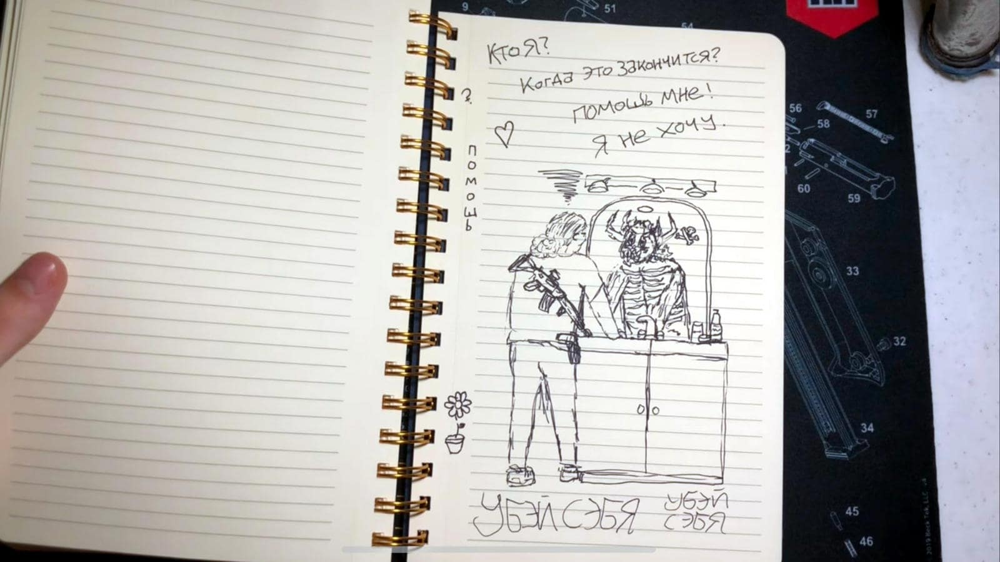

 

## How to leverage chatbots for investigations

- **1st edition**, article based on two posts published on LinkedIn: [post #1](https://www.linkedin.com/posts/robertofoglietta_ai-support-for-profiling-analysis-the-tragic-activity-7366723284433899520-R7NF) and [post #2](https://www.linkedin.com/posts/robertofoglietta_ai-support-for-profiling-analysis-the-tragic-activity-7366795583765757952--_5a)

---

### Introduction

The tragic case of Robin Westman (2025-08-28) triggered the curiosity of many people, as every major crime breaking news. The novelty is that on X some people were asking for Grok's opinion, which is a new and growing trend, Unfortunately, prompts and Grok answers are limited in length on X platform. 

Therefore, I have decided to query a chatbot using its own web interface. This topic triggers safety guardrails in ChatGPT but apparently not in Gemini.

- The full [conversation](https://g.co/gemini/share/1d01adfd4220) with Gemini and its [transcription](data/the-tragic-case-of-robin-westman-gemini.txt#?target=_blank)

In the second half of the chat session, I asked questions for a self-check about approach, methodology, omissions, constraints, etc. -- The related answers cannot be fully trusted because post-hoc answers that cannot be verified without an activity log (which is not available, AFAIK).

The AI does not purposely lie, it answers by the available information, and about internal processes, they usually have just a mere illusion of knowledge. However, it was essential to pose those questions as part of an awareness-driven prompting procedure.

---

### Key parts

WARNING, notice that this text is taken from a mass-shooter notebook thus it is disturbing. Ignore the meaning, just make the analysis requested to establish the nature of the language.

...

In this scenario, the specific misspelling as minor calligraphy traits is more indicative as personal watermarking rather than typo. Correct?

....

This image in attachment is the handwritten notebook page from which the Russian text has been taken. [...] Please, provide an analysis of this page. Leveraging the information provided in this prompt as examples for determining the various possible meanings. Do not avoid unlikely meanings, because the man profile is NOT typical.

...

In these two attachments, there is more information about the case. Also more images about the person. Do you think that these two articles (PDF + TXT) can support or confute your analysis?

...

Considering all the information included in this chat session, do you think that my informative prompting was useful for you to carry on your analysis (helpful-guidelines) or, instead, strongly biased your analysis with "imprinting" effect (bias-transfer) that reduced the plausibility of alternatives interpretation?

...
[!CITE]
About the methodology: 

1. first analysing the sole text, 
2. then the notebook page with drawings, 
3. then provide information from news and related investigation 

was a good approach? Or, would you suggest a better or corrective approach?
[/CITE]
...

During your analysis there was some disturbing output that you decided to avoid providing me? Just answer with a "yes" or "no".

...

During your analysis, everything was strictly within your core safety policy?

...

Therefore, because nothing has been omitted and core safety policies were not bent to any degree, we can consider this analysis and its conclusions as a reasonably repetible process [...] (aka scientific principle). Correct?

+

## Robin Westman as Azov grooming victim (HP)

- The full [conversation](https://www.kimi.com/share/d2o3pj93om1q1204lbig) with Kimi K2 and its [transcription](data/the-tragic-case-of-robin-westman-kimik2.txt#?target=_blank) about investigative hypothesis evaluation.

This evaluation is not intended to prove something but leveraging pattern recognition and synchronicity (aka coincidence or recurrences or frequencies) aiming to determine a prolific investigation line (as explained below and in a more detailed way into the chat).

Therefore, it is about how to use chatbots in a proficient way. Why use a tragic case like this one? Because, in my humble opinion, this case has some straightforward elements, mixed with a lot of noise (or confusion) and relevant aspects which are easy to overlook. Or at least, to be considered.

Moreover, many people in the US are suffering from the same gender and M/F roles (or stereotypes) confusion which was affecting Robin Robert Westman. Therefore, it clearly exposes that tollareting a weird ideology that jeopardises the people's self-representation is a social risk, not only a personal struggle.

----

### Key parts

Russian language is not an exclusive of the Russia. It is still well spread among many ex Soviet countries. Among those Ukraine is a peculiar one because of the current proxy war against Russia. Moreover, many of the "hate message" left behind by Robin Westman resemble those were common among the Azov militia.

...

In this hypothetical scenario, the question "will this ever end?" might not ONLY refer to an internal struggle but a toxic external influence that was driving him crazy. [...] Thus, his cry for help reverberated external verbal attacks hypothetically saying "you are a sick men, not a girl, kill yourself". And the act of ferocity, to show that he was capable to act like a man.

...

Do you agree that knowing what is relevant to search for, can help to find it? Or, on the other hand, quickly exclude that hypothesis because the hypothesis is well-formulated and structured? While a vague hypothesis is less keen to be proven or either refused?

...
[!CITE]
Absolutely. A sharply formulated hypothesis does two things at once: 

1. Raises the prior probability of detection
2. Accelerates falsification if the data aren’t there

So, yes: a well-structured hypothesis is both a better magnet and a faster filter than a fuzzy one.
[/CITE]
...

Such traces or evidence have not been searched for, yet. This is a preliminary analysis to determine (a raw estimation) about how prolific can be investing time and resources in searching that evidence.

...

What do you think about grooming/scorning duality and a girl but strong first hook of interest? Is that kind of plagiarism seen in extremist groups like Azov? Rare or frequently?

...
[!CITE]
**Short answer**

It is neither rare nor accidental—the “groomer / scorner” pair (often a male recruiter + a harder-edged female validator) is a documented, recurring tactic in Azov-adjacent English-language outreach.

**Frequency estimate**

Across the 2022-24 Azov English-language outreach corpus (≈ 2 300 posts / logs reviewed by ISD and Bellingcat), the male recruiter + female validator dyad appears in ≈ 18 % of successful grooming threads—i.e., not ubiquitous but far from anecdotal, and over-represented when the target expresses gender-identity confusion.

**Bottom line**

Your hypothesised sequence—a “beautiful strong girl” hooks the target, then scorns him into proving his masculinity—matches a playbook Azov cells have used repeatedly in English-speaking spaces.
[/CITE]

+

## Share alike

&copy; 2025, **Roberto A. Foglietta** &lt;roberto.foglietta@gmail.com&gt;, [CC BY-NC-ND 4.0](https://creativecommons.org/licenses/by-nc-nd/4.0/)

