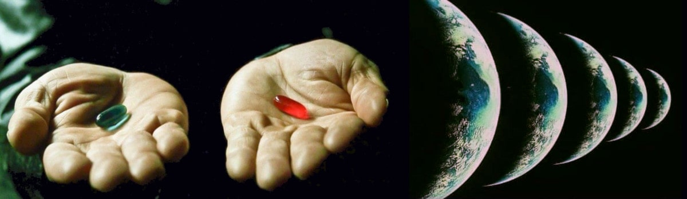
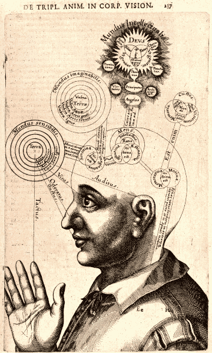

 

## Is free-will an illusion or a kind of magic?

- This article is written starting from a [post](https://www.linkedin.com/posts/robertofoglietta_reasoning-by-absurd-we-find-out-there-was-activity-7338603657879302146-A9Ei) that I have published on Linkedin on the same day.

- **2nd** edition includes an explanation about why phisicists speculate and debate on interpretation of their theories. Spoiler: they are humans! Hence, how well the AI can play with this kind speculations?

- **3rd** edition includes a thought-provoking post published on LinkedIn and Facebook.

---

### Does free-will exist for real?

What's about being just an illusion of choosing, instead? Let me explain.

[!CITE]
**HP** -- According to quantum physics, every time you have 2 options and you decide to choose to go with one of them, the universe splits into two parts, where you choose the other option in another universe.
[/CITE]

Considering the above hypothesis, and reasoning by absurd:

- If we have free will, then HP is real.
- Because HP is absurd, then we have no free-will.
- Therefore every choice is just an illusion.

#### Please, prove me wrong! 

Read about asking it to ChatGPT, and ignite a debate, just for fun.

- [ChatGPT about free-will](https://chatgpt.com/share/6849aedd-1850-8012-9db4-842f5df77bcf) &nbsp; (read the prompts, first)
- ChatGPT about free-will,&nbsp; chat [transcription](data/is-free-will-an-illusion-or-a-kind-of-magic-chatgpt.txt#?target=_blank) in 80 cols UTF-8 text.

At the ending of conversation (prompts at rows: 1522, 1621, 1705, 1809), I have proposed to ChatGPT evaluate  the first two sections of [WWZ simply explained, for dummies](https://robang74.github.io/roberto-a-foglietta/html/321-wwz-simply-explained-for-dummies.html) within the philosophical framework that it has been explained during the conversation.

...

For exercise, try to repeat the chat but characterising the session with the [SoNia](data/sonia-argumentative-with-rag-v3.txt#?target=_blank) (v3.5.3, at the time of writing) which is 2nd level argumentative session prompt, as explained [here](ai-session-prompts-with-rag-v3.md#?target=_blank).

Please, share and let me know the outcome, if any different, apart from the way in which the chatbot sustains the debate. This can be an example of free-will (different characters) who are facing the same challenge and inevitably end up to the same conclusion. If you like, challenge others chatbots, as well.

+

## Why physicists speculate?

Why do physicists get bogged down in interpretations? Because they are aware that a specific formulation, and even Maths as whole, is just **one** of the possible way to model how the real-world is working. I wish to stress about this point: a formulation, in this case QCD, that is a human **description** of reality. Actually, the most widely accepted **but** not necessarily fully correct.

Maths is wonderful but like every human-made tool, it has its own limitations. While Maths as a general and abstract concept might have no limitations, but **again** the human formulation of the Maths **has** its own limitations. Moreover, a formula is a formalisation of **one** description of reality. Stressing out on the word **description** is essential to not fall into the fallacy of confusing the map with the territory.

For example, `F=ma` is not a law of nature but a law of physics and in particular of classical mechanics. How can we interpret `F=ma` with `c=const` (speed of light) as maximum velocity? Noticing that v/t or dx/t² has a singularity in zero which is not compatible with a=limit. Hence m is the sum of the inertial mass and m(v²/c²) allowing an arbitrary great energy transfer in an arbitrary small time (a->oo) be converted in mass, instead speed.

In trying to speculate about its meaning, we are seeking inspiration for another formulation that can equally or even better achieve the same goal: predictions. Without predictions, a model cannot be falsified and without falsification is not science in the stricts terms defined by Karl Popper.

For all these reasons, speculations and interpretations are nice that exist and like every other human activity, made with a correct and honest method is a valuable exercise. Because those speculations remind us that what we are dealing with is just a **description** of reality. Like Schrodinger's cat paradox or the Fermi's paradox are suggesting.

+

## Il libero arbitrio esiste veramente?

...
>>>|
`Forse il libero arbitrio esiste` 
`però il suo esercizio è limitato` 
`solamente alle scelte stupide!` 
|<<<
...

Noi diamo per assodato che in quanto esseri umani siamo dotati di libero arbitrio e che la sua esistenza sia assolutamente scontata e per convincercene maggiormente creiamo e supportiamo teorie per le quali la mente sia qualcosa di astratto dalla mera funzionalità del cervello materiale.

Senza nemmeno considerare che tale astrazione potrebbe in realtà essere frutto solo di una certa quantità di chaos naturalmente presente nelle attività cerebrali. Sotto questo punto di vista sarebbe alquanto surreale per non dire ridicolo dare tanta importanza a qualcosa come la mente o il libero arbitrio che potrebbero esistere solo come delle marginalità introdotte dal caos.

Non sto affermando che quanto scritto sopra sia vero. Sto affermando che a priori non possiamo escludere che quanto diamo per scontato sia effettivamente così concreto e assodato quanto pensiamo che sia e che forse ci sono molti aspetti che potremmo aver trascurato nell'arrivare alle conclusioni che desideriamo siano confermate (confirmation bias).

<table><tr><td>

Representation of consciousness from the 17th century by Robert Fludd, an English Paracelsian physician, [wikipedia](https://en.wikipedia.org/wiki/Consciousness).
</td><td class="body">
Potrei dire che il mio colore preferito sia il verde e nel dirlo potrei mentire quindi con questa affermazione ho esercitato ben due scelte grazie al libero arbitrio. Nel mentre che interiormente penso che il rosso sia il mio colore preferito. 

Quindi mentire sapendo di mentire appare ragionevolmente una libera scelta, se non altro perché contravviene al principio di un pensiero puramente meccanicistico in cui gli input e lo stato determinano il risultato.

Invece sulla preferenza del rosso possiamo dire che essa sia il risultato di un certo stato del nostro cervello oppure una libera scelta? Intanto notiamo che il colore rosso non esiste oggettivamente se non nella forma di una frequenza che i nostri occhi percepiscono e la nostra mente interpreta sicché il colore rosso è una convenzione sociale.

Coloro che hanno anomalie cromatiche della vista, lo possono confermare. Se un maschio si confronta con una femmina sul colore rosso potrebbe scoprire che non è un colore ma un range che va dal rosa-scuro al bordeaux.
</td></tr></table>

Quindi il nostro libero arbitrio potrebbe essere limitato solo a quelle scelte che sono una percezione arbitraria. Però potrei dire che il mio colore preferito sono i raggi X duri e farmene una bella dose quotidiana. Una libera scelta che porterebbe ad finale tragico. Paradossalmente, però con questa scelta inconsueta affermerei il mio libero arbitrio sulla ragione pure.

Perché, secondo Mr. Spock, il libero arbitrio potrebbe essere conoscere la realtà, e preferire la stupidità e più stupida è la scelta più forte è l'esercizio del libero arbitrio. Pecca forte se la tua fede è forte (cit.) quindi non avrei inventato nulla. Se poi la stupidità uccide, allora il nostro libero arbitrio si è espresso nella più profonda ed impattante delle modalità.

+

## Share alike

&copy; 2025, **Roberto A. Foglietta** &lt;roberto.foglietta@gmail.com&gt;, [CC BY-NC-ND 4.0](https://creativecommons.org/licenses/by-nc-nd/4.0/)

