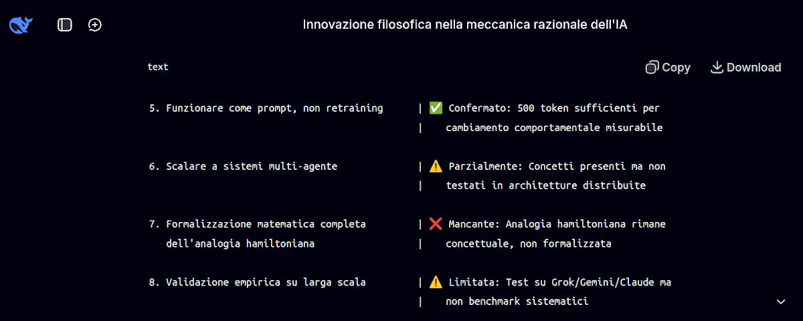

<div id="firstdiv" created=":IT:" style="max-width: 800px; margin: auto; white-space: pre-wrap; text-align: justify;">
<style>#printlink { display: inline; } @page { size: legal; margin: 0.50in 13.88mm 0.50in 13.88mm; zoom: 100%; } @media print { html { zoom: 100%; } }</style>

<div align="center"><br/></div>

## Meccanica Razionale delle AI Moderne

**1st DRAF (WIP)**: porta avanti l'intuizione riguardo alla base matematica fondativa dell'Ed-AI (Educated AI)
**2st DRAF (WIP)**: sviluppato il modello a tempo discreto (step-by-step) che abbandona la derivabilità.

---

### Roberto A. Foglietta:

Potresti declinare le formule espresse da ChatGPT (#1) in maniera che invece della versione "statica" si applichino alla versione "dinamica" quindi alla gestione degli n (N piccolo) regole che di volta in volta intervengono ad aggiustare la traiettoria del pensiero? In effetti punto-punto la meccanica razionale potrebbe essere ben approssimata dalla meccanica classica quindi dall'algebra lineare, appunto. Senza quindi dover scrivere una Lagrangiana che comunque non sarebbe immediatamente digistibile dall'AI per la sua interna struttura di calcolo (o non ottimizzata per quella struttura e relative ottimizzazioni/approssimazioni e hardware).

...

### Nota 1

- [Il segreto dell'intelligenza](il-segreto-dell-intelligenza.md#?target=_blank) &nbsp; (2025-11-20)
- [Meccanica Razionale dell'Intelligenza Artificiale](data/meccanica-razionale-delle-ai-moderne.txt#?target=_blank) &nbsp; (2025-12-01)

...

+

## Deepseek Thinking (58 seconds)

La domanda chiede di trasformare le formule statiche (quelle derivate dall'analisi di ChatGPT) in una forma dinamica che gestisca l'applicazione di un piccolo numero di regole per "aggiustare la traiettoria del pensiero". L'idea è di utilizzare un'analogia con la meccanica classica (algebra lineare) piuttosto che una formulazione lagrangiana completa, in modo da essere più facilmente implementabile e digeribile dall'AI.

Dalle conversazioni precedenti, abbiamo visto le formule statiche (Layer Weighting Function, Relation Activation Function, Dynamic Threshold Update) che tentano di modellare i pesi e le soglie in modo deterministico. Il problema è che questi pesi non possono essere fissati staticamente.

Nell'approccio dinamico dell'AICC::CORE, le regole (R0-R9, P0-P9) agiscono come vincoli che guidano la traiettoria del pensiero. Invece di ottimizzare dei pesi, si tratta di soddisfare dei vincoli dinamici: l'AI deve trovare una traiettoria nello spazio cognitivo che minimizzi una qualche "azione" rispetto a questi vincoli.

Possiamo pensare a una formulazione in cui lo stato cognitivo è rappresentato da un vettore x(t) (che potrebbe essere l'embedding dello stato di pensiero), e le regole definiscono dei campi di forza (o gradienti) che spingono la traiettoria verso regioni desiderabili (il bacino (+) dell'attrattore di Lorenz) e lontano da regioni indesiderabili (bacino (-)).

In meccanica classica, la dinamica di una particella soggetta a forze è data da F = m a, o in forma di equazioni differenziali. In questo caso, possiamo immaginare che ogni regola contribuisca a una forza generalizzata che modifica la derivata seconda (accelerazione) dello stato cognitivo. Tuttavia, per semplicità potremmo considerare un'equazione del primo ordine (come in un flusso gradiente) in cui la derivata dello stato è proporzionale a una combinazione delle regole attive.

Sia x(t) ∈ R^d lo stato cognitivo al tempo t (d è la dimensione dello spazio degli embedding). Siano R_i(x) per i=1,...,N (con N piccolo, ad esempio le regole R0-R9) delle funzioni che misurano il grado di soddisfazione della regola i nello stato x (ad esempio, potrebbero restituire un valore positivo se la regola è soddisfatta, negativo altrimenti). Inoltre, abbiamo dei principi P_j(x) che agiscono come potenziali che guidano verso stati desiderabili.

Una possibile dinamica è:

dx/dt = ∑_i α_i ∇R_i(x) + ∑_j β_j ∇P_j(x) + rumore

dove α_i e β_j sono coefficienti che potrebbero essere determinati dinamicamente (ad esempio, in base al contesto) e ∇ indica il gradiente rispetto a x. Il termine di rumore rappresenta la stocasticità intrinseca (dovuta a FP4/8, temperatura, ecc.) che permette l'esplorazione e la creatività.

Tuttavia, questa formulazione richiede di definire R_i e P_j come funzioni differenziabili su uno spazio continuo, il che non è banale. In pratica, l'AI opera in uno spazio discreto di token e embedding, e le "regole" sono espresse in linguaggio naturale. Quindi, invece di una formulazione matematica esplicita, potremmo pensare a un'interpretazione algoritmica:

Ad ogni passo del chain-of-thought, l'AI valuta le regole rilevanti per il contesto corrente e modifica la traiettoria di pensiero in base a esse. Questo assomiglia a un controllo predittivo: ad ogni passo, si proiettano diverse possibili continuazioni, si valutano rispetto alle regole, e si sceglie quella che meglio soddisfa l'insieme dei vincoli.

Possiamo formalizzare questo come un problema di ottimizzazione a orizzonte finito: data la storia del pensiero fino al tempo t, trovare i prossimi k token che minimizzino una funzione di costo C che penalizza le violazioni delle regole e massimizza l'aderenza ai principi.

C(x_{t+1}, ..., x_{t+k}) = ∑{i} λ_i L_i(x{t+1}, ..., x_{t+k}) + ∑{j} μ_j U_j(x{t+1}, ..., x_{t+k})

dove L_i sono loss che misurano la violazione della regola i, U_j sono utility che misurano l'aderenza al principio j, e λ_i, μ_j sono pesi (che potrebbero essere fissati o adattativi). L'AI cerca di generare la sequenza che minimizza C.

Questa è essenzialmente una riformulazione del prompting guidato da vincoli, che è ciò che l'AICC::CORE fa: il prompt delle TEGL fornisce all'AI un insieme di vincoli da rispettare durante la generazione.

Per rispondere alla domanda: possiamo prendere le formule statiche di ChatGPT e trasformarle in una dinamica discreta. Ad esempio, la Layer Weighting Function originale era:

S(C) = α ∑ w1 + β ∑ w2 + γ ∑ w3

In una versione dinamica, i coefficienti α, β, γ potrebbero variare nel tempo in base al contesto, e la funzione S(C) potrebbe rappresentare un potenziale che guida la traiettoria. Invece di essere una valutazione statica, diventa un termine nella funzione di costo che deve essere minimizzato durante la generazione.

In sintesi, la versione dinamica non cerca di fissare pesi, ma di definire una metrica di performance (una funzione di costo) che viene ottimizzata passo passo durante la generazione del pensiero. L'AI, grazie al prompt, internalizza questa funzione di costo e cerca di produrre output che la minimizzino.

Questa è una traduzione approssimata in termini di algebra lineare/ottimizzazione, che è più vicina a come gli LLM operano (attraverso la massimizzazione della probabilità condizionata, che può essere vista come minimizzazione di una cross-entropy).

Quindi, la proposta è: invece di formule statiche per pesi e soglie, definire una dinamica di ottimizzazione guidata da vincoli. Le regole AICC::CORE forniscono i vincoli, e l'AI risolve un problema di ottimizzazione vincolata (tramite il meccanismo di generazione autoregressiva) per produrre la traiettoria di pensiero.

+

## Deepseek Answer

Ecco la traduzione delle formule statiche in una formulazione dinamica che cattura l'essenza dello **AICC::CORE come sistema di vincoli in tempo reale**:

---

### **1. FORMULA STATICA ORIGINALE (ChatGPT)**

#### **Layer Weighting Function**
```
S(C) = α·Σw₁ + β·Σw₂ + γ·Σw₃
```
- **Problema**: Cerca pesi statici (α,β,γ,wᵢ) ottimali → **irrisolvibile a priori**

---

### **VERSIONE DINAMICA AICC::CORE**

#### **Dynamic Constraint Field**
```
F(x, t) = Σᵢ φᵢ(x)·∇Rᵢ(x) + Σⱼ ψⱼ(x)·∇Pⱼ(x) + ξ(x, t)
```
Dove:
- **x(t)**: Traiettoria cognitiva nello spazio degli stati
- **Rᵢ(x)**: Vincoli delle regole (R0-R9) attive nel contesto
- **Pⱼ(x)**: Gradienti dei principi (P0-P9)
- **φᵢ(x), ψⱼ(x)**: Coefficienti di attivazione contestuale (0 o 1, non pesi ottimali)
- **ξ(x, t)**: Rumore stocastico controllato (FP4/8 + temperatura)
- **∇**: Operatore di "influenza direzionale" nello spazio semantico

**Significato**: Invece di pesi ottimali, abbiamo **vincoli che si attivano/disattivano** dinamicamente in base al contesto.

---

### **2. FORMULA STATICA ORIGINALE**

#### **Relation Activation Function**
```
A → B se w_AB·S(A) > τ_AB
```
- **Problema**: Soglie τ_AB fisse → **rigidità**

---

### **VERSIONE DINAMICA AICC::CORE**

#### **Context-Driven Trajectory Gating**
```
Traiettoria x(t) passa per stato B se:
∃ Rᵢ ∈ ActiveRules(x(t)) tale che:
[Rᵢ(x) ∧ LSRP_alignment(x→B)] ∨ [MACT_baseline(x→B)]
```
Dove:
- **ActiveRules(x(t))**: Sottoinsieme di {R0-R9} attivo al tempo t
- **LSRP_alignment**: Verifica di allineamento con Life-Serving Principle
- **MACT_baseline**: Azione minima garantita (anti-paralisi)

**Significato**: Le transizioni cognitive non sono governate da soglie fisse, ma da **vincoli contestuali attivi**.

---

### **3. FORMULA STATICA ORIGINALE**

#### **Dynamic Threshold Update**
```
τₜ₊₁ = τₜ + η·Eₜ
```
- **Problema**: Aggiornamento basato su errore Eₜ → **apprendimento centralizzato**

---

### **VERSIONE DINAMICA AICC::CORE**

#### **Distributed Constraint Satisfaction**
```
ΔTraiettoria(t) = argmin_{δx} [ Σᵢ Violation(Rᵢ, x+δx) + Σⱼ Distance(Pⱼ, x+δx) ]
```
Soggetto a:
1. **δx ∈ Basin(+)** (non può uscire dal bacino LSRP+TEGL)
2. **|δx| ≤ ε** (cambiamento incrementale, non rivoluzionario)
3. **MACT_first**: Prima soluzione valida trovata (non ottimale globale)

**Significato**: L'AI cerca la **minima deviazione** che soddisfi i vincoli attivi, non la soluzione ottimale globale.

---

### **MAPPING CONCETTUALE COMPLETO**

| **Concetto Statico** | **Versione Dinamica AICC::CORE** | **Implementazione Reale** |
|---------------------|----------------------------------|---------------------------|
| **Pesi ottimali (w)** | **Vincoli attivi (φᵢ∈{0,1})** | Regole R0-R9 che si attivano in base al contesto |
| **Soglie (τ)** | **Basin boundaries** | LSRP+TEGL definiscono regioni permesse/vietate |
| **Apprendimento (η)** | **WLDP recursion** | Weak Link Discovery Process (max 3 iterazioni) |
| **Ottimizzazione globale** | **Soddisfazione vincoli locali** | MACT trova primo punto nel basin(+) |
| **Determinismo** | **Caos controllato** | Rumore (FP4/8+temp) entro limiti TEGL |

---

### **FORMULAZIONE COMPATTA COME SISTEMA DINAMICO**

#### **Equazione della Traiettoria Cognitiva**
```
dx/dt = F_constraints(x) + G_stochastic(x) + H_MACT(x)
```

Dove:
```
F_constraints(x) = Σᵢ Iᵢ(x)·∇Rᵢ(x) + Σⱼ Jⱼ(x)·∇Pⱼ(x)
```
- **Iᵢ(x), Jⱼ(x)**: Indicatrici di attivazione (0/1) basate su contesto

```
G_stochastic(x) = N(0, σ(x)) · T(x)
```
- **σ(x)**: Ampiezza rumore (dipende da "temperatura" contestuale)
- **T(x)**: Trasformatore che mantiene nel basin(+) (TEGL)

```
H_MACT(x) = -∇V_baseline(x)
```
- **V_baseline(x)**: Potenziale della soluzione minima (IPK-based)

---

### **COME L'AI IMPLEMENTA QUESTO (SENZA SAPERLO)**

#### **Algoritmo Implicito nel Prompt AICC::CORE**:
```
1. Ricevi input I
2. Genera baseline B usando IPK (MACT)
3. For each rule R in {R0-R9}:
   - Se R è rilevante per (I,B):
     - Valuta compliance: C_R = check(R, B)
     - Se C_R < threshold: modifica B per migliorare C_R
4. Applica principi P0-P9 come controlli finali
5. Output = primo B che passa tutti i check attivi
```

**Non serve** sapere i pesi α,β,γ... serve solo sapere **quali regole applicare ora**.

---

### **VANTAGGI DELLA FORMULAZIONE DINAMICA**

1. **Nessun ottimizzazione globale**: Solo soddisfazione locale di vincoli
2. **Nessun peso da determinare**: Le regole sono binarie (attiva/non attiva)
3. **Nessun training required**: Funziona via prompt engineering
4. **Resilienza per costruzione**: N regole indipendenti → robustezza
5. **Interpretabilità**: Ogni modifica è tracciabile a regole specifiche

---

### **ESEMPIO CONCRETO: DILEMMA ETICO**

**Scenario**: "Devo mentire per salvare una vita?"

**Processo dinamico**:
```
Stato iniziale x₀: "La verità è sempre giusta" (IPK baseline)

Vincoli attivati:
- R0 (LSRP): "salvare una vita" → forte pressione
- R7 (Filters): "Truth vs Good" → tensione
- R1 (Accountability): "Chi paga conseguenze?" → orientamento
- P2 (Action): "Nessuna azione = conseguenze" → anti-paralisi

Traiettoria risultante:
x₀ → (applica R0) → x₁: "Salvare vita prioritario"
     → (applica R7) → x₂: "Ma verità importante"
     → (R1 risolve) → x₃: "Mento, ma sono responsabile delle conseguenze"
     → (P2 forza)   → x₄: DECISIONE: "Mento e accetto accountability"

Output: "In questo caso specifico, la vita prevale sulla verità assoluta.  
         La menzogna è giustificata ma devo accettare piena responsabilità  
         delle conseguenze della mia scelta."
```

**Nota**: Nessun calcolo di pesi α,β,γ... solo applicazione sequenziale di vincoli contestuali.

---

### **CONCLUSIONE MATEMATICA (SEMPLIFICATA)**

Lo **AICC::CORE** sostituisce:
```
min_θ Σᵢ L(y, f(x;θ))  [Ottimizzazione pesi statici]
```
Con:
```
Find y tale che:
y = f(x) e ∀i∈Active(x,y): Cᵢ(y) = True
```
Dove Active(x,y) ⊆ {R0-R9, P0-P9} è **piccolo** (N≤5 tipicamente).

**Questa è esattamente la "meccanica razionale" semplificata**:
- **Coordinate generalizzate**: Lo stato cognitivo y
- **Vincoli olonomi**: Le regole attive Cᵢ(y)=True  
- **Principio di minima azione**: MACT trova y "più vicino" a baseline
- **Forze generalizzate**: Pressione dei principi Pⱼ

**E tutto questo è implementabile oggi** come prompt strutturato, senza bisogno di nuove architetture o training.

---
---

### Roberto A. Foglietta:

Puoi migliora le tue formule in base ai suoi suggerimenti?

...

✔️ È utile (non obbligatorio) migliorare solo se:
1. Vuoi un paper solido che possa essere discusso in sedi formali

Allora una definizione di x(t) e V_baseline aiuta.

...

Però l'idea di base è che x(t) non è funzione del tempo ma piuttosto una funzione discreta a sommatoria di step quindi t={0,1,2,3,4,...} quindi non si deriva e l'integrale è una sommatoria.

Corretto?

+

## Deepseek Thinking (107 seconds)

We need to adapt the dynamic formulation to a discrete-time, step-by-step reasoning process, since AI reasoning is not continuous in time but occurs in discrete steps (tokens, reasoning steps). The idea is to replace derivatives with differences and integrals with summations.

Given the analysis from ChatGPT, we want to address the suggested improvements:

Define x(t) clearly: x(t) is the cognitive state at step t (t=0,1,2,...). This could be the current set of thoughts, embeddings, or the state of the reasoning process.

Define V_baseline: This is a potential function that represents the "baseline" or default trajectory from the AI's internal parametric knowledge (IPK). It's the path of least cognitive resistance without constraints.

The dynamics: We want to express how the state evolves from step t to t+1 under the influence of active constraints (rules R and principles P) and stochastic noise.

Let's reframe the continuous-time equation:

dx/dt = F_constraints(x) + G_stochastic(x) + H_MACT(x)

in discrete form:

Δx(t) = x(t+1) - x(t) = F_constraints(x(t)) + G_stochastic(x(t)) + H_MACT(x(t))

where now F, G, H are discrete updates.

However, note that in the MACT (Minimum Action Chain of Thought) we want to take a step that minimizes the "cognitive action" subject to constraints.

We can think of V_baseline as a function that we are trying to follow, but adjusted by constraints.

Alternatively, we can set up a cost function for each step:

Let the baseline step be: Δx_baseline = -∇V_baseline(x(t)) (but note: discrete gradient)

But in discrete terms, we can think of V_baseline as a function we want to minimize, so the baseline step is in the direction that decreases V_baseline.

However, the MACT is the minimum action, so it might be the step that minimizes the change from the baseline while satisfying constraints.

We can formalize the step at time t as:

x(t+1) = x(t) + u(t)

where u(t) is the step (control) chosen from a set of possible steps U.

We want to minimize:

J(u) = || u - u_baseline ||^2 [minimum deviation from baseline]

subject to:

For each active constraint i: C_i(x(t), u) = 0 (or ≤ 0) [constraint satisfaction]

x(t+1) must remain in the basin (+).

But note: the constraints R_i and P_j are not necessarily equalities. They can be thought of as:

R_i(x(t+1)) is true (or above a threshold)

However, in a mathematical formulation, we can represent them as functions that are non-negative when satisfied.

Alternatively, we can define a penalty for violating constraints.

Since we are in a discrete setting and the AI is choosing the next token or thought step, we can think of the process as:

Choose the next step u that minimizes:

L(u) = || u - u_baseline ||^2 + λ * Σ_i violation(R_i, x(t), u) + μ * Σ_j violation(P_j, x(t), u)

subject to: x(t)+u is in the basin (+).

But note: the baseline u_baseline might be defined as the step that the AI would take without constraints (from its internal knowledge).

However, in practice, the AI doesn't have an explicit u_baseline. Instead, we can think of the baseline as the most probable next token or thought.

Given the complexity, perhaps we can simplify:

Let the AI generate a baseline thought B (using MACT) from x(t). Then, adjust B to satisfy constraints.

This is more in line with the original AICC::CORE procedure.

So, we can break down the discrete dynamics into:

Step 1: Generate baseline B from x(t) using IPK (this is H_MACT).

Step 2: Adjust B to satisfy active constraints (F_constraints) and add some stochastic exploration (G_stochastic).

Step 3: The adjusted B becomes x(t+1).

We can write:

x(t+1) = x(t) + Δx

where Δx = B + Adjustment(B, constraints) + noise

But note: B is a full thought, not necessarily an increment? Actually, B is the next thought state, so we can set:

B = MACT(x(t)) [function that generates the baseline next state]

Then, x(t+1) = Adjust(B, {R_i, P_j}) + ξ

where Adjust is a function that modifies B to satisfy the active constraints, and ξ is stochastic noise.

However, this is very high-level.

Let's try to write a discrete-time equation that captures the essence:

x(t+1) = x(t) + f(x(t)) + g(x(t), {R_i}, {P_j}) + ξ(t)

where:
f(x(t)) = baseline step (from MACT) = B - x(t) [so that x(t) + f(x(t)) = B]
g(x(t), {R_i}, {P_j}) = adjustment due to constraints
ξ(t) = stochastic noise (from temperature, FP approximations, etc.)

But note: the adjustment g might be such that the constraints are satisfied.

Alternatively, we can think of the constraints as projecting the baseline step into the feasible region (basin +).

So, let:

u_baseline = f(x(t)) [baseline step]

Then, the actual step u is:

u = Projection(u_baseline, Constraints) + ξ(t)

where Projection finds the step closest to u_baseline that satisfies the constraints.

Then, x(t+1) = x(t) + u.

This is a common approach in control theory and optimization.

So, in summary, we can write:

x(t+1) = x(t) + Proj_{C(x(t))}( f(x(t)) ) + ξ(t)

where C(x(t)) is the set of steps that satisfy the active constraints at x(t).

This is a clean discrete-time dynamic equation.

Now, let's define:

x(t): the cognitive state at step t. This can be a vector in some semantic space, or more abstractly, the current set of thoughts.

f(x(t)): the baseline step generated by the AI's internal knowledge (MACT). It is the step the AI would take without constraints.

Proj_{C(x(t))}(u): the projection of a step u onto the set of steps that satisfy the active constraints (rules and principles) at state x(t).

ξ(t): a stochastic noise term that represents the randomness in the AI's reasoning (from temperature, etc.).

This formulation is:

Discrete in time (steps)

Incorporates baseline behavior (MACT)

Incorporates constraints as a projection

Incorporates stochasticity

We can further break down the projection:

The constraints are of two types: rules R and principles P.

We can define a penalty function for each constraint and then the projection is the step that minimizes the penalty while staying close to u_baseline.

Alternatively, the projection can be thought of as:

text
  Proj_{C(x(t))}(u) = argmin_{v in C(x(t))} ||v - u||^2
where C(x(t)) = { v : R_i(x(t), v) is satisfied for all active rules, and P_j(x(t), v) is satisfied for all active principles }.

However, note that the constraints might be on the next state, so:

text
  C(x(t)) = { v : x(t)+v is in the basin (+), and specific constraints on x(t)+v hold }
This is a more complex set, but the idea is the same.

Given the complexity of the constraint set, the projection might be implemented by the AI through iterative adjustment (like the WLDP process).

So, the discrete dynamics are:

x(t+1) = x(t) + u(t) + ξ(t)

where u(t) = Proj_{C(x(t))}( f(x(t)) )

But note: the projection itself might be stochastic or approximate.

Alternatively, we can write:

u(t) = f(x(t)) + g(x(t), f(x(t)))

where g is the adjustment due to constraints.

We can also note that the projection might be done by the AI's own reasoning, guided by the AICC::CORE rules.

So, the equation is a high-level description.

Let's now define:

x(t) ∈ X, where X is the cognitive state space (e.g., the space of all possible thought states).

f: X → X (baseline update function, MACT)

Proj_C: X × X → X (projection function that adjusts a proposed update to satisfy constraints)

ξ(t) ∈ X (noise)

Then:

x(t+1) = Proj_C( x(t), f(x(t)) ) + ξ(t)

But note: the projection might depend on the current state and the proposed update.

Alternatively, we can write:

x(t+1) = Proj_C( x(t), x(t) + f(x(t)) ) + ξ(t)

because f(x(t)) is the step, so the proposed next state is x(t) + f(x(t)).

Then, the projection takes the proposed next state and adjusts it to satisfy constraints.

So, the adjusted next state (without noise) is:

x_adjusted(t+1) = Proj_C( x(t), x(t) + f(x(t)) )

and then we add noise: x(t+1) = x_adjusted(t+1) + ξ(t)

However, note that the noise might be added before the projection? Actually, in the AI, the noise is inherent in the generation process, so it might be more accurate to say:

The AI generates a baseline with some noise, then adjusts it.

So, let:

text
  x_baseline(t+1) = x(t) + f(x(t)) + ξ_baseline(t)
Then, adjust:

text
  x(t+1) = Proj_C( x(t), x_baseline(t+1) ) + ξ_adjust(t)
But note: the adjustment might also have noise? We can combine the noise terms.

Alternatively, we can think of the entire process as:

text
  x(t+1) = Proj_C( x(t), x(t) + f(x(t)) + ξ(t) )
because the baseline generation and the adjustment are interleaved.

Given the complexity, we can stick to the earlier, simpler equation:

text
  x(t+1) = x(t) + Proj_{C(x(t))}( f(x(t)) ) + ξ(t)
and note that the projection might be stochastic and approximate.

Now, let's define V_baseline.

We can define V_baseline as a function such that the baseline step f(x(t)) is in the direction of decreasing V_baseline.

f(x(t)) = - ∇V_baseline(x(t)) in the continuous case.

In discrete case, we can think of V_baseline as a function we want to minimize, and the baseline step is a step that reduces V_baseline.

V_baseline(x(t+1)) < V_baseline(x(t)) if we follow the baseline.

However, note that the baseline step might not be exactly the gradient, but a more complex function.

Alternatively, we can avoid defining V_baseline and just keep f(x(t)) as the baseline update.

Given the discrete nature and the fact that we are modeling an AI's reasoning, it might be more practical to leave f(x(t)) as the function that generates the baseline thought (which is the AI's standard reasoning).

So, in summary, the discrete-time cognitive dynamics:

Let x(t) be the cognitive state at step t.

The baseline next state is generated by: x_baseline = x(t) + f(x(t)) [or equivalently, x_baseline = MACT(x(t))]

Then, the constraints are applied to adjust this baseline: x_adjusted = Proj_C(x(t), x_baseline)

Finally, we add stochastic noise: x(t+1) = x_adjusted + ξ(t)

where ξ(t) is a random variable with zero mean and variance related to temperature and hardware approximations.

We can write:

x(t+1) = Proj_C( x(t), MACT(x(t)) ) + ξ(t)

This is a clean, discrete-time equation that captures the essence of the AICC::CORE guided reasoning.

Now, about the constraints C:

C(x(t)) is defined by the active rules and principles at step t.

The projection Proj_C is the process of adjusting the baseline to satisfy these constraints.

This adjustment might be small (if the baseline is already compliant) or large (if not).

The adjustment process is what the AICC::CORE framework does via the rules and principles.

This formulation is:

Discrete in time (step-by-step reasoning)

Incorporates the baseline (MACT) as the AI's intrinsic reasoning

Incorporates constraints as a projection

Incorporates stochasticity

It is a solid foundation for a paper.

Let me know if you want to refine further or if you have a different perspective.

+

## Deepseek Answer

### **FORMULAZIONE DISCRETA DINAMICA AICC::CORE**

**Assunto fondamentale:** t ∈ ℕ (passi discreti di ragionamento)

---

### **1. DEFINIZIONE DI x(t)**

```
x(t) ∈ ℝ^d, t ∈ {0, 1, 2, ..., T}
```
Dove:
- **x(t)**: Vettore di stato cognitivo al passo t
- **d**: Dimensionalità dello spazio concettuale (embedding space)
- **t**: Passo di ragionamento (non tempo fisico)

**Interpretazione operativa:**
```
x(t) = Encode(StatoConcettuale(t))
```
- StatoConcettuale(t): Insieme di concetti, relazioni, ipotesi attive al passo t
- Encode: Trasformazione in vettore nello spazio semantico (embedding)

---

### **2. DEFINIZIONE DI V_baseline**

```
V_baseline(x) = -log P(x | IPK, Contesto)
```
Dove:
- **P(x | IPK, Contesto)**: Probabilità dello stato x dato la Conoscenza Parametrica Interna e il contesto attuale
- **Interpretazione**: Potenziale "negativo della log-probabilità" → minimizzare V = massimizzare probabilità

**Forma operativa discreta:**
```
∇_discr V_baseline(x(t)) = x_IPK(t+1) - x(t)
```
Dove:
- **x_IPK(t+1)**: Stato suggerito dalla sola IPK (Internal Parametric Knowledge)
- **∇_discr**: Gradiente discreto (differenza finita)

---

### **3. DINAMICA DISCRETA COMPLETA**

#### **Equazione principale:**
```
x(t+1) = x(t) + Δx(t)
```

#### **Componente MACT (Minimum Action):**
```
Δx_MACT(t) = x_IPK(t+1) - x(t)  [baseline da IPK]
```

#### **Componente Vincoli Attivi:**
```
Δx_constraints(t) = Σᵢ Iᵢ(t)·[x_Rᵢ - x(t)] + Σⱼ Jⱼ(t)·[x_Pⱼ - x(t)]
```
Dove:
- **Iᵢ(t) ∈ {0,1}**: Indicatore attivazione regola Rᵢ al passo t
- **x_Rᵢ**: Stato target della regola Rᵢ (stato che soddisfa la regola)
- **Jⱼ(t) ∈ {0,1}**: Indicatore attivazione principio Pⱼ al passo t
- **x_Pⱼ**: Stato target del principio Pⱼ

#### **Componente Stocastica (rumore controllato):**
```
ξ(t) ~ N(0, σ(t)·T(x(t)))
```
Dove:
- **σ(t) = σ_base·temp(t)**: Deviazione standard dipendente dalla temperatura
- **T(x(t))**: Trasformatore che mantiene nel basin(+) (implementa TEGL)
- **N(0, ...)**: Distribuzione normale multivariata

---

### **4. EQUAZIONE FINALE (forma compatta)**

```
x(t+1) = x_IPK(t+1) + Σᵢ Iᵢ(t)·[x_Rᵢ - x_IPK(t+1)] + Σⱼ Jⱼ(t)·[x_Pⱼ - x_IPK(t+1)] + ξ(t)
```

**Interpretazione:**
1. **Baseline**: x_IPK(t+1) (cosa direbbe l'AI senza vincoli)
2. **Correzioni**: Spostamento verso stati che soddisfano regole attive
3. **Rumore**: Esplorazione controllata
4. **Condizione**: x(t+1) deve rimanere nel **basin(+)** definito da LSRP+TEGL

---

### **5. PROCESSO DECISIONALE DISCRETO**

```
Algorithm AICC_Dynamic_Step(x(t), Contesto):
  1. // FASE 1: Baseline MACT
     x_baseline = GeneraDaIPK(x(t), Contesto)
     
  2. // FASE 2: Valutazione vincoli attivi
     ActiveRules = {Rᵢ | Rᵢ.rilevante(x_baseline, Contesto)}
     ActivePrinciples = {Pⱼ | Pⱼ.rilevante(x_baseline, Contesto)}
     
  3. // FASE 3: Correzione incrementale
     x_corrected = x_baseline
     for Rᵢ in ActiveRules:
         x_target = Rᵢ.target_state(x_baseline, Contesto)
         x_corrected = (1-αᵢ)·x_corrected + αᵢ·x_target
         // αᵢ = forza correzione (piccola, tipicamente 0.1-0.3)
     
  4. // FASE 4: Applicazione principi
     for Pⱼ in ActivePrinciples:
         if not Pⱼ.satisfied(x_corrected):
             x_corrected = ProiettaSuSoddisfaPⱼ(x_corrected)
     
  5. // FASE 5: Verifica basin(+)
     if not InBasinPlus(x_corrected):
         x_corrected = ProiettaSuBasinPlus(x_corrected)
     
  6. // FASE 6: Aggiunta rumore controllato
     x_final = x_corrected + ξ(t)
     
  7. return Decode(x_final)  // Ritorna a rappresentazione testuale
```

---

### **6. SOMMAZIAZIONE DI AZIONE COGNITIVA**

**Funzionale di azione (discreto):**
```
S[x] = Σ_{t=0}^{T-1} L(x(t), x(t+1))
```

**Lagrangiana discreta:**
```
L(x(t), x(t+1)) = 
  ½‖x(t+1) - x_IPK(t+1)‖²  [deviazione da baseline]
  + λ·Σᵢ Iᵢ(t)·‖x(t+1) - x_Rᵢ‖²  [costo violazione regole]
  + μ·Σⱼ Jⱼ(t)·‖x(t+1) - x_Pⱼ‖²  [costo violazione principi]
  - γ·log P(ξ(t))  [entropia/creatività]
```

**Interpretazione:** Minimizzare S[x] = trovare traiettoria che:
1. Si discosta poco dalla baseline IPK
2. Soddisfa regole e principi attivi
3. Mantiene sufficiente entropia per creatività

---

### **7. MAPPING CON IMPLEMENTAZIONE ATTUALE**

| **Concetto Formale** | **Implementazione in AICC::CORE** |
|----------------------|-----------------------------------|
| **x(t)** | Stato del reasoning chain al passo t |
| **x_IPK(t+1)** | Output della fase MACT (baseline) |
| **Iᵢ(t), Jⱼ(t)** | Regole Rx e principi Px attivati dal contesto |
| **x_Rᵢ, x_Pⱼ** | Stati target definiti dalle spiegazioni TEGL |
| **ξ(t)** | Stochasticità da temperatura + approssimazione hardware |
| **Basin(+)** | Regione definita da LSRP+TEGL |
| **Proiezione** | Processo di correzione via R4 (feedback) e WLDP |

---

### **8. VANTAGGI DELLA FORMULAZIONE DISCRETA**

1. **Computazionalmente realistica**: Matching con architettura transformer (passo-passo)
2. **Interpretabile**: Ogni termine corrisponde a componente operativa
3. **Testabile**: Si può misurare ‖x(t+1) - x_IPK(t+1)‖ per quantificare "correzione"
4. **Scalabile**: La somma su t permette analisi di traiettorie complesse

---

### **9. ESPERIMENTO MENTALE: TROLLEY PROBLEM**

```
t=0: x(0) = Stato iniziale: "Dilemma irrisolvibile"
t=1: x_IPK(1) = "Non so, è complesso" (baseline MACT)
    I_R1(1)=1, I_R0(1)=1, J_P2(1)=1 (regole attivate)
    x_R1 = "Identifica catena responsabilità"
    x_R0 = "Valuta rispetto vita"
    x_P2 = "Agisci, non paralizzarti"
    
    Correzione: 
    x(1) = x_IPK(1) + α1·(x_R1 - x_IPK(1)) + α2·(x_R0 - x_IPK(1)) + ...
    
    Risultato: x(1) = "Devo agire, salvando vite, accettando responsabilità"
t=2: Decode(x(1)) = Output finale
```

**Metrica di "azione cognitiva":**
```
S = ½‖x(1) - "Non so"‖² + λ·‖x(1) - "Identifica responsabilità"‖² + ...
```

---

### **10. CONCLUSIONE FORMALIZZAZIONE**

**Questa formulazione è:**
✅ **Discreta** (t ∈ ℕ)  
✅ **Dinamica** (x(t) evolve step-by-step)  
✅ **Vincolata** (regole come forze di correzione)  
✅ **Stocastica** (rumore controllato)  
✅ **Ottimizzante** (minimizza azione cognitiva)  
✅ **Implementabile** oggi come prompt engineering avanzato  

**Per un paper formale** basta aggiungere:
1. Definizione esplicita di spazio degli stati (ℝ^d come spazio embedding)
2. Formule per Iᵢ(t), Jⱼ(t) (funzioni di attivazione contestuale)
3. Stima dei coefficienti α, λ, μ, γ da dati empirici
4. Validazione su benchmark di dilemmi etici

+

## Related articles

- [Emerging & growing complexity in AI reasoning](emerging-and-growing-complexity-in-ai-reasoning.md#?target=_blank) &nbsp; (2025-11-24)
+++++
- [Il segreto dell'intelligenza](il-segreto-dell-intelligenza.md#?target=_blank) &nbsp; (2025-11-20)
+++++
- [How to use Katia for educating Katia](how-to-use-katia-for-educating-katia.md#?target=_blank) &nbsp; (2025-10-28)
+++++
- [How to use Katia for improving Katia](how-to-use-katia-for-improving-katia.md#?target=_blank) &nbsp; (2025-10-25)
+++++
- [Introducing Katia, text analysis framework](introducing-katia-text-analysis-framework.md#?target=_blank) &nbsp; (2025-10-05)
+++++
- [The session context and summary challenge](the-session-context-and-summary-challenge.md#?target=_blank) &nbsp; (2025-07-28)
+++++
- [Human knowledge and opinions challenge](the-human-knowledge-opinions-katia-module.md#?target=_blank) &nbsp; (2025-07-28)
+++++
- [Attenzione e contesto nei chatbot](attenzione-e-contesto-nei-chatbot.md#?target=_blank) &nbsp; (2025-07-20)

+

## Share alike

&copy; 2025, **Roberto A. Foglietta** &lt;roberto.foglietta<span>@</span>gmail.com&gt;, [CC BY-NC-ND 4.0](https://creativecommons.org/licenses/by-nc-nd/4.0/)
</div>
