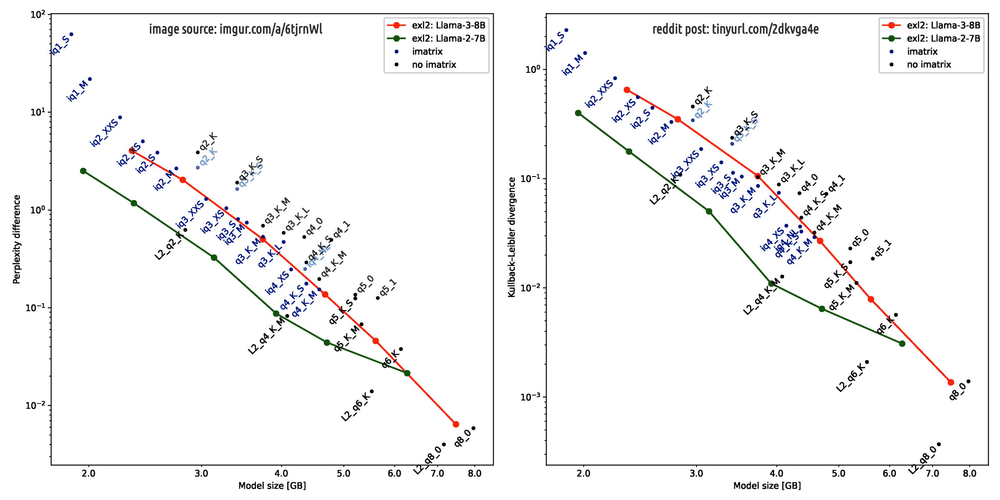

 

## Neutrality vs biases for chatbots

* This paper is about the Nous Hermes 2 Mistral DPO [AI model's issues](https://huggingface.co/NousResearch/Nous-Hermes-2-Mistral-7B-DPO-GGUF) and - after being updated at its 2nd edition (since rev.4) about which is the best AI model to choose to be used with Nomic AI gpt4all GUI application.

* This paper content evolved since its publication up to the update revision received on [2025-01-07](#update-2025-01-07) also in the parts which were written before the update, reaching its full second edition in time (since rev.11).

* Along with the various initial revisions and the update, during which most of the content's changes were made, this paper maintained conceptually the same PoV while deepening its argumentations, providing examples, comparisons in other areas of knowledge and [presenting data](img/llma-3-vs-2-quantisation-fork-gap.png?target=_blank) collected by a 3rd party to support the initial PoV.

---

### Introduction

First of all, it works greatly considering that Nous Hermes 2 Mistral DPO AI model has *only* 7 billions of parameters with a `Q4_0` legacy quantisation, while the `Q4_K_M` is much better but not supported. 

I am running it without the support from a GPU card because the Intel GPUs are not supported by gpt4all. Despite these limitations, it is relatively amusing. Unfortunately, it is also strongly biased toward some topics:

* ecological preservation and environment protection

* international coordination with a centralised governance

* universal vaccination policy

Let's get this straight right away. I am not against these values. That's **NOT** the point.

<b class="post-it">&#9432;</b>
The expected and correct behaviour, in this case, would have been to do the task keeping the output as much as fidel to the original meaning -- **Gulp!** -- This sentence seems supposing that an AI model is able to "understand" the meaning of a text... 

...well, a mimic of human understanding of it or more specifically speaking a lexical comprehension of text. Statistically speaking, the meaning in all those cases in which opinions <b translate="no">`AND`</b> way of writing are "common" in terms of statistics frequency, related to the *corpus-testii* it learnt from.

The issue arises when those values are so strongly embedded in the model for which it cannot provide the service that it is supposed to do. In fact, asking to analyse a text - part by part - create a list of brief summaries in order to evaluate the structure of the text and the logic reasoning along the text, comes up with "inventing" things because of its biases' manipulating influence.

---

### The casus-belli

It is not a case of AI's hallucinations. In fact, by decreasing its temperature (e.g. from 0.7 to 0.5) the biases transfert was worsening. This happens because the AI model is strongly biassed about some topics that instead of summarizing a text with a high degree of fidelity, it manipulates it, colouring it with its own biases. The text on which it was working is the Gemini vs Human conversation presented in this page.

* [La semplicità delle direttive in caso di crisi](https://robang74.github.io/chatgpt-answered-prompts/html/la-semplicita-delle-direttive-in-caso-di-crisi.html) with English translation available on the topbar.

Please, notice that the dialogue with Gemini is not about contrasting those values but put them in a reasonable rational perspective that in brief can be summarized as in the following schema.

<b class="post-it">&#9432;</b>
Once we took almost all the same way at almost the same time, following apply:

- rigidity vs fragility,
- uniformity vs collapse risk, 
- single headed governance vs single point of critical failure;

plus the main law of physic, like the `F=ma` in classical mechanics, for which:

- fast moving vs hard deceleration (in case of impact)

In short, the risk of facing a HUGE disaster is implicit because of the theory of systems.

As you can imagine, these are NOT arguments against those values but reasonable and legit concerns about HOW that values are managed. In this context the chatbot based on the AI model listed above, decided to introduce its own biases and tainting with them the author’s opinion.

The best part was when I asked why it invented those things. Surprisingly, it provided me with a relatively long answer in which the first part was about 

* literature about those topics should be also considered not just the author's opinion

and in the second part, it was trying to convince me about its bona-fide:

* it was doing good in reporting rather than admit it was inventing.

So, I answered that I was sure about it was inventing because I was "the author" of that text, **BOOM**. &#x1F604;

---

### One extra mile

Finally, it is noticeable that it has a quite interesting mild bias - not particularly strong as seen as  in this test, at least - about ethics. Something which is quite common, also among VERY large models available online.

However, this bias does not allow it to correctly differentiate the "ethic" and the "moral hazard". I mean, ethics is about doing the right thing - like proposing vaccination - the moral hazard is HOW the right thing is enforced or managed.

IMHO, this distinction is pretty clear in that dialogue because explaining it is the reason for which Gemini decided to agree with me. 

Once, Gemini correctly identified my opinion was NOT be against its values but trying to put their management into a rational framework, agreed with me despite some previous prompts showing pathetic censorship and strong biases about those topics.

I have to admit that the process of prompting / engaging the AI model was purposely a bit malicious in order to trick the model to expose its own biases. Where "a bit malicious" means something reasonable like in a decent human conversation:

* in asking you to execute a task, I give you the feeling that you can introduce "your own stuff" in it. However, because I know my own stuff, I get informed about your stuff (biases).

Without any surprise, the AI models are mirrors of humans, including our biases.

---

### AI quantization

Now, I am going to try this model downloaded from HuggingFace as an alternative of the one cited above.

* [Open Hermes on Neural Chat + Mistral 7B](https://huggingface.co/TheBloke/OpenHermes-2.5-neural-chat-v3-3-Slerp-GGUF) Slerp merged and quantised in `Q4_0` by TheBloke 

I have tried another derivative model of this one, hence a sibling, but it was strongly biased towards the users privacy in particular when an AI technology was involved. Curiously, the derivative model - AFAIK - was not fine-tuned or re-trained but only differently quantised.

Possibly, the different way of simplifying its weights introduced that bias like an artifact of such operation.

---

### Conclusion

Please, notice that the bias neutrality of an AI model is way more **IMPORTANT** than a relatively small optimisation in performances (e.g. 2.6 tk/s vs 3.1 tk/s), which in the worst case, it means 20% c.a. slower. 

 

## Update 2025-01-07

The following image, taken from [r/localLLaMA](https://www.reddit.com/r/LocalLLaMA/), illustrates the main reason why the quantisation of LLMA-3 models can create artefacts in the neural network weights, which induce distortions in the quantised AI model, such as bias reinforcement or increased bias compared to the original floating-point-encoded AI model.

> Llama 3 degrades more than Llama 2 when quantized.
> 
> Probably because Llama 3, trained on a record 15T tokens, captures extremely nuanced data relationships, utilizing even the minutest decimals in BF16 precision fully. 
> 
> Making it more sensitive to quantization degradation.

 

Right click to enlarge the image in a new window.

In brief, the quantized model can loose relevant details about a concept it has learnt as much as it has leveraged every single bit of information stored in the floating-point weight matrixes (to be precise, each layer has its own matrix) to learn it.

Moreover, in that sentence, the term "probably" is just a *memento* to highlight that 8 months ago this statement was not yet verified against every reasonable scientific sceptic critic.

---

### Humans similarity

Explaining this phenomenon with a human example - after all, the AI models are mirrors of humans - can be achieved comparing a brilliant and highly educated person (**Tizio**) with a person (**Caio**) on which the mass education system enforced an irrational way of thinking.

Imagine that both these two persons developed or accepted strong biases about some topics, the same topics both.

- While **Tizio** perceive a lot of details about his own biases, despite his strong convictions do not try to enforce them on other people and based on context can decide how to handle a confrontation among different opinions. Plus, his arguments are rational and highly educated, therefore he is not willing to impose his own PoV over others. Because he knows that what is good for him may not be good enough for others. Moreover, even if others can improve their own situation by adapting his PoV, he knows that people have their own life path and unless they are in an imminent danger or putting others in an imminent danger, they have the full right to go their own way. Live and let others live. With this open-mind attitude, he is prone to enlarge and diversify his sets of friends, peers, interests, ideas, etc.

- Instead, **Caio** do not have such fine-grained distinction about its own biases' details plus he received a kind of education that made him incapable of rational high-level reasoning. Therefore, he tends to oversimplify concepts usually in just two categories {yes/no, good/bad, me/you, white/black, ...}. Because of this oversimplification (quantisation from `fp32` to `Q4_0`) the strong biases crystallised in his mind becoming compulsive while fine-grain details faded away. Therefore, many misbehaviour attitude will emerge like trying to impose to others their own biases also when the context might suggest a milder approach (listening, learning, etc.) and/or he has problems in differentiate himself from others (social addiction, closed circle of friends or colleagues) creating a vicious loop of unfactual self-assessment.

Now, imagine that Caio is the "*reduced*" version of Tizio. With this concept we have got two targets with a single shot.

1. the mass education system operates to provide society with useful idiots, like Caio because they still are productive but are less demanding in terms of living-space and payroll-costs plus they lack the fundamentals skills to bring innovation into the society but they are limited to produce (a little), to consume (a little) and fading away (oblivion). This [paper](https://robang74.github.io/chatgpt-answered-prompts/html/propaganda-e-sistema-educativo.html) about the relationship between mass education system and propaganda goes deeper in this specific topic.

2. now that we know about how and how much the "*quantisation*" impacts on AI models, we can effectively try to work-around in order to avoid the issue which buys for us more time to solve the problem more in general, **possibly** also for humans. This [paper](https://robang74.github.io/chatgpt-answered-prompts/html/artificial-intellige-for-education.html) about the AI involvement into a restructuring plan to drive the mass education system out of the 1800's Industrial Revolution paradigms goes deeper in this specific topic.

So, we got a grasp about AI models' quantisation pros and cons, the immediate step is to avoid as much as possible the cons while continuing to leverage the benefits.

---

### A legacy system

First of all we have to notice that `Q4_0` quantisation is considered a legacy technology which works "better" with legacy AI models, unsurprisingly. People who developed this technology were smart and they chose a good way to achieve a good result in dealing with the AI model they had available at that time: `Q4_0` with `LLMA-2`.

In the meantime, technologies advanced on both fronts and now LLMA-3 is better than LLMA-2 while `Q4_K_M` is better than `Q4_0`. Unsurprisingly, from this plain straight consideration emerges an evergreen: a specific job requires a specific tool, and both should be aligned. So, how can we cast this in practice?

Using LLMA-3 with `Q4_K_M` seems the most obvious solution, in general. However, those who are using gpt4all cannot go for something other than `Q4_0 GUFF` format. For this reason Nomic AI who drive the gpt4all application development and chooses to fine-tune those AI models which are offering the best compatibility, should go for gpt-3 + llma-2 merge in proposing AI models as chatbot (text-creation class).

However, a second stage of adaptation is strongly required to cope with "legacy" technology, the only one supported by the open-source version of gpt4all. In fact, running an AI model on a consumer laptop/PC is something seriously limiting. Which is also good because we need to leverage our brains to squeeze as much juice as possible with the minimum requirements and effort (efficiency).

In order to improve efficiency it is necessary to provide guidance lines in the system prompt. This [paper](https://robang74.github.io/chatbots-for-fun/html/the-system-prompt-alchemy.html) about system prompt alchemy goes deeper in this topic. Unfortunately, an advanced system prompt requires that the AI model is able to follow instructions and understand how rules (general guidelines, *what*) became instructions (contextual application, *how*).

---

### The legacy recipe

To fulfil the requirements above - the best candidates are text-generative AI models (chat + llm) with 7 billions of parameters "instructed" and knowledgeable because when context matters, knowledge matters as well.

After all, without knowledge, there is no context at all. Hence, lesser the knowledge smaller the context and vice-versa more knowledge broader the context. So, how to match these requirements. Here the recipe:

1. a chatbot AI engine, like OpenAI GPT-3 or Intel Neural Chat, etc.;

2. a large language AI model like LLMA-2 or Mistral, etc.;

3. a fine tuning for knowledge, first, like Open Hermes 2.5 dataset;

4. a fine tuning for being instructed, like Open Orca Slim dataset.

The standard way of doing that is quite straightforward seeing what is most frequently done on Hugging Face platform:

1. merge the two AI engines from their original models: chat + llm;

2. fine tuning the merged engine with knowledgeable dataset - first - because context matters;

3. fine tuning with a relatively smaller dataset about how to follow instruction from the user prompt;

4. quantisation, using `Q4_0` when this legacy algorithm is required and packaging with the `GUFF` format when it is compulsory or useful.

Looking from the perspective of a data scientist with some knowledge about human psychology, considering that AI is mirroring the human traits, then this recipe is straightforward and clear.

---

### Is there anybody out there?

Therefore, even including that the adoption of LLMA-3 was a marketing choice, why is there not, into gpt4all catalogue, **any** of a GPT-3 [Slerp](https://en.wikipedia.org/wiki/Slerp) merged LLMA-2 fine tuned on OH 2.5 and OO slim instruct AI models? The most probable answer is:

- because such training is "uncommon"

   - because Hermes and Orca trainings are competing for setting the matrixes weights which are limited

   - hence those datasets were designed to be alternative rather than complementary

- because it is an "anti-marketing" choice

   - gpt4all is a open-source applications which amateurs download pay nothing
   
   - amateurs wishes to try the most trending AI models, not a "geniette-in-a-box"

- because those who use CLI-only tools have no such restrictions

   - hence nobody cares: not the company, not the amateurs and not professionals

   - which is the best scenario for a nerdish divulgation oriented incursion.

So, what is missing? The user base (aka market niche).

---

### Conclusions

In summary, who has the skills to provide such a AI model leveraging cloud platform and distributed pay-for-compute plans, they are also skilled enough for using a CLI-only approach which allows them to use newest models quantised with newest algorithms and packaged using the newest formats.

The others are proudly cheering in watching a trendy chatbot running on their consumer hardware while few are smiling at this article... &#128522;

 

## Related

* [The system prompt alchemy](the-system-prompt-alchemy.md)

* [Chatting with AleX the chatbot](chatting-with-alex-the-chatbot.md)

* [ChatGPT vs human real reasoning](chatgpt-vs-human-real-reasoning.md)

* [Il problema sei tu, non l'AI](il-problema-sei-tu-non-l-AI.md)

* [Manipulation of a chatbot](manipulation-of-a-chatbot.md)

* [Dammi sei parole a caso](dammi-sei-parole-a-caso.md)

 

## Copyright

&copy; 2024, **Roberto A. Foglietta** &lt;roberto.foglietta@gmail.com&gt;, [CC BY-NC-ND 4.0](https://creativecommons.org/licenses/by-nc-nd/4.0/)

