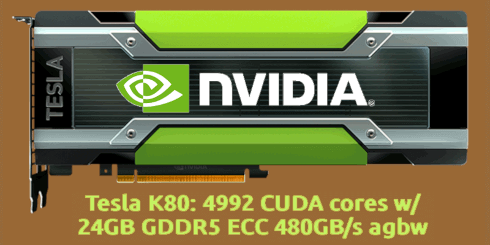

 

## Nvidia Tesla K80 installation

Let me introduce the Nvidia Tesla K80 accelerator board, which is not a graphic card for the consumer market but an accelerator for data centers.

- 4992 NVIDIA CUDA cores with dual GPU design each with 12Gb of RAM
- Up to 2.91 teraflops of double precision performance with NVIDIA GPU Boost
- Up to 8.73 teraflops of single precision performance with NVIDIA GPU Boost
- 24GB GDDR5 memory with 480GB/s aggregate memory bandwidth
- Server optimised with ECC protection for maximum reliability
- Kepler architecture, market entry 17 November 2014 at $7.000

It is a 10yo hardware which has NOT been designed for being put into a desktop computer, so it does not have an active cooling system by itself. Currently, its support is DEPRECATED and it will not be ported further to the 470 series of drivers and CUDA software stack, officially. Which is one of the reasons because it can be bought for something between $100 and $200 on the refurbished market. The other main reason for its relatively cheap price is a sort of gambling/bricolage activity to make it work with desktop hardware. So, here we are! {:-)}

+

## Share alike

&copy; 2025, **Roberto A. Foglietta** &lt;roberto.foglietta@gmail.com&gt;, [CC BY-NC-ND 4.0](https://creativecommons.org/licenses/by-nc-nd/4.0/)

