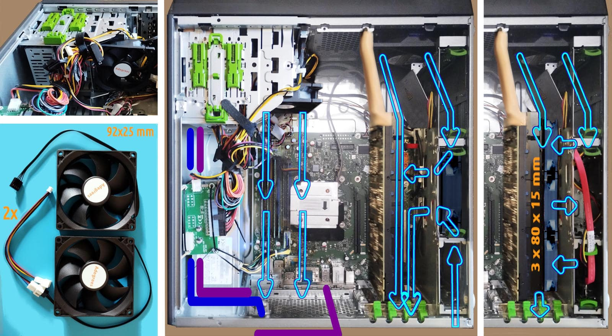

 

## P910 cooling system for K80

- This paper is part of the Esprimo P910 w/ Tesla K80 [installation manual](p910-k80-installation-manual-intro.md#?target=_blank) serie.

The photo on the left is a composition of few photos took at different stage of modding and it should be considered just an artistic creation not a reference model. For sake of completeness, in blue is indicated the power line from the second PSU to the back of the case and in purple the USB3 cable to expose in front of the case a 5GBs port. Two mods that professionals and industry can leverage but unskilled end-users should avoid.

---

### Introduction

The most straighforward and most widely used cooling solution does not apply within Esprimo P910 in combination with Tesla K80. Which is partially true as long as we keep stick with 25 mm wide fans but 15 mm might fit in place. It is hard to find 12 cm fan that are tinner than 15 mm. Moreover, large but thin fans which are also powerful are usually highly priced, enough to not fit into the tiny budget allocated for this project.

---

### The proposal

After all, this project exists for the only reason to explore options within extremely strict constrains. Hence, here is presented another possible solution which is quite cheap:

- 2 x fan 92x25 mm, priced €3.52 each = €7.04

- 2 x fan 4-pin Y cable, priced €1.63 each = €3.26

The advantage of this proposal is that it does not require to move the main fain but leaving it in its original position, untouched. In fact, a 92mm fan will be used to cooling down the CPU and hence attached by the Y cable to the CPU fan 4-pin connector.

While the second will be placed in the 2nd data storage bay which is the only one with holes, large enough that potentially let the other 92 mm fan do its work. This fan will powered and controlled by the original main fan 4-pin connector by an Y cable.

It is worth to notice that this proposal separate the extra fans into the two original fan/thermal zones. The 92 mm which are quite common and cheap fans, fits in both the places but to fix them in a way they will not vibrate and cause noise, might be tricky.

Probably, among all the solutions the most logic but also the most tricky and those which more than others requires a 3D printer for precisely creates three artefacts:

- an adapter to fit a 92mm fan into the 2.5" storage bay using the original green sliders, or even better without but levaraging the rails to be set in place.

- an adapter to mount the other 92mm fan into the Floppy Disk bay but in a way that face the CPU where its radiator is expected to receive air.

- a baffle to guide the 12 cm main fan mainly toward the Tesla K80 card while the original metallic air-flow splitter remains in place.

About the second point, the mere installation by enchasing it might work for testing but it should not considered stable because vibration can make it fall. Instead, if the grip is enough solid then it transmits a lot of vibrations to the metallic chasis. Moreover, in that position the air-flow is cooling the RAM DIMMs and the top part of the CPU radiator while by factory, it is the lower part to be hit, mainly. Which is not necessarly a mistake.

---

### Some considerations

The lines that illustrated the air-flow are clearly ideal. Not even in case of laminar flow, that lines would be correct. Hence they illustrate the basic concept, only. For example, our expectation is that the top 92 mm fan does not requires a great attention but a correct positioning. While the bottom 92 mm, ideally is pushing its air-flow toward the K80 radiators bit its functioning is more tricky to determine.

Even considering that two fans are PWm by the same controller, this does not means that a laminar flow determined by the two contributes will reamin laminar at any speed in the coupled ranges. Inevitably a fraction of the 92 mm fan air-flow will be bounced back by the metal frame and by the radiators. In this second case, back might also means toward the 12 cm fan, hence opposing at its effort.

Therefore, this installation is strongly at risk to be the worst in terms of turbolences. As long as the turbulence is not leading to a sensitive noise increase, it can be acceptable and even more useful in colling the hardware. Fundamentally, the bet is related to the pressure differentials - and now the flow lines start to have a real-world meaning: they indicates in which direction is expected the pressure grandient to be, hopefully, stable. 

At the first sight we might doubt about the need of a panel that constricts the whole 12 cm fan air-flow toward the K80. In terms of cooling can be unneccesary adding a baffle while in terms of keeping stable the pressure differentials at every speed in the coupled range, it can be the barrier which avoid any temporary pressure gradient inversion in the mainlane airflow. Which is that matters.

Personally, I love and I hate this proposal because it requires cheap and easy to find components but the adapters designing process is not trivial despite their geometry is not the main issue. Keeping the turbulence and the noise into a reasonable range using it is not a matter of a mere good-will approach but possibly includes HPC simulation and real-world tests finetuning.

Plus, without a 3D printer and related 3D models to print, the adapters kit is not triavial to replicate. By contrary, this means that the kit is an added-value product and the 3D models files are valuable. Which it seems an opportunity - in general terms - but for a tiny budget project and with the top price established by 2 x 12 cm fans height 15 mm to install into a PCI frame. So, the three adpaters kit, production and expedition included, would be priced something around €11 for being equally competitive.

Instead, an aspect of this cooling proposal that I love is that it could work enough to keep into a reasonable temperature range the K80 under load - despite turbulence and noise - and then it is possible to leverage the K80 for running a stocastic model of the turbolence and try to solve it or find a decent solution, at least. Which is a mere theoretical speculation because it would be a paramount of work just to address cheap issue. A part the value earned by the know-how developed in such attempt, obviously.

---

### Preparation stage

The preparation stage for installing this proposal is common with all the others solutions evaluated before:

Clean the mess of cables in the data storage area, just in case you were so lucky to receive all of them:

- SATA3 data, audio I/O and USB2 front-case cables, only
- tight the cables in a way that do not obstruct the holes
- organise the cable to minimise the air-flow turbolence

While audio I/O and the front-case USB port are not essential, the SATA3 data cable cannot be ignored, also for a future expansion. Otherwise the K80 card and its adapter should be removed just to connect that cable. Unless, using high-precision and strong-grip tools. Hence, do once and forever.

+

## Share alike

&copy; 2025, **Roberto A. Foglietta** &lt;roberto.foglietta@gmail.com&gt;, [CC BY-NC-ND 4.0](https://creativecommons.org/licenses/by-nc-nd/4.0/)

