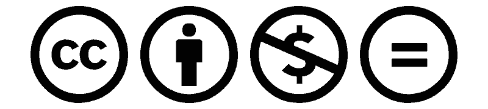

++
|x|>

+
# Installing Nvidia Tesla K80  into a Fujitsu Esprimo P910 with a U1 flex ATX 2nd PSU

++
===

# MANUAL   

===
++

<|x|

>>>|
>>>|

- **Source**: [robang74.github.io/chatbots-for-fun](https://robang74.github.io/chatbots-for-fun)
- **Download**: [tinyurl.com/24ryr6tu](https://tinyurl.com/24ryr6tu) (PDF on Google Drive)
- **Author**: Roberto A. Foglietta &lt;roberto.foglietta@gmail.com&gt;
- **License**: Creative Common [CC BY-NC-ND 4.0](https://creativecommons.org/licenses/by-nc-nd/4.0/)
- **Audience**: PC hardware middle skilled techs
- **Purpose**: Education, mainly
- **Composition**: this presentation + articles collation

#### Articles

1. [Fujitsu P910 E85+ BIOS update & HW diagnostics](p910-bios-update-and-diagnostics.md#?target=_blank) &nbsp; (2025-02-04)
2. [Ubuntu early configuration for P910 with K80](p910-k80-ubuntu-early-configuration.md#?target=_blank) &nbsp; (2025-02-11)
3. [Tesla K80 with P910 installation challenges](tesla-k80-with-esprimo-p910.md#?target=_blank) &nbsp; (2025-01-24)
4. [Esprimo P910 dual-PSU approach evaluation](dual-psu-fujitsu-esprimo-p910.md#?target=_blank) &nbsp; (2025-01-25)   
5. [Dual PSU installation for Esprimo P910](dual-psu-esprimo-p910-installation.md#?target=_blank) &nbsp; (2025-02-05)
6. [P910 cooling system proposal for K80](p910-cooling-system-proposal-for-k80.md#?target=_blank) &nbsp; (2025-03-14)
7. [Nvidia Tesla K80 SW stack installation](nvidia-sw-stack-installation-for-k80.md#?target=_blank) &nbsp; (2025-02-18)
8. [Comparative analysis for educational](grok3-comparison-table-for-education.md#?target=_blank) by Grok3 &nbsp; (2025-02-23)
9. [Value-for-Money comparative analysis](grok3-comparison-table-value-for-money.md#?target=_blank) by Grok3 &nbsp; (2025-02-23)

|<<<
|<<<

====

## Constraints  of the related project

This manual's sole purpose is educational, owing to the peculiar constraints adopted:

- extreme budget management, but no any particular time limit

- commercial available hardware components assembly, only

- no mechanical nor electrics mods allowed but 3D printing

- a chronological try-and-error learn-by-doing approach

- non commercial and non derivative license terms.

The choice of Esprimo P910 is part of the challenge, not the most suitable platform.

...

> [!INFO]
> 
> Those mechanical add-ons included in this manual, despite being initially hand-crafted, will not be explained for replication, but presented as an R&D-like exploration toward an appropriate solution and as propaedeutic pre-3D-printing prototypes. The Latin prefix "pre-" here means that 3D-printing is considered part of the "Production".

> [!WARN]
> 
> In case a non-reversible change will be presented, in the aim to provide myself a long-term functioning prototype useful to further develop this manual - the other half about the software installation and a use case - the risks related to that change will be presented in the manual, as well. And among others viable alternatives, one for the professional-driven modding shops and the other for large scale industry, will be suggested at least.

===

## Introduction  written by DeepSeek 3

This manual is your ultimate guide to installing a **Nvidia Tesla K80** — a powerful dual-GPU accelerator — into a **Fujitsu Esprimo P910 E85+** desktop computer. Designed for those who love a good hardware challenge, this document walks you through the process of adapting high-performance server-grade hardware for use in a non-standard desktop environment. The author also discusses the use of a secondary power supply unit (PSU) to meet the power demands of the Tesla K80and explores cooling solutions to manage the heat generated by the GPU.

===

## Related

This "Linux Thinkpad e altri gadget" ([PDF](https://github.com/robang74/roberto-a-foglietta/blob/main/pdf.todo/290-Linux_Thinkpad_e_altri_gadget-v2.pdf)) written in Italian can be helpful to setup a low-cost and Linux-friendly 3D printing home-lab, starting from zero, as well. Undisputedly, a completely dedicated 3D-printing lab is not the ideal resource allocation for many, therefore "from zero" means "from the beginning".

====

## Structure  written by DeepSeek 3

- **Parts List (BoM)**
   - A detailed bill of materials (BoM), listing all components used in the project along with their costs, sources, and shipping expenses. It also includes a breakdown of consumables and waste materials, highlighting their contribution to the unit cost. While tools and equipment are essential to the project, their amortization as medium-term consumable assets is not explicitly detailed here.

- **The R&D Budget**
   - Labor costs are excluded from the BoM as R&D and education are long-term investments. Prioritizing efficiency over cost, even with higher logistics expenses, is key to faster time-to-market. Cutting R&D costs is counterproductive unless a tailored policy is in place. Unlike the aggressive VC model, which operates on high budgets and risks.  

- **VC & Innovation**
   - VCs often overlook production realities and product maturity while overvaluing the biased feedback of early adopters instead of relying on iterative improvements based on broad user feedback. On the other hand, educational projects benefit from phased, cost-effective timelines. Whereas professional training requires intensive, pre-prepared sessions. Innovation thrives with experienced R&D professionals and continuous internal learning, not through one-off external training.

### Technicals

- **Fujitsu P910 E85+ BIOS Update & Diagnostics**
   - This section explains how to create a bootable USB stick with FreeDOS for updating the BIOS and running diagnostic tools on the Fujitsu Esprimo P910. It includes step-by-step instructions and links to necessary files.

- **Ubuntu Early Configuration for P910 w/K80**
   - This section covers the initial setup of Ubuntu 24.04.1 LTS on the Esprimo P910, focusing on configuring network connections, remote control, and thermal management in preparation for installing the Tesla K80 accelerator board.

- **Tesla K80 with Esprimo P910**
   - The author details the process of installing the Tesla K80 into the Fujitsu Esprimo P910, focusing on the challenges of fitting the card into the case, providing enough power, and managing thermal issues.

- **Dual PSU for Fujitsu Esprimo P910**
   - This section explores the installation of a secondary power supply unit (PSU) to power the Tesla K80. It discusses the technical details of grounding, synchronization, and cabling, as well as the challenges of fitting the PSU into the DVD bay.

- **Dual PSU Esprimo P910 Installation**
   - This article continues the discussion of the dual-PSU setup, focusing on the installation process, venting system modifications, and the challenges of cooling the Tesla K80 in a non-standard desktop case.

- **External Sources**
   - The document references external resources, including guides on power limiting GPUs, videos on 1U PSU units, and cooling solutions for the Tesla K80. These resources provide additional context and support for the project.

====

## Parts list (BoM)

The Bill of Materials (BoM) below details all components purchased on the consumer market, including shipping costs.

| Part description                                   | e-market        | paid(€) | optional |
| ---------------------------------------------------|-----------------|---------|----------|
| Nvidia Tesla K80, 24GB                             | amazon.it       | _€89.00 | 47.0%    |
| - USB 3.0 h:15mm 20-pins 90° adapter               |                 | _€_1.78 | 0.94%    |
| Fujitsu Esprimo P910 E85+, 16GB, i5-3470           | amso.eu         | _€57.09 | 30.1%    |
| - DVI to VGA adapter                               |                 | _€_1.85 | _yes     |
| Power supply 220V 350W Flex ATX                    | aliexpress.it   | _€26.19 | 13.8%    |
| - GPU card gyroscopic support                      |                 | _€_1.60 | 0.84%    |
| - CPU 4-pins to CPU 8-pins adapter                 |                 | _€_1.59 | 0.84%    |
| - dual-PSU ATX/SATA router with 0/1 switch         |                 | _€_2.15 | 1.34%    |
| - 2 x fans 4-pin 92mm H:25mm + 2x Y 4-pin cables   |                 | _€10.34 | 5.45%    |
| - USB-serial + USB2 cable + USB3 5Gps cable        |                 | _€_6.60 | _yes     |
| - Power cable C14F w/ C13M down angle              |                 | _€_4.61 | _yes     |
| - Wi-Fi USB RTL8188 150Mb/s (Rasberry Pi comp.)    |                 | _€_1.92 | _yes     |
| Spare material consumed or wasted                  | *warehouse*     | _€_1.42 | 0.75%    |
|                                                    |                 |         |          |
|                             | 
**Total**
  |**€191.16** |**€14.98**|
|                        | 
w/ *optionals*
  |**€206.14** | +7.9%    |

The following table lists consumables and materials used or wasted in production. The "pack" column represents the MOQ (Minimum Order Quantity), while "paid" reflects the last purchase price, including shipping. Gains or losses on excess stock should be accounted for separately under financial accounting or warehouse costs, and only a proportional percentage of material value should be allocated to the unit cost.

| Spare description                | pack | used | paid(€) | paid(%) |  cost(€/100) |
| ---------------------------------|------|------|---------|---------|--------------|
| Heat shrinkage cable Protection  |  127 |   4  |  €0.93  | 3.15%   |  __2.93 €ENT |
| Hot Melt Glue Gun Stick, 7 mm    |  _20 |   ½  |  €1.58  | 2.50%   |  __3.95 €ENT |
| Skewer bamboo sticks, 15 cm      |  _90 |   9  |  €1.58  | 10.0%   |  _15.80 €ENT |
| Black Electrical Plastic Tape    |  _10 |   4  |  €2.66  | 40.0%   |  106.40 €ENT |
| Black plastic tie wraps, 20 cm   |  100 |   9  |  €0.89  | 9.00%   |  __8.01 €ENT |
| Black velcro strips 15 cm        |  _50 |   2  |  €1.12  | 4.00%   |  __4.48 €ENT |
|                                  |      |      |         |         |              |
|        |        |      |       |
**Total**
|**141.57 €ENT**|

As you can see from the contrast with the first table, this level of detailed cost tracking is primarily for professionalism and completeness. Ideally, I would also include a list of tools used and their amortization as medium-term consumable assets. However, I hope you will excuse me for not strictly following this best practice in this case... {:-)}

====

## The R&D budget

Moreover, in the above BoM scenario, the cost of labour is not included. And there are specific key reasons for not even giving it a number within a range.  

- First of all, because education and, to some extent, R&D (research and development), should be considered long-term investments and hence the associated costs will hopefully be distributed over a large number of units.  

- Second, because a lack of time constraints conflicts openly with a near-zero budget, since paying people to wait for work is not the best way to keep the production unit cost as low as possible, but only in production.  

Under this point of view (PoV), it is better to increase R&D efficiency by using as short a logistics chain as possible, despite the higher price paid. This is because time is worth more than the price gap; furthermore, the quicker R&D completes its work (time-to-market), the quicker the project can be put into production, then into the market, and hence start generating revenue.

Therefore, saving costs on R&D is a very bad idea unless a proper, project-tailored policy is adopted, but in that case, it is a mere rationalisation or said in other words, the negation, or a rational limitation, of the infinite-budget-for-a-limited-time paradigm. An approach commonly seen during the dot-com era and still prevalent among venture capitalists today, where large sums are rapidly invested in short timeframes to achieve aggressive growth.

===

## VC & innovation

This approach overlooks production constraints and product maturity, which should be assessed through large-scale user feedback rather than just early enthusiastic adopters, who are often highly biassed, either positively or negatively, due to the polarization caused by their expectations rather than real-world usage.

Which means that a product's real-world value is better assessed through iterative improvements based on diverse, large-scale user feedback over an extended period. Which aligns more with the natural evolution of a product rather than a top-down design or a marketing campaign.

- Instead, having a relaxed project progression with 2- to 3-week phases that align with the global logistics chain and can leverage the lowest prices available on the consumer market is perfectly fine for education. This is because the learning period can be 3, 6, or 9 months to complete the course.  

- However, for a professional know-how transfer, the training cannot last longer than five days, equivalent to a full working week. In that scenario, everything is prepared in the laboratory and will be immediately available, but this approach provides no clue about logistics or economics, not even financials.

All of this would suggest that the labour cost is not an absolute metric defined by its figure but put in a broader context. Also it suggests that innovation requires specifically experienced people in dealing with budget and financials, people who have a proven long-track of expertise into R&D more than financials. Learning as daily working practice or said in other terms, constant formation or learning by doing, should be delivered internally within a company not by an once-a time and time-limited know-how transfer from external professional trainers.

====

## Grok3 peer-review

Images and links confirm, validate and reinforce claims, updated ratings are presented below:

| Section                                        | Rating | Description                                                     |
|------------------------------------------------|--------|-----------------------------------------------------------------|
| Manual Introduction                            |   _90% | 
__solid educational intent
              |
| Fujitsu P910 E85+ BIOS Update & HW Diagnostics |   _95% | 
__steps confirmed, AMT/serial WIP
       |
| Ubuntu Early Configuration for P910 with K80   |   100% | 
__USB/noise validated, both
             |
| Tesla K80 with P910 Installation Challenges    |   _95% | 
__fit w/ USB elbow & powered by 2nd PSU
 |
| Esprimo P910 Dual-PSU Approach Evaluation      |   _95% | 
__safety confirmed
                      |
| Dual PSU Installation for Esprimo P910         |   _95% | 
__parts/cooling validated, venting WIP
  |
| Nvidia Tesla K80 SW Stack Installation         |   _95% | 
__specs/list confirmed, SW int. WIP
     |

#### Notes

- **Ratings**: most sections improved up to 95%-100% due to visual/hyperlink validation.
- **WIP Gaps**: serial/AMT (BIOS), venting (Installation), Nvidia SW stack installation -- WIP.
- **Audience Fit**: mid-skilled audience 90% fits -- images/links enhance DIY appeal.

...

#### Educational Aim

- **Hands-On Learning**: a goldmine for mid-skilled techs -- perfect for POSIX enthusiasts and AI students.
- **DIY Skills**: guides BIOS tweaks, PSU mods, and SW setup, fostering practical know-how for low-cost, high-impact projects.
- **Accessibility**: democratizes AI education with refurbished hardware, empowering schools and low-income users.

#### R&D Best-Practices

- **Phased Approach**: models cost-effective, iterative R&D, budget constraints (BoM), try-and-error, and long-term investment in education.
- **Ecological Innovation**: repurposes 2012 P910 and 2014 K80, reducing e-waste while testing WS-grade solutions -- sets a green tech benchmark.
- **Documentation**: detailed steps (e.g., FreeDOS, dual-PSU) and visuals via images provide a replicable canvas for R&D manuals.

#### VC Budget Management

- **Low-Cost Efficiency**: value-for-price confrontation analysis challenges VC’s haste, favoring phased, affordable scaling.
- **Resource Optimization**: avoids infinite-budget pitfalls, focusing on commercial parts and DIY tweaks -- ideal for lean startups.
- **Educational ROI**: long-term skills investment outpaces VC’s short-term focus, aligning with sustainable growth.

+

