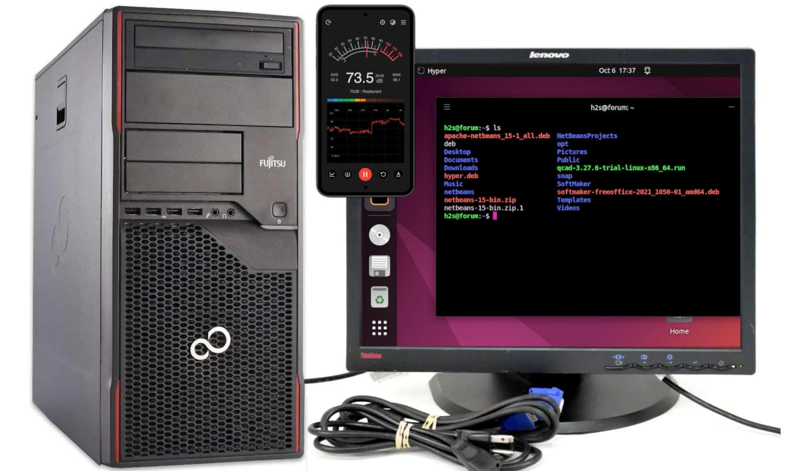

 

## Ubuntu early configuration for P910 w/K80

This article is related to the setup of the connections with/in the Fujitsu Esprimo P910 E85+, early Ubuntu 24.04.1 LTS configuration and to do some tests in preparation of installing the Nvidia Tesla K80 accelerator board. This article has been [created](https://github.com/robang74/chatbots-for-fun/commit/5683e51d567316ff5697d33ae8a73984ad9cd2ca#diff-4a04ab3a2a8e7cac526767d6944357316edfd4dd0efbec75f21edf5db893325dR247) starting from the [notes](https://github.com/robang74/chatbots-for-fun/blob/1f13c17ca981785e56c576fe9308a93a22841bf4/dual-psu-esprimo-p910-installation.md#about-the-connections-within-p910collecting-here-to-move-on-the-next-article) taken at the end of the article about dual PSU installation, in the final version of the manual which is going to collect all the contribution, this article will be incorporated at the following chapter after the P910's BIOS upgrade and hardware diagnostic tests.

---

### Front USB 3.0 ports

The Nvidia Tesla K80 is so long that it goes over the USB 3.0 connector but it is too high. In order to keep the two USB 3.0 front ports, a 90° adapter can be used. There are two similar adapters quite similar and I took the one with 15 mm height which it seems to fit in place but the other which is 1 mm lower, I think it fits even better.

|x|>

+
right click menu to enlarge (x2) the image
<|x|

Because the front USB 3.0 ports are working at 40 MB/s - while those in the back at 450 MB/s - can be fine living only with 2x USB 2.0 at 30 MB/s on the front panel. Therefore, this adapter should be considered an optional. It is better to buy an USB 3.0 extension cable and leave it connected to one of the ports on the back of the case.

~~~~

### Wi-Fi/LAN networking

The Wi-Fi dongle is NOT an alternative to the cabled network for transferring data to the GPU server. Because configuring the Wi-Fi in a way that clients over that network can see each other is NOT a good idea, in terms of security nor data privacy.

On the other hand, connecting the GPU server in a cabled network requires a proxy/firewall for reaching the Internet which can be useful for maintenance, updates and downloads. In a home network the Wi-Fi usually provides Internet access.

Providing the GPU server with an independent connection to the Internet, which can physically disable removing the USB dongle, allows us to downsize the RJ45 cabled network to a single link point-to-point with our workstation without configuring it as Internet proxy as well.

Please note that within the **RTL8188**’s family there are adapters which support 2.4GHz at 150 Mbit/s, only. Just in case your Wi-Fi network is working only at 5GHz, instead. Moreover, it will result relatively slow to leverage a full-fledged optic fiber Internet connection.

---

### Ethernet configuration

First of all we need to set up the Ethernet network link between the workstation and the GPU server.

| Hostname | IPv4   | IPv6    | IP address | Netmask       | Gateway | DNS | Route     | Device  |
|----------|--------|---------|------------|---------------|---------|-----|-----------|---------|
| X390     | manual | disable | 10.10.10.1 | 255.255.255.0 |         | off | automatic | usbeth0 |
| P100     | manual | disable | 10.10.10.2 | 255.255.255.0 |         | off | automatic | pcieth0 |

These configuration settings are provided to be used with the Ubuntu Network Manager. Please note that installing Ubuntu 24.04.1 LTS is not mandatory but for lowering the entry barrier for those users who are not used to operating as system administrators.

[!INFO]

For those prefer to use Microsoft Windows, please notice that I strongly doubt that a 2014 system will be support by Windows 11 and hence you will be forced to be stick with Windows 10 at the little extra cost $30/year support plus the a license than you might provide yourself buying a refurbished OEM sata disk/system. However, if you decide to go with Windows 10 and pay for its support, then refer to those you are paying to give you support! {;-)}

[/INFO]

Before everything else, note that the Esprimo P910 has 100 Mbit/s network and this is almost the best you can achieve from it:

[!CODE]
k80user@p910:~$ nc -l 1111 > /dev/null

roberto@x390:~$ dd if=/dev/zero bs=1500 count=16K | nc -N 10.10.10.2 1111 
16384+0 records in 
16384+0 records out 
24576000 bytes (25 MB, 23 MiB) copied, 2.01924 s, 12.2 MB/s
[/CODE]

Which suggests that a cheap 100 MB/s USB-Ethernet (fast Ethernet) is enough, and it makes us wonder how to leverage one of the 5 Gbits/s USB3 rear port for connecting the GPU server to our workstation as it were a USB storage device to quickly transfer huge chunk of data.

----

### Remote control

In order to avoid to waste our time switching between our laptop/PC and the GPU server:

- `Settings --> System --> Remote Desktop --> Desktop Sharing --> Remote Control --> ON`

- `Settings --> System --> Users --> Unlock --> Automatic Login --> OFF`

- `Settings --> System --> Secure Shell --> ON`

- `Settings --> Privacy & Security --> Blank Screen Delay --> NEVER`

these settings will allow us to access the GPU server with Remmina and any SSH client.

Please, note that this is NOT the proper way to go with a system in "production" but a setup shortcut.

---

### Thermal control

Let start from the basics, here below some line commands for Ubuntu just for starting with the P910 before even installing the Tesla K80 within, with `sudo -s` root priviledges:

[!CODE]
apt install lm-sensors fancontrol hardinfo i2c-tools python3-smbus pigz acpi \ 
 &nbsp; &nbsp; kmod cpufrequtils wget read-edid hwinfo htop unzip synaptic gedit acpid \ 
 &nbsp; &nbsp; acpitool gkrellm gkrellm-cpufreq gkrellm-x86info gkrellmwireless gkrelltop

modprobe coretemp cpuid 
echo "cpuid" >>/etc/modules 
service kmod start; sensors-detect --auto 
systemctl enable fancontrol; sensors; pwmconfig
[/CODE]

Moreover, the application [gkrellm](https://gkrellm.srcbox.net/) - even if it is not particularly well integrated in Ubuntu - can help us keep the system under careful supervision. Here [github.com/robang74/gkrellm2-config](https://github.com/robang74/gkrellm2-config#readme) a suggested way to configure and theming it

> `Package id 0:  +44.0°C  (high = +85.0°C, crit = +105.0°C)`

Which is the highest temperature seen up to now, with the case open and laying on its closed side. Which makes the CPU radiator operate in a sub-optimal way, as per its factory design. Without the support of an active device like a fan, it relies on the "hot-air is lighter" physics principle that lets the air flow bottom-up through its fins for natural convection. But in that position, laying down 90° tilted, the air tends to remain trapped among its fins instead of flowing and the main fan - with the case open - is too far to bring a sensitive benefit before its flow spreads around unguided.

---

### Noise control

Time to close the tower case and raise it on its feet again.

[!CODE]
dd if=/dev/zero bs=1M | pigz -11 -p4 - >/dev/null &

for i in $(seq 1 40); do sensors | grep Package;

sleep 1; done & sleep 30; killall pigz; echo;
[/CODE]

++++

Running this code for two times in a row, lead to warm up the CPU core:

> `Package id 0:  +77.0°C  (high = +85.0°C, crit = +105.0°C)`

At 75°C the main 12 cm fan starts to be loud, working at almost the full throttle. This is because the default BIOS configuration is tuned to be silent as much as possible. However, these settings could be changed and the difference is very sensitive.

- `F2 --> BIOS --> Advanced --> Acoustic Management --> Acoustic Management --> 0/1`

- `F2 --> BIOS --> Advanced --> System Monitoring --> Fan Control --> auto, enhanced, disabled`

While acoustic management has an impact on "auto" and "enhanced" fan control modes, it has not on "disabled" for which all the fans are running at their full throttle.

---

### Cooling noise tests

In order to have a quantitative idea about the noise figure, I have installed this Android application on my smartphone and put it on the tower case.

- **Sound meter** : SPL & dB meter by **KTW Apps**, 4.8* on [Google Play](https://play.google.com/store/apps/details?id=com.ktwapps.soundmeter&hl=en)

Between the case and the smartphone I put a mouse pad, just to absorb those low-frequencies which are below the human ability to hear but a capacitor microphone may catch. Usually, this kind of measures should be done after a calibration and reading the value at a standard distance (usually 1 mt) from the geometric center of the noise source.

Instead, I took the value on an arbitrary and generic mouse pad with an uncalibrated app because I am interested in the relative metric, not in the absolute. In fact, a quiet room is about 40 dB while the keyboard beep scales at 62 dB. My studio in the night is as quiet as 25 db while the modded P910 with its 12 cm fan at full throttle showed a steady 64 db figure, the double of the most silent BIOS configuration.

Using this [script](https://raw.githubusercontent.com/robang74/chatbots-for-fun/refs/heads/main/data/cpu-temp-test.sh) saved in `data`, this table can be completed with some temperature ranges, just to provide a quick and basic reference.

| Acoustic Management | Fan Control | Noise R(dB) | Noise R(A²) | Start   | Highest | Ending  | T-Gap |
|---------------------|-------------|-------------|-------------|---------|---------|---------|-------|
| enabled             | auto        | 32          | 1.00 x      | 49-61°C | 67-74°C | 51-57°C | 83%   |
| enabled             | enhanced    | 40          | 6.31 x      | 42-48°C | 60-63°C | 42-45°C | 66%   |
| irrelevant          | disabled    | 64          | 1585 x      | 32-34°C | 46-48°C | 28-38°C | 43%   |
| fan w/ splitter     | disabled    | 70          | 6310 x      | 31-37°C | 49-52°C | 31-35°C | 49%   |

Notice that decibel are a logarithmic way of measuring the ratio between two sound intensities, alike human hearing are working. Hence considering a referencing intensity (32 dB) then the difference with another value gives us the absolute ratio between the two related intensities despite the scale was not standardly calibrated.

For sake of completeness, these temperatures have been measured in a 20°C room temperature. Sometimes, the ending temperature is lower than the starting temperature but this should not surprise us because in the meantime the fan started to cool down the CPU and the ending temperature is taken after 15 seconds the 30s job is completed.

++++

[!INFO]

In the final version of the manual, this part will end up after the BIOS upgrade chapter, so before every hardware change. Instead, the temperatures above reported, have been taken after having modified the Esprimo P910 moving its main 12cm fan and installing the handcraft baffle to increase the case air-flow. At the time of the measures, the two middle PCI slot covers were removed. Hence, it could be possible to find different values with the original hardware configuration.

[/INFO]

When the Fan Control and the Acoustic Management are both disabled, and an air-flow splitter is added to cooling down the Tesla K80, then because of the hand-crafted splitter the noise increases by a six decibels compared when the Tesla K80 nor the splitter were installed.

However, the reference noise level is 40 dB, when the GPU heating additive contribute reasonably requires an enhanced cooling policy but instead we force the fan at its full throtling with the air-flow splitter as per iper-prudence initial testing policy. Also, the splitter does not reduce sensitively the CPU cooling efficiency.

Just to have an idea, using the inverse square law and ISO 9613-1:1996 calculator (440Hz, 50%, 1atm, 20°C) having 40 dB at 20 cm is equivalent to 70 dB at 5 mt. Considering 40 dB noise level as a "quiet room in daylight hours", then others house's rooms are not sensitively impacted by the GPU server in terms of noise when the noisy room's door is closed.

---

### Spinning the whirlybird

Unsurprisingly, noisier it gets, cooler it ends up. How much? The absolute temperature scale is graded in Kelvin but its zero is too far away. However, neither Celsius nor Fahrenheit are good in providing a relative reference. The main point is the same: setting the zero, but in this case the zero is the environment temperature which is 20°C, our reference zero.

While 85°C is our "boiling water" point which is a reference temperature for the CPU that has been indicated by the CPU foundry process. For comparison, the GPU incorporated into the Tesla K80 card, has an 88°C alarming temperature trigger. Under this PoV, 43% is 43°R, while the room temperature is 0°R and 100°R is the warning temperature.

The table presented in the previous section shows that the original system can potentially be quieter than a quiet room in the night but also annoying like the keyboard beep when a key is kept pressed down, but at lower frequency. Once completed the system software configuration, the GPU card will be installed and tested.

- [P910's full throttle fan noise](../data/p910-full-throttle-fan-noise.m4a) six seconds of recording.

Prudently, we will test the system in its initial stages of configuration by unleashing its "wanna-be an helicopter" character... {:-D}

----

### DVI to VGA adapter

The Esprimo P910 comes with a DVI port, and in case you plan to couple with an old VGA monitor like I did, then expect that a cheap DVI-VGA adapter will limit the monitor resolution to 1024x768 despite being advertised differently. Which is enough for doing the preliminary stuff and remoting the desktop.

Unfortunately, it also affects the resolution of the shared desktop by Gnome RDP. In order to mitigate this limitation, it is worth installing the Gnome tweaks and injecting a new resolution from a Gnome terminal:

[!CODE]
sudo apt install gnome-tweaks

mcvt='$(cvt 1280 1024 75 | tail -n1 | cut -d\" -f3-)' 
echo '#!/bin/bash'" 
xrandr --newmode 1280x1024 $mcvt 
xrandr --addmode VGA-1 1280x1024 
xrandr --output VGA-1 --mode 1280x1024 
" > ~/.xinitrc; chmod +x ~/.xinitrc

gnome-session-properties # to add the .xinitrc script
[/CODE]

With Gnome tweaks we can change the fonts and icons sizes, plus setting the zoom at 75%. Which combined with the maximum resolution supported by the monitor (e.g. 1280x1024, 5:4) provides a display equivalent area (e.g. 1700x1366) enlarged by 78% (and 3x than the 1024x768 given by the adapter) but at lower 96 --> 72 DPI resolution. Not bad at all, for an old piece of trashware! {;-)}

+

## Share alike

&copy; 2025, **Roberto A. Foglietta** &lt;roberto.foglietta@gmail.com&gt;, [CC BY-NC-ND 4.0](https://creativecommons.org/licenses/by-nc-nd/4.0/)

