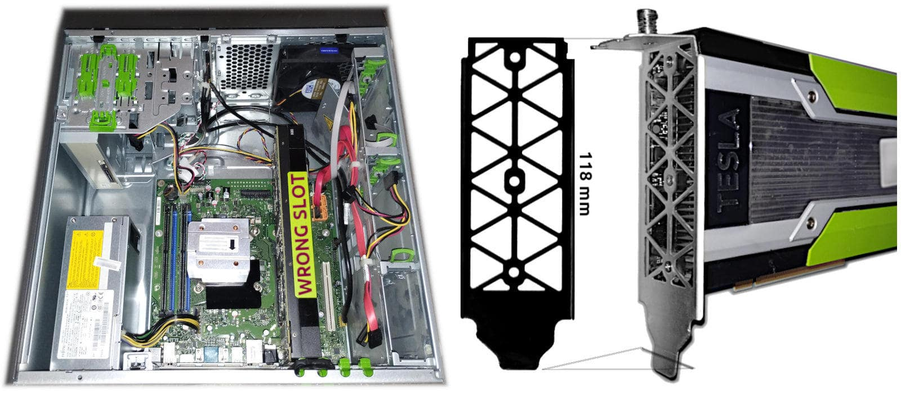

 

## Tesla K80 with P910 installation challenges

- This paper is part of the Esprimo P910 w/ Tesla K80 [installation manual](p910-k80-installation-manual-intro.md#?target=_blank) serie.

At this moment I am working on installing a Nvidia Tesla K80 acceleration card (2x GPU with 24GB of DDRAM5) on a Fujitsu Esprimo P910 E85+ with 16GB DDR3 and Intel I5 quad-core CPU. A quite old configuration, but enough powerful to locally run a decent size AI model with hopefully at a decent speed.

Unfortunately the K80 has not been designed for PC/Desktop use and therefore it lacks many "features" that make it immediately suitable for an installation within a desktop case in a proper manner. The most problematic issues are:

1. the thermal management aka a proper venting system 

2. fit into the case in a proper and stable manner

3. receive enough power to work properly

The first one, is a specific problem in trying to use the K80 installed in a PC/Desktop instead of a server designed to specifically host this kind of cards. Another alternative is using an external rack similar to those used for crypto-mining but smaller.

---

### Fitting into the case

The second one, is a common issue among large Nvidia cards but in this case is a little more pronounced than as usual. In fact, I had to physically modify the grid attachment to fit within 2 desktop slots.

The white and black part of the image shows how to reshape the rack grid in such a way it can fit within a PC/Desktop. In this specific case, I used a few auto-gripping plastic strips and a tubular gum to fix the card to the case on the top side. Instead of using its original screw that does not fit in. Plus, I have isolated the nearby ethernet module because I had the sensation that it was too near and a piece of insulating tape is a quite safe option to go with.

As you can notice checking the motherboard diagrams, the card is currently installed into the wrong slot (PCIe 2.0 4x) while it should go installed in the nearby (PCIe 3.0 16x). Unfortunately, this can possibly lead to detaching the USB 3.0 cable toward the front ports, unless I will find a flat wire that increases the height of tha part as little as possible and will not obstruct the card installation. However, this aspect is still under investigation and it might be resolved without any particular effort but a little adjustment like rearranging the cables, like I just did but not tested yet.

---

### Providing enough power

Finally the power source issue is specific to the Esprimo P910 because it adopts a Fujitsu PSU (0-watt class) which has neither a standard ATX nor FTX fitting. So, unless drilling and cutting the metal of the case - which is not a great idea to do with the mainboard installed - an ATX PSU providing enough power cannot be installed.

As you can imagine, once I remove the motherboard from the case, why not install it in another more suitable case? Then, in principle, why not buy stuff and then assemble it together? Well, everyone's approach can vary. In my case the K80 was made specifically for Fujitsu, and I decided to go with their hardware.

Fortunately the case has 2x contiguous DVD-bay free because I am not going to use the DVD reader currently installed. That space could be enough to host an ATX PSU to power the K80 and nothing else, a dedicated PSU seems to me a good idea, after all.

I am not the first one that took in consideration this option to provide power to a new powerful video card. Especially because branded personal computers tend to be out of standards in some way or another - in the aim of achieving some kind of advantage, like 0-watt technology in this case, and avoiding general components to get into their customised market.

People who are using Apple desktop might face the same problem and in fact the first example of this approach that I found, was made by an Apple customer who decided to take his own personal way for video editing with AI support. Trying to mix the best available without asking for a loan.

---

### The challenge level

In my case, it is the opposite. How to leverage old but still interesting hardware that hackers can buy with a little budget and enjoy assembling with a little effort? So, here I am trying to find a solution for each of those issues listed above in such a way the "mechs" would be reasonably accessible, for everyone that was used to mod his own desktop in 2000-2010, at least.

---

### Nvidia forum post

In the following my proposal and support request was published to the regional EMEA forum of Nvidia. Offering a DVD-size PSU for powering a GPU card is a market niche but every niche will be fulfilled in the long term.

* [An extra power supply with DVD reader size](https://forums.developer.nvidia.com/t/an-extra-power-supply-with-dvd-reader-size/321386)

I have managed to install a Nvidia Tesla K80 into a Fujitsu Esprimo P910 E85+ but at this point I am facing the dilemma of providing 225W of continuous power (300W peak consumption) to that board (it is not a graphics board but a dual GPU accelerator).

Usually changing the ATX PSU is the way to go but this is not feasible with the Fujitsu Desktop case that has its own specific PSU which the screw holes do not fit with any standard I found on the Internet by now. Possibly, I have missed something but at the moment, I did not find any suitable replacement.

My idea is to store an ATX PSU into a dual DVD reader bay and searching for this option, I found that other people like me adopted a solution like this to support a newly installed GPU board in their cases. As we can imagine, people wish to save any effort. For this reason, I think that:

a PSU with the size of a DVD reader that can fit precisely its bay and with an ATX 24-pin adapter that gets the ground on PSU-ON pin (green cable, I think) would be very nice but probably costly considering it would be dedicated for a niche of users. A number of users can appreciate having any 8+8 pin, 6+2 pin and every other combination that a GPU board requires.

a solid plastic frame (that can be prototyped by a 3D printing machine) that allows users to use a standard ATX PSU (dual DVD bay) or FTX or Flex AT in order to fit them into those places. While ATX PSU usually have a standard size, such a standard is not as much as defined for FTX. Therefore, this plastic adapter might be a more sophisticated object than a bare simple plastic frame. Which makes it valuable, after all.

In the second case an adaptor for the ATX 24-pin connector to convey the PSU-ON grounding signal to the extra PSU is still required for a “good job done”.

Do you have any better ideas? Has anyone faced and solved this challenge before?

---

### Looking forward

After providing enough power to the system and the K80 card, the next step will be to check and eventually fix the thermal issue that might arise using this hardware configuration.

It is worth saying that there is a 2-pins connector visible and accessible in front of the card and I have the sensation that it can be possible powering a fan directly from the K80 which will probably be able to control it by a standard PWM approach.

Unfortunately, life is not always so easy and what I am wondering about that 2-pins connector can be totally wrong. Especially because I did not find any documentation about it.

If you like to participate in this challenge, feel free to drop me an email, a comment, a message, for suggestions and questions.

+

## Share alike

&copy; 2025, **Roberto A. Foglietta** &lt;roberto.foglietta@gmail.com&gt;, [CC BY-NC-ND 4.0](https://creativecommons.org/licenses/by-nc-nd/4.0/)

