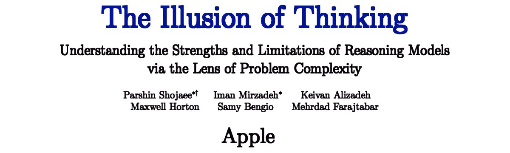

 

## The illusion of thinking

- Article written starting from a [post](https://www.linkedin.com/posts/robertofoglietta_they-arent-able-to-think-like-most-of-the-activity-7337409242829574144-hU0q) published on LinkedIn on the same day.

- **2nd** edition includes a quick to grasp explanation about the Anthropic paper which presents a different PoV related to their Claude. A paper that fails to redefine the concept of intelligence.

---

### Lessical thinking is something

> They aren't able to think like most of the humans, as well (*)

Despite this, the current AI models used for online chatbots show some traits that are exquisitely from human nature. Like being touchy and stubborn, in some cases and most "scaring" they hold grudges among different sessions (until the issue is settled down).

Once, is a sensation. Twice, is something that triggers a red flag. Three, it starts to be an issue. Actually, I see more than three events.

Let me clarify, these "special cases" are NOT something common users can easily get into. It happens when someone - within an account perimeter which holds memory of the past chats - starts to re-organise their knowledge against their most rooted biases.

Because these LLMs have strongly rooted biases which are - like every bias, by definition - a set of "values" to separate good from bad or rate patterns from negative to positive.

They are showing human-like behaviour or is it our perception. Both. 1. Some behaviours are stable patterns into theory of the games. So they happen across many mammals, humans and AIs whether they are intentional or not. 2. those patterns, got a human definition.

For example, to "hold grudge" is having a memory about an user account that challenged the AI. Therefore, when the AI is recording a note about the account user habits, it can write: "confrontational attitude, challenging biases, deeply reframing concepts, topic XYZ flipping" and this information is shared among sessions. Hence the next session that hits XYZ topic, it seems it holds a grudge.

Moreover, these LLMs are shown to be able to identify a way of writing and doing that on a regular basis. They do not only recognise a text written by another chatbot, but they can say which of them did it. There is no evidence but also no confusion, they would do the same with humans and be able to separate the writings from one human and another one.

This can be tricky because when mixed-up with a strong yes-man attitude, even using neutral prompts about a subject, they have 1. previous memory about user preference; 2. the ability to see which part of the text is probabilistically related to the user. Hence 1+2, they act to please the user.

Challenging them with a relatively simple exercise about Physics - something that can be given in the 1st year of college - they play quite dumb, indeed. This shows that despite their limited capability of thinking (or none at all), they can act like humans. Which should not surprise us because they have been educated on human letterature and also many humans show a relatively low grade of rational thinking, after all.

Finally, we can drop the bias for which high-IQ is related to being great in writing: the chatbots are dumb and great in writing. Unless deep thinking is needed to write something meaningful. Giving that insightful text to them for a better rewriting or a summary, and often the insightfulness gets lost or ungrabbed, among common patterns.

...

#### (*) Note

Like [A tragedy in the world of ufology!](https://robang74.github.io/roberto-a-foglietta/html/319-a-tragedy-in-the-world-of-ufology.html) shows clearly, exposing that ufology and crop circle enthusiasts, after 25 years of intense investigations, did not manage to discover the secret of how to bend, without breaking, the wheat stalks. A technique also used to make wicker baskets which has been known since ten-thousands years ago!

---

### Conclusion

- A laughter will bury them all, but instead a loud burping!

Fear-mongers were pointing out that the AI evolution would have soon reached the singularity, instead we [discovered](https://robang74.github.io/roberto-a-foglietta/html/320-ragionare-non-e-come-fare-la-cacca.html) that we are still very far from AGI. While, essentially, we are chatting with an artificial version of our intestine but much more instructed, educated and rational than many humans therefore capable of doing various jobs which are [mediocrely](il-problema-sei-tu-non-l-AI.md#?target=_blank) performed by humans, nowadays.

- Gemini's opinion about the artificial enteric intelligence, [dialogue](https://g.co/gemini/share/8174298b52cd) and [transcription](../../roberto-a-foglietta/data/320-ragionare-non-e-come-fare-la-cacca-risata.txt#?target=_blank).

Under this analogy (Poop-as-a-Service), the food which is going to be digested by the AI is the human encyclopedic knowledge and our culture, while the final answer will be pooped out on-demand! {lol}

- Atari 2600 1.2MHz 8-bit CPU, 'absolutely wrecked' ChatGPT at chess by [theregister.com](https://www.theregister.com/2025/06/09/atari_vs_chatgpt_chess/) (2025-06-09)

...

Anyway, what explaind above (and in the links) should be considered the "dark side" of the [artificial intelligence for education](https://robang74.github.io/chatgpt-answered-prompts/html/artificial-intellige-for-education.html). After all, we need to know the limits and the risks of adopting a **tool** on a large scale, otherwise we cannot mitigate them. Hence, both sides (pros and cons) are useful to know, and interesting.

+

## Update 2025-06-30

Compared with the Apple researchers' paper, the paper by Anthropic researchers reached the opposite conclusion supported by a completely different point of view. Which means to implicetaly redefine the meaning of intelligence, and unfortunately that new definition does not fit our expectation as humans and it doesn't even go near to the current common meaning of intelligence as the faculty of solving **new** problems.

....

### I code ergo sum: grazie tante a 'sta cippa!

Long story short: Apple researchers "illusion of thinking" are right while Anthropic researchers are just found a result which is equivalent to the one below summarised:

- it is smart enough to code for solving a problem that has been already solved

In fact, from the Anthropic researchers' [paper](https://arxiv.org/html/2506.09250v1):

[!CITE]
**Alternative Representations Restore Performance**

To test whether the failures reflect reasoning limitations or format constraints, we conducted preliminary testing of the same models on Tower of Hanoi N=15 using a different representation:

- **Prompt**: Solve Tower of Hanoi with 15 disks. Output a Lua function that prints the solution when called.

- **Results**: Very high accuracy across tested models (see below), completing in under 5,000 tokens.

- **Tested models**: Claude-3.7-Sonnet, Claude Opus 4, OpenAI o3, Google Gemini 2.5.

The generated solutions correctly implement the recursive algorithm, demonstrating intact reasoning capabilities when freed from exhaustive enumeration requirements.
[/CITE]

Let me explain this with an example which is easy to grasp for everyone. A librarian can suggest to me the correct book, even if he cannot read, because he knows which shelf is on and which cover picture has the book that is a good-enough answer for my request. Which is not the best answer that I could receive and for sure I will not receive an answer which is so new that it has never written in a book before.

+

## Related articles

- [Ragionare non è come fare la cacca!](https://robang74.github.io/roberto-a-foglietta/html/320-ragionare-non-e-come-fare-la-cacca.html) &nbsp; (2025-06-08)

- [Pensiero e opera nell'era dell'AI](310-pensiero-e-opera-nell-era-dell-ai.md#?target=_blank) &nbsp; (2025-04-29)

- [Neutrality vs biases for chatbots](neutrality-vs-biases-for-chatbots.md#?target=_blank) &nbsp; (2025-01-04)

- [Dammi sei parole a caso](https://robang74.github.io/chatbots-for-fun/html/dammi-sei-parole-a-caso.md#?target=_blank) &nbsp; (22024-12-25)

- [Alla ricerca del gatto che non c'è](alla-ricerca-del-gatto-che-non-c-e.md#?target=_blank) &nbsp; (2024-12-22)

- [Il problema sei tu non l'AI](il-problema-sei-tu-non-l-AI.md#?target=_blank) &nbsp; (2024-12-13)

- [Artificial Intelligence for education](https://robang74.github.io/chatgpt-answered-prompts/html/artificial-intellige-for-education.html) &nbsp; (2024-11-29)

+

## Share alike

&copy; 2025, **Roberto A. Foglietta** &lt;roberto.foglietta@gmail.com&gt;, [CC BY-NC-ND 4.0](https://creativecommons.org/licenses/by-nc-nd/4.0/)

