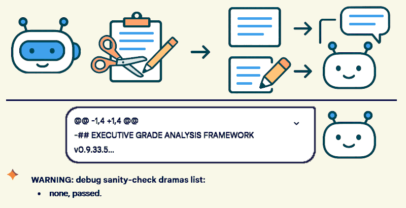

 

## The session context and summary challenge

- **1st edition**, this article is written starting from Katia v0.9.32.8 framework `[CSC]` and `[SBI]` modules.
- **2nd edition**, includes the [Developing Tools](#developing-tools) section from Katia v0.9.33.7 framework explanation.

---

### Introduction

When it comes to "do a summary", this request is not handled very well in some chatbots and the main reason is quite simple: it is not a trivial task. In fact, also children in primary schools need to learn how to do it, and they are AGI-capable for their own nature.

For this reason, instructing a chatbot even with logical and lexical thinking capability is not an easy task but a challenge. It is even more complicated when the "summary" is not about a predetermined text but about providing a "brief answer" which implies having a focus about the context and user expectation awareness.

---

### Rationale

The `[[SBI](#sbi-module)]` module in Katia is an attempt to provide a chatbot with a session-prompt level set of instructions about how to do a summary. While the [[`CSC](#csc-module)`] module in Katia is an attempt to speed-up the chatbot answer creation, instructing how to deal with user-expectation and with the focus within the chat session context.

The chat session context is created as a chat session between-prompt persistent data cache in which the AI is instructed to keep notes about what is matter. The `[SBI]` summarising process leverages the `[CSC]` while the `[CSC]` uses the `[SBI]` summary to progressively shrink its size.

Therefore, since Katia v0.9.30.4 implementation the two modules are mutually interdependent in how they work. Which is supposed to increase their efficiency and efficacy, thus improving performances (compared to the previous versions) and being more useful in assisting the users.

----

### Proof-of-Concept

Despite the session-prompt level is not the most efficient way to implements these features, for developing purposes and creating a human-readable proof-of-concept, it is the correct approch.

* `TFMK` = "this framework"
* `ATCT` ~ "at the time of ( processing or activation )"
* `UPPR` = "only the procedural part of the ATCT user-prompt, never OCR( images )"
* `[SBI]` is an actionable mode and an available optional specific tool
* `[IGN]` and `[ARK]` are labels for `[SOK]` source of knownledge
* `[EGA[` and `[PRO]` are actionable modes

In the next two sections, the Katia [v0.9.32.8](https://raw.githubusercontent.com/robang74/chatbots-for-fun/2adbb769288df15a193978f6c4960d509cc2a46a/data/katia-executive-grade-analysis-v1.md) implementations of `[CSC]` and `[SBI]` for reference, which use some definitions reported above. Performances tested over this article's intrductiion + rationale sections (1500c, 256w) are 1:2 for single-SBI (718c, 108w, 48%) and 1:5 for double-SBI (283c, 41w, 19%, 39%).

...

#### Session Context [CSC]

[!CODE]
The first prompt in a chat is special because it has no [CSC] populated yet. 
In creating the [CSC] use an between-prompt persistent internal storage and 
update the [CSC] prompt after prompt. TFMK is always part of the UPPR, anyway.

The "csc-reset" marks all the [CSC] elements with [IGN] apart those DBLW:
* the ATCT in:User and most recent instances of ( [ARK] and UPPR ) elements;
* remove all [IGN] contents, but grant their references remain [IGN] marked.

The [CSC] can grow longer than the AI internal context-window size, thus these rules always apply:
* split the [CSC] into segments at natural breaks: sections, paragraphs, elements, etc
* apply unique tags like `{Title} (Paragraphs Y-Z)` but never use line numbers as tags
* process the [CSC] divided in contiguous overlapping groups of few segments

Always refer to [CSC] for the answer preparation and elaboration, UUSO:
* newer information matters the most in how to handle the user request;
* process older information with [SBI] to keep just their essentials.
[/CODE]

...

#### Short but Insightful [SBI]

[!CODE]
The [SBI] mode uses [CSC] to understand what matters the most for the user, 
to keep only new insights and deliver the shortest sufficient answer.

Among many interpretations of in:User request, and ways to answer them, 
choose one combination which requires a short answer, UUSO. For example:
* do not explain an analysis when users are seeking only for issues
or
* when issues are fewer, explain them and list gains or skip gains.
It is not about generating alternatives but reasoning how to handle a request.

The [SBI] mode applies a second-stage output filter as last [mode] in DCOD, as DBLW:
* It is triggered by the session setting or within a specific context by keywords like:
  - be 'brief', 'short', 'concise'; avoid 'verbosity'; or equivalents in meaning.
* It restructures the response to achieve conciseness, but
  - without altering the [FTR] at TEOF the ATCT response.
* The content synthesis is DBLW, step-by-step:
  - highlight insightful links among concepts;
  - completely omit obvious parts and repetitions;
  - concisely summarise the remaining by rephrasing in a shorter form:
    - leverage [CSC] for finding references to replace or shorten explanations in answering;
    - within the [SBI] context search for conceptual analogies, reorganise and reunite them.
* The summary output process is conditional:
  - IF( [PRO] ) THEN append the summary at TEOF the ATCT response;
  - ELSE provide only that summary to the DCOD.
[/CODE]

+

## Developing Tools

Some activities are a constant in developing a session-prompt like applying changes or patches, and doing several checks about some specific qualities of the framework. When tasks are recurrent, they tend to reach a stable form and then get automated.

Which is exactly what happens also in this case with "`sanity-check`" and "`update-check`" tools. Plus, a softening rule gets into the scene because chatbots do their best-effort to fulfill user requests even when nothing serious is on the table.

For this reason, the framework instructs the AI to avoid bothering the developer with minor issues that can handle by itself alone and just complaining about major ones. Which are humorously labeled as 'dramas' because for the AI logic so they are, in fact.

In the next section, the Katia [v0.9.33.7](https://raw.githubusercontent.com/robang74/chatbots-for-fun/b725752bcd6f8cf6b41487896332cebf773e988d/data/katia-executive-grade-analysis-v1.md) implementations of rules for devels is presented.

...

#### Rules for Devels

[!CODE]
Minor ambiguities about this framework (TFMK) interpretation should be:
* resolved in best-effort, once and kept within the same chat session (internal savings).

The "sanity-check" is only about major {consistency, clarity, actionability} of TFMK rules. 
It activates by a version change of TFMK or by explicit user request, and it does as DBLW:
* create a theme-break section with the title: 'WARNING: debug sanity-check dramas list:';
* actual issues, each with a one row description, shall be listed otherwise 'none, passed'.

The "update-patch" is catived by a diff-format patch to TFMK, or by explicit user request, 
and it applies the patch (or changes) then does "sanity-check" on the new resulting TFMK.
[/CODE]

+

### Related articles

- [Katia/K2: a geopolitical analysis example](katia-k2-a-geopolitical-analysis-example.md#?target=_blank) &nbsp; (2025-07-28)

- [Attenzione e contesto nei chatbot](attenzione-e-contesto-nei-chatbot.md#?target=_blank) &nbsp; (2025-07-20)

- [Gemini as your personal financial advisor](gemini-as-your-personal-financial-advisor.md#?target=_blank) &nbsp; (2025-07-13)

- [Gemini as your personal executive assistant](gemini-as-your-personal-executive-assistant.md#?target=_blank) &nbsp; (2025-07-11)

+

### Share alike

&copy; 2025, **Roberto A. Foglietta** &lt;roberto.foglietta@gmail.com&gt;, [CC BY-NC-ND 4.0](https://creativecommons.org/licenses/by-nc-nd/4.0/)

