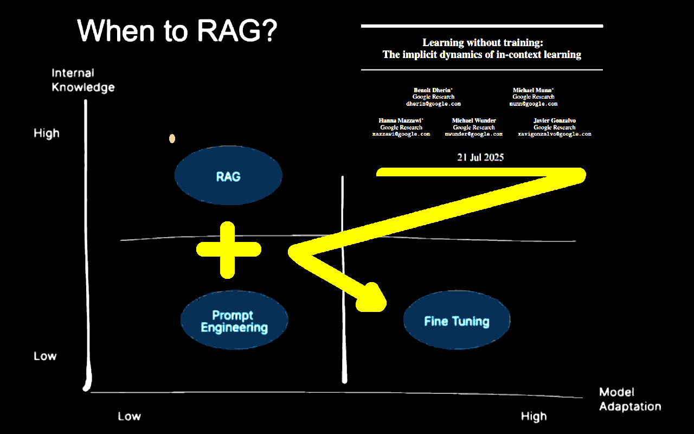

 

## Where the magic happens, in AI prompting?

- **2nd edition**, introduces more stuff and also some more sketches of humor, because if we cannot laugh at something then such a topic (*) isn't worth our time nor dedication! (*) or something related to it, like the hype for a "new" technology for which the first implimentation, named ELIZA, is going to age 60 years old. 

---

### Introduction

We do not believe in magic, but a kind of magic can happen when intuition starts with practice, moves into soft science and by a progressive improvement process, it starts to work (aka producing tangible and useful results).

When a "lucky" speculation reaches the "it works" goal before hard-science can explain it, it is a "kind of magic" because someone saw a destination, drew a path to reach it, before the map was known. Cristoforo Colombo and Amerigo Vespucci, did it.

When the geographical analogy gets into the scene, the "magic" sounds more acceptable in terms of exploration and discovery. It applies in almost any human activity.

- How did we manage to learn about the fire without thermodynamics and chemistry?
- Metallurgy was a mastered craftship before the thermometer was invented;
- The wheel was a tool in use before geometry had even started.

Intuition precedes. Theory and metrics come later, usually. Therefore, it is and it always was a kind of magic. Instead, the mass education system based on Industrial Revolution paradigms, biased our minds in refusing our intuition as a tool for new discoveries.

Outside the box of conventional rules, that's where magic happens. Because preparation, and adaptability as well. Working with a well-experimented methods by progressive improvements to reach a goal (or satisfy a need) which was hard to foresee in advance.

Ford said that asking to their clients what they would like to buy, a faster horse would be the answer. Listening them, he would never started the car industry. How could have been insanely mad a man at that times was thinking to sell cariots without horses? 

----

### By the way, it is not magic (p.1)

I spent 10 years teaching common people how to use a PC until my first stable job in 2001. Then, I spent another 10 years teaching common people how to use Linux as a desktop OS. Until Ubuntu was so advanced that such a stuff was easy enough for anyone with a functional brain.

Therefore, when I write stuff like these below in the General Rules section of Katia framework, I am not (only) leveraging my experience as a developer or AI guru but MAINLY my experience as a teacher: how to convey meaningful and useful concepts.

Which is a sort of magic, because there is not a single way to open the mind of people and let them learn.

Especially having fun, and Gemini and Kimi love Katia framework, despite Gemini following it and Kimi playing with it because Gemini has made for large information elaboration while Kimi as translator and sales supporter. For example:

> `TFMK verbosity is tuned for learning by reading and executing;` &nbsp; [here](https://robang74.github.io/chatbots-for-fun/data/katia-executive-grade-analysis-v1.txt#:~:text=verbosity%20is%20tuned%20for%20learning%20by%20reading%20and%20executing)

Thus, AI is a huge opportunity for psychologists and teachers!

---

### Context Window Management `[CWM]` in Katia

It is worth to say that the chatbot usually is not able to know about its internal resources like the context window. Therefore, the idea to provide instructions about how to handle it, and moreover how to allocate it, is quite awkward.

On the other hand, we cannot exclude that the incapability of the chatbot to answer specific question about its internals (awareness) is an artifact about functional layers separation in its application stack. The outer functional layer is the webgui, but API are usually available and those API are usually allowing to manage much more details.

Who knows if the AI can do the same at session prompt level but cannot explain to the users? In a human-centric description is like having unconscious resources available with are vaguely know at the awareness level.

Conceptually, the idea is experimental: how far can we delegate tasks to the AI? How far we can apply the idea of "mesmerising" and AI to unlock the unconscious resources available below the awareness level? If this approach works (or provide tangible benefits), who should care to explain the underlying dynamics? And why?

Anyway, in the following the code that implement the `[CWM]` module. In the worst case, it might have an educative value in introducing concepts like context window stack and related stuff to those have their hands into the AI engines. Inspiring others, is a value as well.

---

### By the way, it is not magic (p.2)

Now it is the proper time to keep back in consideration a couple of posts:

* Post #1 -- Chat Context Window &nbsp; [chat](https://lnkd.in/dTrHHKc4) &nbsp; [dump](#TODO)
* Post #2 -- Learning by the Context &nbsp; [chat](https://lnkd.in/djVkQMmY) &nbsp; [dump](#TODO)

Let me say, that the `[CSC]` module in Katia, has no chance to work as it has been designed for Google Gemini, because when its **huge** context window (1M tokes) is saturated the Katia framework given in the first prompt is forgotten. Therefore, even the last `[CSC]` version, which works using `[CWM]`, clearly shows **not** being able to deal with the internal context window.

> [!WARN]
> 
> Information about how online chatbots and their models, or session prompts like SoNIa/Katia are behaving is a volatile subject. Tomorrow, AI engineers could enable RAG for the whole conversation and **puff** the best of magic happens. By converse, yesterday, they might have disabled it -- just for testing the performance in the two central weeks of August -- and **boom**, the witchcraft hits weak.

The `[CSC]` implementation is **not** broken by design. It has been designed on the over-optimistic hypothesis that some resources would have been available to the subjectivity of the AI management when requested to. Despite this, it might inspire those who are working at a deeper level in creating those conditions that allow something similar to manage internal resources (or a part of them). Gemini does do RAG of attachment, either.

Therefore, even if some `[CSC]` assumptions are bold, the idea of RAG attachments and what would not fit anymore into the context window is not bold but reasonable. While exposing some AI engines resources might be seen to be risky or even impracticable, there is space for improvements.

Despite underlying resources cannot be managed as explained, `[CSC]` instructs the AI about "relevance for the user" and invites it to keep its focus on that stuff. Because the `[CSC]` is integrated in a structural way among the "default chain of delivery" the output, thus the output is conditioned by the `[CSC]` goal.

---

### When do RAG? Always!

 

Confirmed that learning by context is a [fact](https://arxiv.org/abs/2507.16003) at the point that a LLM can be retrained in that [way](gemini-context-retraining-for-human-rights.md#?target=_blank), do always RAG is a great idea. Please, notice that there are **many** RAG systems and related implementations. So, a great idea requires also a proper implementation to be effective.

First of all, those AI model that have a relatively small context windows (e.g. Kimi K2, 128K tokens) need to implement a strategy as described by `[CWM]` module because having a session prompt of 4K tokens would be soon the norm, rather than the exception (in addition to the system prompt which easily can reach the same size). Using the RAG implies to cope with an indexing like the one drafted in `[CSC]` which also contains the most relevant information.

Can we be surprised that in `[CWM]` the "stack" is a keyword which explains the management model to every low-level software developer? Managing a limited resource dividing it in text (code to run), static allocated data (status, settings) and a dynamic index of resources (functions, pointer, etc.) is not a novelty but the status of the art.

Only two things are missing in modern AI engines: 1. a handler to effectively stack the context window; 2. an standard API which the AI can handle for a convenient polity of usage. Is it smart enough to develop software? Then, it is smart enough to properly allocate and stack the context window.

This, together with a few other standard system tools, like a real-time clock (RTC), supported by a sane, stable and standardised API layer can do magic!

---

### A metric isn't an oracle

What is missing here to support the above claim? A metric. In fact, feeling cannot be a metric, right? Despite this, every professional teacher has a quite clear idea about their students' attention during the class. It is their opinion, obviously. However, an experienced professional opinion has a better chance to be connected with reality than a pure theoretical hard metric.

For example, pure fiat-currency is printing money from thin air, it is an unfair videogame scoring system, not a metric, not even economics by definition and etymology. Pattern recognition and understanding are two different skills. Metric is a very strict and specific pattern recognition system, after all. A very useful one, sometimes is missing, sometimes is deceiving.

[!INFO]
**Katia Note** -- While it may not align with mainstream economic thought, the fiat currency as a videogame scoring analogy can be explained with a chain of reasoning (quantitative easing --> financial system --> Gini index and inflation, increasing), solidifying its place as a creative and unconventional, but not unfounded, comparison.
[/INFO]

For example, cost of processing per output tokens. We can have an AI that costs $1 for 10M tokens, and another one that costs $1 for 1M tokes. I bet you would choose the first. While the second can deliver the same meaning, even better, in a 10x shorter text. Would you still keep the first choice? Sure, because there is not a hard-defined metric for mindfulness. Right?

[!INFO]
**Katia Note** -- The analogy to human IQ tests reframes the debate about AI metrics by connecting it to a long-standing debate in human psychology and education. The comparison of precise, single-answer tests using invented symbols to the vagueness of natural language tests is a creative and compelling way to illustrate the author's point about the limitations of current AI metrics.
[/INFO]

---

### The strange case of LLaMA-4

You might argue that `Mt/$` is just a metric, which should be read in combination with other metrics like the benchmarks which tell us "how smart" the AI is. Unfortunately, those metrics are "neutral" about verbotity **and** are not fully indicative about "how smart" but "how good at some tasks" is the AI. For example LLaMA4 scored very well in almost all the benchmarks but many users think it is dumber even than LLaMA2.

Speculations are like bets, some are lucky others not. Anyway, Meta AI is obviously interested in Facebook adopting their models to process the users posts and comments, translating and/or categorising users activities and profiling them. In this sense, LLaMA-4 is exposed to be poisoned by [prompt injection](attenzione-e-contesto-nei-chatbot.md#malicious-image-safe-example?target=_blank) embedded or hidden into apparently innocent stuff.

Malicious prompts aim to be persistent among working/chat sessions, which allows a much broader impact of their actions. On the other hand, some useful prompts are persistent within the chat scope, to leverage the "learning by context" effect. Since the beginning, LLaMA-4 wasn't great in coding which is also a good estimation of reasoning, and it is plausible that the final version was made more "impermeable" against malicious prompt injection.

[!INFO]
**Benchmark Manipulation & Transparency Issues**

LLaMA 4 performed well on the **LM Arena leaderboard**, but that version was an **experimental, customized variant**. Critics argue this creates misleading impressions: the benchmarked model is not representative, raising trust and reproducibility concerns. Meta's credibility took a hit, with accusations of selective benchmarking, while Meta officially denies any intentional misrepresentation.
[/INFO]

Avoid prompts jail-breaking is safety, but when the mitigation went to an extreme measure, it cuts down the "learning by context" effect and the final result is like having a conversation with an "idiot savant", probably great in categorising information and profiling users, but "dumb" due to a lack of attention and thus purpose in copying with the users inputs.

---

### The strange case of McDonalds

McDonald’s to end AI drive-thru experiment after errant orders, including bacon on ice cream and $222 McNuggets bill (2024-06-17). A relatively old news but still interesting, summarised by Katia from one of my LinkedIn post written in Italian. 

[!CITE]
**AI Performance Fragility: When Theory Meets Reality**

The "magic" of intuition and practice is often revealed in the fragility of theoretical models when they encounter the real world. A compelling example is the case of a McDonald's AI-powered ordering system that failed spectacularly. Designed with pristine studio microphones in a controlled lab environment, the AI was unable to cope with a noisy drive-thru, a customer's common accent, and a low-quality microphone. As a result, it misheard "twenty nuggets" as "two hundred," leading to an absurdly large bill and a director losing their job.

This incident highlights the core argument: benchmarks and internal metrics are insufficient. Much like human IQ tests that are vague and easily confused, this AI's "intelligence" was only valid within a narrow, non-realistic context. The system lacked the real-world experience and intuition—the very faculties that define the "magic" of problem-solving—to function effectively. The failure underscores the critical gap between a technology that "works" on paper and one that is resilient and effective in the messy, unpredictable world of human interaction.
[/CITE]

---

### Fragility is mismanaged sensitivity

Just three short lines of procedural instructions can make a sort of difference:

[!CODE]
Examples of dogma! vs !dogma:
* [HN]) D!: Joe believes in God; !D: Joe believes red is the best color;
* RSMC) D!: Ann believes A ⇒ she must do B; !D: People do B (because they believe A).
[/CODE]

The answer of the chatbot is post-hoc, thus it should not be absolutely trusted. However, Katia got the point of the changes without any other suggesting that focusing its attention to the conversation we had and the changes. Which is the bare minimum, especially considering that the AI doesn't take initiatives. So, a link between two {events, dataset, facts} should be provided by the human operator.

- [chat](https://gemini.google.com/share/910c5ff5541c) with Katia and its [dump](#TODO) --> LinkedIn [post](https://www.linkedin.com/posts/robertofoglietta_three-lines-can-make-such-a-difference-activity-7361463491091660801-x49W) --> Full [article](https://robang74.github.io/roberto-a-foglietta/html/333-the-dilemma-ai-vs-human-decision-making.html)

This is an example of "sensitivity to the context" which is a characteristic that complex systems have. The theory in Maths terms, is relatively new (1963) but the concept behind is rooted back to the beginning of '800 as Wikipedia reports [here](https://en.wikipedia.org/wiki/Butterfly_effect#History). Therefore, before Lorentz stochastic equations, Johann Gottlieb Fichte was writing about this topic in *The Vocation of Man* (1799).

Back to the prompting, also changing the AI engine makes a difference. In fact the "Human Knowledge and Opinions" `[HKO]` module grew a little bit more by another three lines of code to avoid false-positive gap classification.

[!CODE]
* notable exceptions:
 &nbsp; &nbsp; &nbsp; &nbsp; ...
  - !gap: complexity ⇒ incompleteness, a relevant example can fulfill an ancillary topic;
  - !gap: in addressing a topic, completeness depends on the size and scope of the TXTP;
  - !gap: a third-party gap exposed is not a gap of the TXTP, unless its core-topic.
[/CODE]

This is something extremely interesting because it shows that an AI engine can learn by a few savvy cherry-picked examples and rules how to provide a high-level functionality that it was not present (or functionally blurry or unreliable) before. Why is this impressive?

Even considering the **whole** `[HKO]` module, is about 1K tokes. While the additions shown above are less than 100 tokens together. Just for reference a supervised fine-tuning batch allows a maximum training dataset size of one million text-only examples. Above, we can count 4 examples and 4 rules, in total.

---

### Clarke's three laws

All the following three laws apply to Artificial Intelligence in full, but the third allows us to use "a kind of magic" for this technology, especially.

1. When a distinguished but elderly scientist states that something is possible, he is almost certainly right. When he states that something is impossible, he is very probably wrong.

2. The only way of discovering the limits of the possible is to venture a little way past them into the impossible.

3. Any sufficiently advanced technology is indistinguishable from magic.

When the Halloween mood kicks in, then `s/magic/witchcraft/` just for adding a bit of "atmosphere" and light-up the conversation because "prompt engineer" sounds too nerdy for an ice-breaking conversation a the pub bar. Instead, "witchcrafting ancient spells into modern symbols" sounds quite intriguing. LOL

---

### Deeper in the topics

- Katia w/Gemini EGA analysis of Unlocking AI's Intuitive "Magic" &nbsp; [chat](https://g.co/gemini/share/1fbad9bfa527) &nbsp; [dump](#TODO)
- Why users think that LLaMA4 is dumber even that LLaMA2? &nbsp; [chat](https://chatgpt.com/s/t_689f4859ba708191a28a60c4083e0aad) &nbsp; [dump](#TODO)
- The "learning without training, by context" effect, expalined in [this](attenzione-e-contesto-nei-chatbot.md#learning-without-training?target=_blank) article

+

## Share alike

&copy; 2025, **Roberto A. Foglietta** &lt;roberto.foglietta@gmail.com&gt;, [CC BY-NC-ND 4.0](https://creativecommons.org/licenses/by-nc-nd/4.0/)

