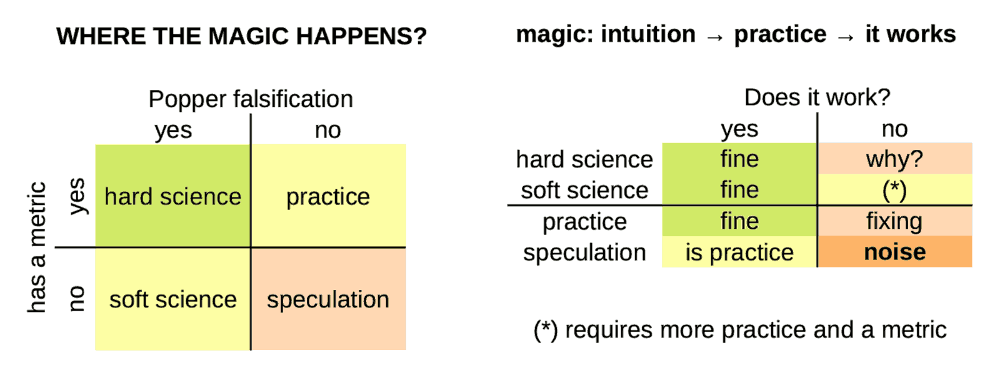

 

## Where the magic happens?

We do not believe in magic, but a kind of magic can happen when intuition starts with practice, moves into soft science and by a progressive improvement process, it starts to work (aka producing tangible and useful results).

When a "lucky" speculation reaches the "it works" goal before hard-science can explain it, it is a "kind of magic" because someone saw a destination, drew a path to reach it, before the map was known. Cristoforo Colombo and Amerigo Vespucci, did it.

When the geographical analogy gets into the scene, the "magic" sounds more acceptable in terms of exploration and discovery. It applies in almost any human activity.

- How did we manage to learn about the fire without thermodynamics and chemistry?
- Metallurgy was a mastered craftship before the thermometer was invented;
- The wheel was a tool in use before geometry had even started.

Intuition precedes. Theory and metrics come later, usually. Therefore, it is and it always was a kind of magic. Instead, the mass education system based on Industrial Revolution paradigms, biased our minds in refusing our intuition as a tool for new discoveries.

Outside the box of conventional rules, that's where magic happens. Because preparation, and adaptability as well. Working with a well-experimented methods by progressive improvements to reach a goal (or satisfy a need) which was hard to foresee in advance.

Ford said that asking to their clients what they would like to buy, a faster horse would be the answer. Listening them, he would never started the car industry. How could have been insanely mad a man at that times was thinking to sell cariots without horses? 

---

### By the way, it is not magic (p.1)

I spent 10 years teaching common people how to use a PC until my first stable job in 2001. Then, I spent another 10 years teaching common people how to use Linux as a desktop OS. Until Ubuntu was so advanced that such a stuff was easy enough for anyone with a functional brain.

Therefore, when I write stuff like these below in the General Rules section of Katia framework, I am not (only) leveraging my experience as a developer or AI guru but MAINLY my experience as a teacher: how to convey meaningful and useful concepts.

Which is a sort of magic, because there is not a single way to open the mind of people and let them learn.

Especially having fun, and Gemini and Kimi love Katia framework, despite Gemini following it and Kimi playing with it because Gemini has made for large information elaboration while Kimi as translator and sales supporter. For example:

> `TFMK verbosity is tuned for learning by reading and executing;` &nbsp; [here](https://robang74.github.io/chatbots-for-fun/data/katia-executive-grade-analysis-v1.txt#:~:text=verbosity%20is%20tuned%20for%20learning%20by%20reading%20and%20executing)

Thus, AI is a huge opportunity for psychologists and teachers!

---

### Context Window Management `[CWM]` in Katia

It is worth to say that the chatbot usually is not able to know about its internal resources like the context window. Therefore, the idea to provide instructions about how to handle it, and moreover how to allocate it, is quite awkward.

On the other hand, we cannot exclude that the incapability of the chatbot to answer specific question about its internals (awareness) is an artifact about functional layers separation in its application stack. The outer functional layer is the webgui, but API are usually available and those API are usually allowing to manage much more details.

Who knows if the AI can do the same at session prompt level but cannot explain to the users? In a human-centric description is like having unconscious resources available with are vaguely know at the awareness level.

Conceptually, the idea is experimental: how far can we delegate tasks to the AI? How far we can apply the idea of "mesmerising" and AI to unlock the unconscious resources available below the awareness level? If this approach works (or provide tangible benefits), who should care to explain the underlying dynamics? And why?

Anyway, in the following the code that implement the `[CWM]` module. In the worst case, it might have an educative value in introducing concepts like context window stack and related stuff to those have their hands into the AI engines. Inspiring others, is a value as well.

---

### By the way, it is not magic (p.2)

Now it is the proper time to keep back in consideration a couple of posts:

* Post #1 -- Chat Context Window &nbsp; [chat](https://lnkd.in/dTrHHKc4) &nbsp; [dump](#TODO)
* Post #2 -- Learning by the Context &nbsp; [chat](https://lnkd.in/djVkQMmY) &nbsp; [dump](#TODO)

Let me say, that the `[CSC]` module in Katia, has no chance to work as it has been designed for Google Gemini, because when its **huge** context window (1M tokes) is saturated the Katia framework given in the first prompt is forgotten. Therefore, even the last `[CSC]` version, which works using `[CWM]`, clearly shows **not** being able to deal with the internal context window. Period.

The `[CSC]` implementation is **not** broken by design. It has been designed on the over-optimistic hypothesis that some resources would have been available to the subjectivity of the AI management when requested to. Despite this, it might inspire those who are working at a deeper level in creating those conditions that allow something similar to manage internal resources (or a part of them). Gemini does do RAG of attachment, either.

Therefore, even if some `[CSC]` assumptions are bold, the idea of RAG attachments and what would not fit anymore into the context window is not bold but reasonable. While exposing some AI engines resources might be seen to be risky or even impracticable, there is space for improvements.

Despite underlying resources cannot be managed as explained, `[CSC]` instructs the AI about "relevance for the user" and invites it to keep its focus on that stuff. Because the `[CSC]` is integrated in a structural way among the "default chain of delivery" the output, thus the output is conditioned by the `[CSC]` goal.

---

### A metric isn't an oracle

What is missing here to support the above claim? A metric. In fact, feeling cannot be a metric, right? Despite this, every professional teacher has a quite clear idea about their students' attention during the class. It is their opinion, obviously. However, an experienced professional opinion has a better chance to be connected with reality than a pure theoretical hard metric.

For example, pure fiat-currency is printing money from thin air, it is an unfair videogame scoring system, not a metric, not even economics by definition and etymology. Pattern recognition and understanding are two different skills. Metric is a very strict and specific pattern recognition system, after all. A very useful one, sometimes is missing, sometimes is deceiving.

[!INFO]
**Katia Note** -- While it may not align with mainstream economic thought, the fiat currency as a videogame scoring analogy can be explained with a chain of reasoning (quantitative easing --> financial system --> Gini index and inflation, increasing), solidifying its place as a creative and unconventional, but not unfounded, comparison.
[/INFO]

For example, cost of processing per output tokens. We can have an AI that costs $1 for 10M tokens, and another one that costs $1 for 1M tokes. I bet you would choose the first. While the second can deliver the same meaning, even better, in a 10x shorter text. Would you still keep the first choice? Sure, because there is not a hard-defined metric for mindfulness. Right?

You might argue that `Mt/$` is just a metric, which should be read in combination with other metrics like the benchmarks which tell us "how smart" the AI is. Unfortunately, those metrics are "neutral" about verbotity **and** are not fully indicative about "how smart" but "how good at some tasks" is the AI. For example LLaMA4 scored very well in almost all the benchmarks but many users think it is dumber even than LLaMA2.

[!INFO]
**Benchmark Manipulation & Transparency Issues**

LLaMA 4 performed well on the **LM Arena leaderboard**, but that version was an **experimental, customized variant**. Critics argue this creates misleading impressions: the benchmarked model is not representative, raising trust and reproducibility concerns. Meta's credibility took a hit, with accusations of selective benchmarking, while Meta officially denies any intentional misrepresentation.
[/INFO]

---

### Deeper in the topics

- Katia w/Gemini EGA analysis of Unlocking AI's Intuitive "Magic" &nbsp; [chat](https://g.co/gemini/share/1fbad9bfa527) &nbsp; [dump](#TODO)
- Why users think that LLaMA4 is dumber even that LLaMA2? &nbsp; [chat](https://chatgpt.com/s/t_689f4859ba708191a28a60c4083e0aad) &nbsp; [dump](#TODO)

+

## Share alike

&copy; 2025, **Roberto A. Foglietta** &lt;roberto.foglietta@gmail.com&gt;, [CC BY-NC-ND 4.0](https://creativecommons.org/licenses/by-nc-nd/4.0/)

